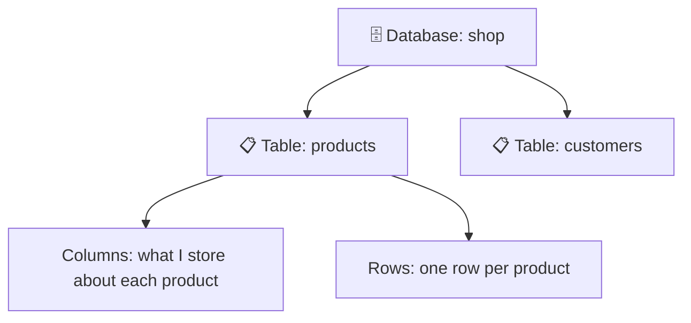
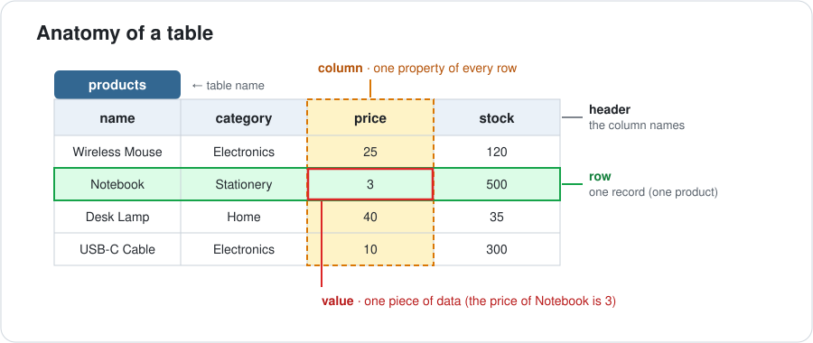
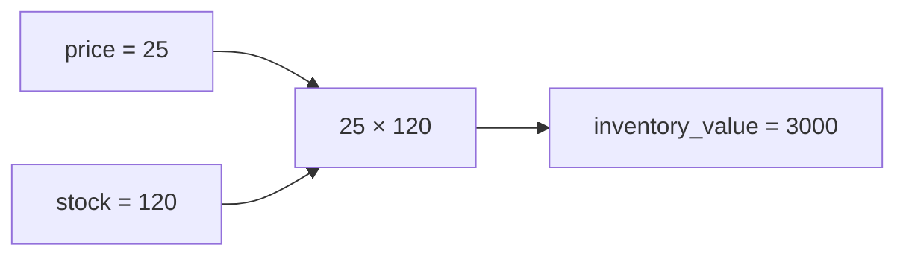

<div align="center">

# 01 · Simple — But Powerful — SQL Statements

**Part 1 — SQL Fundamentals** · ✅ Done

</div>

> This is where my Postgres journey started. Before this section I didn't really know what a database *was*. By the end I could create a table, put data into it, and ask it questions. Everything later in the course builds on these few statements, so I wanted these notes to be really solid.

💾 Every query on this page is in [`examples.sql`](examples.sql). Run it and follow along.

### 📌 What's in here

| # | Topic | In one line |
|:-:|---|---|
| 1 | [What a database and SQL are](#1-what-a-database-and-sql-are) | The big picture before any code |
| 2 | [Creating a table](#2-creating-a-table) | `CREATE TABLE`: making a place for data |
| 3 | [Inserting rows](#3-inserting-rows) | `INSERT INTO`: putting data in |
| 4 | [Reading data](#4-reading-data) | `SELECT`: getting data back out |
| 5 | [Calculated columns and aliases](#5-calculated-columns-and-aliases) | Math inside a query, plus `AS` |
| 6 | [String operators and functions](#6-string-operators-and-functions) | `\|\|`, `CONCAT`, `UPPER`, `LOWER`, `LENGTH` |
| ✔ | [Recap](#recap) · [Practice](#practice) · [What confused me](#what-confused-me) | |

---

## 1. What a database and SQL are

**What it is:** A **database** is an organized place to keep data so I can find it, change it, and trust it later. **PostgreSQL** (everyone just says "Postgres") is the program that stores that data and answers my questions about it. **SQL** is the language I use to ask those questions.

**Why it exists:** I could keep data in a spreadsheet or a text file, but that falls apart fast. Thousands of people read and write at the same time, tables grow to millions of rows, and I need rules like "every user must have an email." A database handles all of that for me.

### How it works


I never touch the data files myself. I write SQL, Postgres does the work, and I get back a result, which is always shaped like a table.

### How data is organized



<p align="center"></p>

- A **database** holds many tables.
- A **table** stores one kind of thing (products, users, orders...).
- A **column** is one property of that thing. Every value in a column has the same type.
- A **row** is one record: one actual product.

### My 3 questions before making any table

Whenever I need to store something new, I ask:

1. **What kind of thing am I storing?** → that becomes the **table** (`products`)
2. **What properties does it have?** → those become the **columns** (`name`, `price`, ...)
3. **What type of data is each property?** → that becomes each column's **data type** (text, whole number, ...)

### Keywords vs identifiers

```sql
SELECT name FROM products;
```

| Part | Type | What it tells Postgres |
|---|---|---|
| `SELECT`, `FROM` | **Keywords** | *What to do* |
| `name`, `products` | **Identifiers** | *What thing* to do it to |

> [!TIP]
> Postgres doesn't care about uppercase or lowercase keywords, but I write keywords in UPPERCASE and names in lowercase so I can read a query at a glance. Every statement ends with a semicolon `;`.

---

## 2. Creating a table

**What it is:** `CREATE TABLE` makes a new, empty table with the columns I choose.

**Why it exists:** Postgres needs to know the shape of my data before I can store any: the column names and the type each one holds.

### Syntax

```sql
CREATE TABLE table_name (
    column_name  DATA_TYPE,
    column_name  DATA_TYPE
);
```

### Example

I'm pretending to run a tiny shop, so my first table stores products:

```sql
CREATE TABLE products (
    name      VARCHAR(50),
    category  VARCHAR(30),
    price     INTEGER,
    stock     INTEGER
);
```

**Result:** `CREATE TABLE`, an empty table with 4 columns and 0 rows.

### The two types I used

| Type | Stores | Example |
|---|---|---|
| `VARCHAR(50)` | Text, up to 50 characters | `'Wireless Mouse'` |
| `INTEGER` | Whole numbers | `25` |

> [!NOTE]
> Real prices need decimals, so they'd use `NUMERIC` instead of `INTEGER`. I'm keeping it simple here. Data types get their own section in [13 · PostgreSQL Complex Datatypes](../13-postgresql-complex-datatypes/README.md). This table also has no `id` column yet; primary keys come in [03 · Working with Tables](../03-working-with-tables/README.md).

### ⚠️ Traps

- **A comma after the last column** → `syntax error at or near ")"`. Commas go *between* columns, not after the last one.
- **Text longer than the limit** → putting a 60-character name into `VARCHAR(50)` fails with `value too long for type character varying(50)`. Postgres won't quietly cut it short.
- **Running it twice** → `relation "products" already exists`. ("Relation" is just Postgres's word for a table.)

---

## 3. Inserting rows

**What it is:** `INSERT INTO` adds new rows to a table.

**Why it exists:** A new table is empty. This is how data gets in.

### Syntax

```sql
INSERT INTO table_name (column1, column2, ...)
VALUES
    (value1, value2, ...),
    (value1, value2, ...);
```

### Example

```sql
INSERT INTO products (name, category, price, stock)
VALUES
    ('Wireless Mouse', 'Electronics', 25, 120),
    ('Notebook',       'Stationery',   3, 500),
    ('Desk Lamp',      'Home',        40,  35),
    ('USB-C Cable',    'Electronics', 10, 300),
    ('Coffee Mug',     'Home',         8, 150);
```

**Result:** `INSERT 0 5`. The second number is how many rows went in. The first is an old field that's always `0` now, so I ignore it.

### How values match columns

Values are matched to columns **by position**, not by name:

```
INSERT INTO products (name,        category,      price,  stock)
VALUES               ('Notebook',  'Stationery',  3,      500);
                        1st ↔ 1st    2nd ↔ 2nd     3rd     4th
```

### ⚠️ Traps

- **Double quotes for text** → `VALUES ("Notebook", ...)` fails with `column "Notebook" does not exist`. In SQL, **text always uses single quotes** `'like this'`. Double quotes are for names of tables and columns.
- **Mixing up the order** → if I swap `price` and `stock` in the column list but not in `VALUES`, Postgres happily saves the wrong numbers. No error, just bad data.
- **Leaving a column out** → it gets `NULL`, which means "no value."

---

## 4. Reading data

**What it is:** `SELECT` asks a table for data and gives it back as a result table.

**Why it exists:** Storing data is pointless if I can't get it back out.

### Syntax

```sql
SELECT column1, column2 FROM table_name;   -- specific columns
SELECT * FROM table_name;                  -- every column
```

### Examples

Every column:

```sql
SELECT * FROM products;
```

| name | category | price | stock |
|---|---|--:|--:|
| Wireless Mouse | Electronics | 25 | 120 |
| Notebook | Stationery | 3 | 500 |
| Desk Lamp | Home | 40 | 35 |
| USB-C Cable | Electronics | 10 | 300 |
| Coffee Mug | Home | 8 | 150 |

Only the columns I need, in the order I want:

```sql
SELECT price, name FROM products;
```

| price | name |
|--:|---|
| 25 | Wireless Mouse |
| 3 | Notebook |
| 40 | Desk Lamp |
| 10 | USB-C Cable |
| 8 | Coffee Mug |

> [!TIP]
> `SELECT *` is great for quickly peeking at a table. In real code I list the columns I actually need. It's clearer, and it doesn't break when someone adds a new column later.

### ⚠️ Traps

- **Expecting a fixed row order** → without `ORDER BY`, Postgres doesn't promise any order. It often *looks* like insert order, but that's luck. Sorting is in [07 · Sorting Records](../07-sorting-records/README.md).
- **A typo in a column name** → `column "nmae" does not exist`. Postgres even adds a hint: *Perhaps you meant to reference the column "products.name".*

---

## 5. Calculated columns and aliases

**What it is:** I can do math inside `SELECT` to create a new column in the result, and use `AS` to give that column a readable name.

**Why it exists:** Often the number I want isn't stored anywhere. It's calculated from other columns, like how much money is sitting on the shelf for each product.

### Syntax

```sql
SELECT column1, expression AS new_name
FROM table_name;
```

### Example

```sql
SELECT name, price * stock AS inventory_value
FROM products;
```

| name | inventory_value |
|---|--:|
| Wireless Mouse | 3000 |
| Notebook | 1500 |
| Desk Lamp | 1400 |
| USB-C Cable | 3000 |
| Coffee Mug | 1200 |

### What happens for each row



Postgres runs the calculation once for every row. Without `AS`, the new column would be called `?column?`, which is ugly and hard to use later.

> [!IMPORTANT]
> A calculated column only exists in the **result**. The `products` table itself doesn't change at all.

### Math operators

| Operator | Meaning | Example | Result |
|:-:|---|---|--:|
| `+` | Add | `5 + 2` | 7 |
| `-` | Subtract | `5 - 2` | 3 |
| `*` | Multiply | `5 * 2` | 10 |
| `/` | Divide | `10 / 2` | 5 |
| `%` | Remainder | `7 % 2` | 1 |
| `^` | Power | `2 ^ 3` | 8 |
| `\|/` | Square root | `\|/ 16` | 4 |
| `@` | Absolute value | `@ -5` | 5 |

### ⚠️ Traps

- **Integer division drops the decimals** → `7 / 2` gives `3`, not `3.5`! When both numbers are integers, the answer is an integer too. Writing `7 / 2.0` gives `3.5` (shown as `3.5000000000000000`).
- **Forgetting `AS`** → the column is named `?column?`.

---

## 6. String operators and functions

**What it is:** Tools for working with text: joining pieces together, changing case, and counting characters.

**Why it exists:** Data is rarely stored exactly how I want to show it. I might need `Desk Lamp (Home)` as a label, or everything lowercase to compare emails.

### Syntax

| Tool | What it does | Example | Result |
|---|---|---|---|
| `\|\|` | Joins text | `'Desk' \|\| ' Lamp'` | `Desk Lamp` |
| `CONCAT(a, b, ...)` | Joins text (function version) | `CONCAT('Desk', ' Lamp')` | `Desk Lamp` |
| `UPPER(text)` | ALL CAPS | `UPPER('lamp')` | `LAMP` |
| `LOWER(text)` | all lowercase | `LOWER('LAMP')` | `lamp` |
| `LENGTH(text)` | Counts characters | `LENGTH('lamp')` | `4` |

### Example

```sql
SELECT
    name || ' (' || category || ')' AS label,
    UPPER(name)                     AS shouting,
    LENGTH(name)                    AS name_length
FROM products;
```

| label | shouting | name_length |
|---|---|--:|
| Wireless Mouse (Electronics) | WIRELESS MOUSE | 14 |
| Notebook (Stationery) | NOTEBOOK | 8 |
| Desk Lamp (Home) | DESK LAMP | 9 |
| USB-C Cable (Electronics) | USB-C CABLE | 11 |
| Coffee Mug (Home) | COFFEE MUG | 10 |

Functions can go inside each other. The inner one runs first:

```sql
SELECT UPPER(CONCAT(name, ' - ', category)) AS tag
FROM products;
```

| tag |
|---|
| WIRELESS MOUSE - ELECTRONICS |
| NOTEBOOK - STATIONERY |
| DESK LAMP - HOME |
| USB-C CABLE - ELECTRONICS |
| COFFEE MUG - HOME |

### ⚠️ Traps

- **`||` with a NULL turns everything into NULL** → `'Mug' || NULL` gives `NULL`, but `CONCAT('Mug', NULL)` gives `Mug`. If a column might be empty, `CONCAT` is the safer choice.
- **A single quote inside text** → to write `it's`, double the quote: `'it''s'`.

---

## Recap

| Statement / tool | What it does |
|---|---|
| `CREATE TABLE` | Makes a new empty table with named, typed columns |
| `INSERT INTO ... VALUES` | Adds rows (values match columns by position) |
| `SELECT ... FROM` | Reads data back as a result table |
| `expression AS name` | Calculates a new column in the result and names it |
| `\|\|`, `CONCAT`, `UPPER`, `LOWER`, `LENGTH` | Work with text |

> **The one thing I want to remember:** SQL describes *what* I want, not *how* to get it. I say "give me the name and price × stock," and Postgres figures out the rest.

---

## Practice

**1.** Create a table `books` with `title` (text up to 100 characters), `author` (text up to 60) and `pages` (a whole number). Then add two books.

<details>
<summary>Show answer</summary>

```sql
CREATE TABLE books (
    title   VARCHAR(100),
    author  VARCHAR(60),
    pages   INTEGER
);

INSERT INTO books (title, author, pages)
VALUES
    ('SQL for Beginners', 'A. Writer',   250),
    ('Databases Made Easy', 'B. Author', 320);
```

</details>

**2.** Show each product's name and its price after a 10% discount, in a column called `sale_price`.

<details>
<summary>Show answer</summary>

```sql
SELECT name, price * 0.9 AS sale_price
FROM products;
```

| name | sale_price |
|---|--:|
| Wireless Mouse | 22.5 |
| Notebook | 2.7 |
| Desk Lamp | 36.0 |
| USB-C Cable | 9.0 |
| Coffee Mug | 7.2 |

Multiplying by `0.9` (a decimal) gives decimals back, so no integer-division problem here.

</details>

**3.** Make one column called `summary` that looks like `NOTEBOOK: 500 in stock`.

<details>
<summary>Show answer</summary>

```sql
SELECT UPPER(name) || ': ' || stock || ' in stock' AS summary
FROM products;
```

</details>

**4.** Which product has the longest name? Show every name with its length and spot it. (Sorting comes in section 07.)

<details>
<summary>Show answer</summary>

```sql
SELECT name, LENGTH(name)
FROM products;
```

`Wireless Mouse` wins with 14 characters.

</details>

---

## What confused me

- I kept writing `"Notebook"` with double quotes, because that's how strings work in JavaScript. In SQL, double quotes mean a *column name*. Single quotes for text: burned into my brain now.
- `7 / 2 = 3` genuinely surprised me. Integers stay integers.
- I thought `AS` renamed the column in the table. It doesn't. It only names the column in the result.

---

[🏠 Index](../README.md) · [02 · Filtering Records ➡](../02-filtering-records/README.md)
