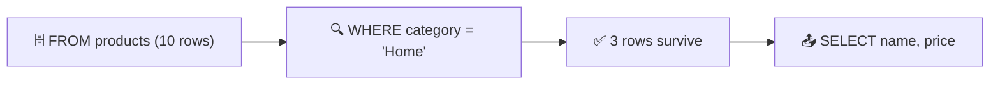

<div align="center">

# 02 · Filtering Records

**Part 1 — SQL Fundamentals** · ✅ Done

</div>

> Section 1 taught me to pull back a whole table with `SELECT * FROM products`. That's rarely what I actually want — usually it's one row, or a handful that match some condition. This section is about being precise: filtering with `WHERE`, combining conditions without accidentally breaking them, and finally being able to fix or remove data instead of just reading it.

💾 Every query on this page is in [`examples.sql`](examples.sql). It builds its own copy of `products`, with a few new rows thrown in to make filtering actually interesting. Run it top to bottom and follow along — later queries depend on the `UPDATE`/`DELETE` earlier in the file.

### 📌 What's in here

| # | Topic | In one line |
|:-:|---|---|
| 1 | [The WHERE clause and query order](#1-the-where-clause-and-query-order) | Picking rows before Postgres even looks at `SELECT` |
| 2 | [Comparison operators](#2-comparison-operators) | `=`, `<>`, `>`, `<`, `>=`, `<=` |
| 3 | [BETWEEN, IN and NOT IN](#3-between-in-and-not-in) | Ranges and lists, and a nasty `NULL` trap |
| 4 | [Combining conditions with AND and OR](#4-combining-conditions-with-and-and-or) | `AND` binds tighter than `OR` — and it matters |
| 5 | [Calculations inside WHERE](#5-calculations-inside-where) | Filtering on math, not just raw columns |
| 6 | [Updating rows with UPDATE](#6-updating-rows-with-update) | Changing data that's already there |
| 7 | [Deleting rows with DELETE](#7-deleting-rows-with-delete) | Removing rows for good |
| ✔ | [Recap](#recap) · [Practice](#practice) · [What confused me](#what-confused-me) | |

---

## 1. The WHERE clause and query order

**What it is:** `WHERE` sits between `FROM` and `SELECT` and throws away every row that doesn't match its condition. Only the rows that survive `WHERE` ever reach the column list.

**Why it exists:** Without it, every query returns the whole table and I'd have to filter it myself, in my head or in application code. The database is much better at this than I am.

### Syntax

```sql
SELECT column1, column2
FROM table_name
WHERE condition;
```

### Example

```sql
SELECT name, price
FROM products
WHERE category = 'Home';
```

**Result**

| name | price |
|---|--:|
| Desk Lamp | 40 |
| Coffee Mug | 8 |
| Standing Desk | 350 |

### The order Postgres actually runs this in

I write `SELECT ... FROM ... WHERE ...`, but Postgres doesn't run it in that order:



`FROM` finds the table, `WHERE` filters it, and only then does `SELECT` decide which columns (or calculations) to show. `SELECT` runs **last**, right before the result is handed back to me.

> [!IMPORTANT]
> Because `SELECT` runs after `WHERE`, I can't filter on an alias I just created:
> ```sql
> SELECT name, price * stock AS inventory_value
> FROM products
> WHERE inventory_value > 3000;
> ```
> This fails with `column "inventory_value" does not exist`. As far as `WHERE` is concerned, `inventory_value` doesn't exist yet — `SELECT` hasn't run. I have to repeat the whole expression in `WHERE` instead: `WHERE price * stock > 3000`. More on this in [5 · Calculations inside WHERE](#5-calculations-inside-where).

### ⚠️ Traps

- **Assuming `WHERE` sees column aliases** → see the `IMPORTANT` box above. This one confused me for a while.
- **Forgetting the row count changes, not the table** → `WHERE` never modifies `products` itself, it only changes what this one query returns.

---

## 2. Comparison operators

**What it is:** The operators that compare a column to a value: `=`, `<>` (or `!=`), `>`, `<`, `>=`, `<=`.

**Why it exists:** "Give me rows where X" needs a precise way to say what "where X" means — exactly equal, bigger than, smaller than, and so on.

### Syntax

| Operator | Meaning |
|:-:|---|
| `=` | Equal to |
| `<>` / `!=` | Not equal to |
| `>` | Greater than |
| `<` | Less than |
| `>=` | Greater than or equal to |
| `<=` | Less than or equal to |

### Example

```sql
SELECT name, price
FROM products
WHERE price > 40;
```

**Result**

| name | price |
|---|--:|
| Mechanical Keyboard | 85 |
| Bluetooth Speaker | 60 |
| Standing Desk | 350 |

`Desk Lamp` is exactly `40`, so `> 40` correctly leaves it out. `>=` would have kept it.

### ⚠️ Traps

- **`NULL` isn't equal *or* unequal to anything** → I added a `Ballpoint Pen` with no price yet (`NULL`). Running:
  ```sql
  SELECT name, price FROM products WHERE price <> 25;
  ```
  I expected 9 rows back (everything except `Wireless Mouse`). I got **8** — the Ballpoint Pen silently disappeared too. `NULL <> 25` doesn't evaluate to `TRUE`, it evaluates to `NULL`, which `WHERE` treats as "leave it out." The fix is `IS NULL` / `IS NOT NULL`, never `=` or `<>`:
  ```sql
  SELECT name FROM products WHERE price IS NULL;
  ```
  | name |
  |---|
  | Ballpoint Pen |
- **Comparing text case-sensitively** → `'home' = 'Home'` is `FALSE`. `WHERE category = 'home'` silently matches nothing. `LOWER(category) = 'home'` is the safe version.

---

## 3. BETWEEN, IN and NOT IN

**What it is:** `BETWEEN` checks an inclusive range. `IN` checks membership in a list, and is shorthand for a chain of `OR`s. `NOT IN` is its negation.

**Why it exists:** Writing `price >= 10 AND price <= 60` works, but `price BETWEEN 10 AND 60` says the same thing more clearly. Same idea for `category = 'A' OR category = 'B' OR category = 'C'` versus `category IN ('A', 'B', 'C')`.

### Syntax

```sql
SELECT column FROM table_name WHERE column BETWEEN low AND high;
SELECT column FROM table_name WHERE column IN (value1, value2, ...);
SELECT column FROM table_name WHERE column NOT IN (value1, value2, ...);
```

### Example — BETWEEN

```sql
SELECT name, price
FROM products
WHERE price BETWEEN 10 AND 60;
```

**Result**

| name | price |
|---|--:|
| Wireless Mouse | 25 |
| Desk Lamp | 40 |
| USB-C Cable | 10 |
| Bluetooth Speaker | 60 |

`BETWEEN` is **inclusive** on both ends — `USB-C Cable` at exactly `10` and `Bluetooth Speaker` at exactly `60` both made it in. It's identical to `price >= 10 AND price <= 60`.

### Example — IN

```sql
SELECT name, category
FROM products
WHERE category IN ('Electronics', 'Stationery');
```

**Result**

| name | category |
|---|---|
| Wireless Mouse | Electronics |
| Notebook | Stationery |
| USB-C Cable | Electronics |
| Mechanical Keyboard | Electronics |
| Sticky Notes | Stationery |
| Bluetooth Speaker | Electronics |
| Ballpoint Pen | Stationery |

### ⚠️ Traps

- **`BETWEEN` low and high the wrong way round matches nothing** → `price BETWEEN 60 AND 10` silently returns zero rows. Postgres doesn't swap them for me.
- **`NOT IN` with a `NULL` anywhere breaks the whole query.** This one is genuinely nasty:
  ```sql
  SELECT name FROM products WHERE price NOT IN (25, 3, 40);
  ```
  I expected 7 rows back (10 products minus the 3 exact matches). I got **6** — `Ballpoint Pen` (`NULL` price) silently disappeared too. `NOT IN` is really `<> 25 AND <> 3 AND <> 40` for every row, and any comparison against `NULL` gives `NULL`, not `FALSE`, so that row is quietly dropped without an error — same root cause as the `<>` trap above. Worse, if `NULL` shows up *inside the list itself*:
  ```sql
  SELECT name FROM products WHERE price NOT IN (25, 3, 40, NULL);
  ```
  This returns **zero rows** — for every single product, even ones priced `1000`. One `NULL` in a `NOT IN` list poisons the entire condition for every row. `IN` doesn't have this problem nearly as badly (a `NULL` column value just fails to match, like `=` does); it's specifically `NOT IN` I no longer trust without checking for `NULL`s first.

---

## 4. Combining conditions with AND and OR

**What it is:** `AND` requires every condition to be true. `OR` requires at least one. Both can be combined in the same `WHERE`.

**Why it exists:** Real filters are rarely a single condition — "Electronics under $30", "Home or cheap", these need more than one comparison at once.

### Syntax

```sql
SELECT column FROM table_name WHERE condition1 AND condition2;
SELECT column FROM table_name WHERE condition1 OR condition2;
```

### Example

```sql
SELECT name, category, price
FROM products
WHERE category = 'Electronics' AND price < 30;
```

**Result**

| name | category | price |
|---|---|--:|
| Wireless Mouse | Electronics | 25 |
| USB-C Cable | Electronics | 10 |

### ⚠️ Traps

- **`AND` binds tighter than `OR`, and it's easy to forget.** I wanted "cheap Home or Stationery items" and wrote:
  ```sql
  SELECT name, category, price
  FROM products
  WHERE category = 'Home' OR category = 'Stationery' AND price < 5;
  ```
  Postgres reads this as `category = 'Home' OR (category = 'Stationery' AND price < 5)` — the `AND` grabs its neighbors first:
  ```
  category = 'Home'   OR   category = 'Stationery'  AND  price < 5
                            └──────────── AND runs first ──────────┘
  └──────────────────────────── then OR ──────────────────────────┘
  ```
  The result includes the **$350 Standing Desk**, because it's `Home` — the price condition never applied to it at all:

  | name | category | price |
  |---|---|--:|
  | Desk Lamp | Home | 40 |
  | Coffee Mug | Home | 8 |
  | Standing Desk | Home | 350 |
  | Notebook | Stationery | 3 |
  | Sticky Notes | Stationery | 2 |

  Parentheses fix it by grouping the `OR` explicitly:
  ```sql
  SELECT name, category, price
  FROM products
  WHERE (category = 'Home' OR category = 'Stationery') AND price < 5;
  ```
  | name | category | price |
  |---|---|--:|
  | Notebook | Stationery | 3 |
  | Sticky Notes | Stationery | 2 |

  That's the actual "cheap items" list I meant. **Now I add parentheses any time `AND` and `OR` appear in the same `WHERE`, even when I think I know the precedence.**

---

## 5. Calculations inside WHERE

**What it is:** `WHERE` isn't limited to bare columns — it accepts the same expressions and math I'd use in `SELECT`.

**Why it exists:** Sometimes the thing I want to filter on isn't a stored column at all, like total inventory value (`price * stock`), which only exists as a calculation.

### Syntax

```sql
SELECT column FROM table_name WHERE expression comparison value;
```

### Example

```sql
SELECT name, price, stock, price * stock AS inventory_value
FROM products
WHERE price * stock > 1300;
```

**Result**

| name | price | stock | inventory_value |
|---|--:|--:|--:|
| Wireless Mouse | 25 | 120 | 3000 |
| Notebook | 3 | 500 | 1500 |
| Desk Lamp | 40 | 35 | 1400 |
| USB-C Cable | 10 | 300 | 3000 |
| Mechanical Keyboard | 85 | 40 | 3400 |
| Standing Desk | 350 | 5 | 1750 |

Note that `WHERE` repeats the full expression `price * stock` — as covered in [1 · Query order](#1-the-where-clause-and-query-order), the `inventory_value` alias doesn't exist yet at this point.

### ⚠️ Traps

- **Math against a `NULL` column silently drops the row.** `Ballpoint Pen` has `price = NULL`, so `price * stock` is `NULL` too — and `NULL > 1300` is `NULL`, not `TRUE`. It vanishes from the result with no warning, same root cause as the `NULL` traps above.

---

## 6. Updating rows with UPDATE

**What it is:** `UPDATE` changes the values of existing rows that match a `WHERE` condition.

**Why it exists:** Data changes. Stock gets restocked, prices go up, typos need fixing — I don't want to delete and re-insert a row just to change one value.

### Syntax

```sql
UPDATE table_name
SET column1 = value1, column2 = value2
WHERE condition;
```

### Example

`Bluetooth Speaker` is out of stock (`0`). A new shipment just came in:

```sql
UPDATE products
SET stock = 25
WHERE name = 'Bluetooth Speaker';
```

**Result:** `UPDATE 1` — one row matched `WHERE` and was changed.

### Updating more than one row, and seeing what changed

`SET` can use the column's own current value, and `RETURNING` shows me the changed rows immediately, without a separate `SELECT`:

```sql
UPDATE products
SET price = price * 1.10
WHERE category = 'Electronics'
RETURNING name, price;
```

**Result**

| name | price |
|---|--:|
| Wireless Mouse | 28 |
| USB-C Cable | 11 |
| Mechanical Keyboard | 94 |
| Bluetooth Speaker | 66 |

> [!NOTE]
> `RETURNING` is Postgres-specific (not standard SQL), but it's genuinely one of my favorite features here — no separate `SELECT` needed to confirm what just changed.

### ⚠️ Traps

> [!WARNING]
> **`UPDATE` with no `WHERE` changes every single row in the table.** There's no confirmation prompt. I now always run the `WHERE` clause as a plain `SELECT` first, to see exactly which rows I'm about to hit, before turning it into an `UPDATE`.

- **`25 × 1.10 = 27.50`, but I got `28`.** `price` is still an `INTEGER` column — the same simplification section 1's traps warned me about, in [13 · PostgreSQL Complex Datatypes](../13-postgresql-complex-datatypes/README.md). Postgres doesn't error on `price * 1.10`; it happily computes `27.5`, then rounds it to fit back into an `INTEGER` column when it's stored. `25` and `85` both landed exactly on `.5` and got rounded up to `28` and `94`. `10` and `60` had no decimals to round and came out exactly as `11` and `66`. If I actually needed the cents, `price` should be `NUMERIC`, not `INTEGER`.

---

## 7. Deleting rows with DELETE

**What it is:** `DELETE` removes entire rows that match a `WHERE` condition. There's no "undo" — the row is just gone.

**Why it exists:** Sometimes a row shouldn't exist any more at all, not just have different values. Discontinued products, spam comments, cancelled orders.

### Syntax

```sql
DELETE FROM table_name
WHERE condition;
```

### Example

We're discontinuing `Sticky Notes`:

```sql
DELETE FROM products
WHERE name = 'Sticky Notes'
RETURNING *;
```

**Result:** `DELETE 1`, and `RETURNING *` shows me exactly what was removed:

| name | category | price | stock |
|---|---|--:|--:|
| Sticky Notes | Stationery | 2 | 600 |

### ⚠️ Traps

> [!WARNING]
> **`DELETE FROM table_name;` with no `WHERE` deletes every row.** The table itself still exists, but it's now empty. Same rule as `UPDATE`: preview with `SELECT` first.

- **`DELETE` is not the same as `TRUNCATE`.** `DELETE FROM products;` (no `WHERE`) removes every row one at a time and I could technically wrap it in a transaction to undo it before committing. `TRUNCATE products;` instantly wipes the whole table and resets things like auto-incrementing IDs — faster, but there's even less safety net. I haven't needed `TRUNCATE` yet, just noting it exists.

---

## Recap

| Statement / tool | What it does |
|---|---|
| `WHERE` | Filters rows; runs before `SELECT`, so it can't see `SELECT`'s aliases |
| `=`, `<>`/`!=`, `>`, `<`, `>=`, `<=` | Compare a column to a value |
| `IS NULL` / `IS NOT NULL` | The only correct way to test for `NULL` |
| `BETWEEN low AND high` | Inclusive range check |
| `IN (...)` / `NOT IN (...)` | List membership / exclusion — check for `NULL`s before using `NOT IN` |
| `AND` / `OR` | Combine conditions; `AND` binds tighter — use parentheses to be sure |
| `UPDATE ... SET ... WHERE` | Changes matching rows in place |
| `DELETE FROM ... WHERE` | Removes matching rows entirely |
| `RETURNING` | Shows the rows an `UPDATE`/`DELETE` just touched |

> **The one thing I want to remember:** `WHERE` runs on three-valued logic — `TRUE`, `FALSE`, or `NULL` (unknown) — and only `TRUE` survives. That single fact explains almost every surprising result in this section. And before any `UPDATE` or `DELETE`, run the same `WHERE` as a `SELECT` first — always know the blast radius before pulling the trigger.

---

## Practice

All questions use the `products` table exactly as it stands at the end of [`examples.sql`](examples.sql) — after the restock, the price increase, and the `Sticky Notes` deletion above.

**1.** Find every product priced under $15.

<details>
<summary>Show answer</summary>

```sql
SELECT name, price
FROM products
WHERE price < 15;
```

| name | price |
|---|--:|
| Notebook | 3 |
| USB-C Cable | 11 |
| Coffee Mug | 8 |

`Ballpoint Pen` (`NULL` price) doesn't appear — `NULL < 15` is never `TRUE`.

</details>

**2.** Find every product that's in the `Home` category, or costs more than $50.

<details>
<summary>Show answer</summary>

```sql
SELECT name, category, price
FROM products
WHERE category = 'Home' OR price > 50;
```

| name | category | price |
|---|---|--:|
| Desk Lamp | Home | 40 |
| Coffee Mug | Home | 8 |
| Mechanical Keyboard | Electronics | 94 |
| Bluetooth Speaker | Electronics | 66 |
| Standing Desk | Home | 350 |

</details>

**3.** Find every product priced between $20 and $70 (inclusive).

<details>
<summary>Show answer</summary>

```sql
SELECT name, price
FROM products
WHERE price BETWEEN 20 AND 70;
```

| name | price |
|---|--:|
| Wireless Mouse | 28 |
| Desk Lamp | 40 |
| Bluetooth Speaker | 66 |

</details>

**4.** Trick question: how many rows would `DELETE FROM products WHERE stock = 0;` remove, right now? Why?

<details>
<summary>Show answer</summary>

**Zero.** `Bluetooth Speaker` was the only product with `stock = 0`, and it was already restocked to `25` back in [6 · Updating rows](#6-updating-rows-with-update). This is exactly why I always check the *current* state of the data with a `SELECT` before assuming what a `WHERE` clause will match — the table doesn't stay the same between sections.

</details>

---

## What confused me

- `NULL` isn't "equal to nothing" the way I expected — it's not equal *or* unequal to anything, including another `NULL`. `= NULL` and `<> NULL` both silently match zero rows. Only `IS NULL` / `IS NOT NULL` work.
- `NOT IN` with a `NULL` anywhere in the list (or in the column) makes the **entire query** return nothing, not just skip the `NULL` row. I don't reach for `NOT IN` any more without checking for `NULL`s first.
- I genuinely believed `AND` and `OR` were evaluated left-to-right like reading a sentence. They're not — `AND` always groups first. Parentheses now go around every `OR` I write next to an `AND`.
- I assumed multiplying an `INTEGER` column would either error or magically become a decimal. It does neither — it silently rounds. Data types matter more than I thought back in section 1.

---

[⬅ 01 · Simple — But Powerful — SQL Statements](../01-simple-sql-statements/README.md) · [🏠 Index](../README.md) · [03 · Working with Tables ➡](../03-working-with-tables/README.md)
