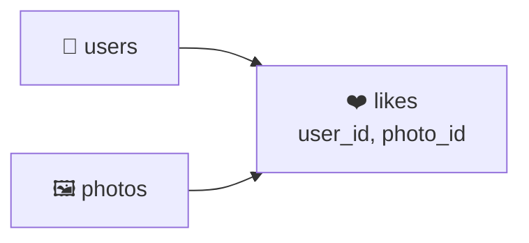

<div align="center">

# 03 · Working with Tables

**Part 1 — SQL Fundamentals** · ✅ Done

</div>

> Everything up to now lived in one `products` table. Real apps need more than that — users, their photos, comments on those photos — and those things have to stay *connected* to each other without duplicating data everywhere. This section is where I designed my first real, multi-table schema and learned what actually enforces those connections.

💾 Every query on this page is in [`examples.sql`](examples.sql). The schema I build here — `users`, `photos`, `comments` — is the same one that now lives in [`sample-db/`](../sample-db/), so every section from here on reuses it instead of redefining it from scratch.

### 📌 What's in here

| # | Topic | In one line |
|:-:|---|---|
| 1 | [Designing a schema for a photo-sharing app](#1-designing-a-schema-for-a-photo-sharing-app) | Splitting one big idea into connected tables |
| 2 | [Relationship types](#2-relationship-types) | One-to-many, many-to-one, one-to-one, many-to-many |
| 3 | [Primary keys and SERIAL](#3-primary-keys-and-serial) | Giving every row a stable, unique identity |
| 4 | [Foreign keys](#4-foreign-keys) | Making one column point at another table's primary key |
| 5 | [Foreign key rules when inserting](#5-foreign-key-rules-when-inserting) | What Postgres checks, and in what order |
| 6 | [ON DELETE options](#6-on-delete-options) | Deciding what happens to the children when a parent row goes |
| ✔ | [Recap](#recap) · [Practice](#practice) · [What confused me](#what-confused-me) | |

---

## 1. Designing a schema for a photo-sharing app

**What it is:** Breaking one idea ("a photo-sharing app") into separate tables, one per *kind of thing*, then connecting them.

**Why it exists:** Cramming everything into one table seems simpler at first, but it falls apart fast.

### The wrong way first

Imagine one giant table for photos and their comments:

| photo_url | username | comment_text | commenter_name |
|---|---|---|---|
| sunset.jpg | alex | Beautiful! | bella |
| sunset.jpg | alex | Love this | chris |
| mountain.jpg | bella | Where is this? | alex |

This *looks* fine with three rows. It falls apart with three thousand:

- `sunset.jpg` and `alex` are repeated on every single comment. If alex renames their account, I now have to find and update every row that mentions them.
- There's no reliable way to ask "how many photos does alex have" without string-matching a username column, and nothing stops `'alex'` and `'Alex'` from silently becoming two different people.
- A photo with zero comments has nowhere to live in this table at all.

### The fix: one table per kind of thing


- **`users`** — one row per person.
- **`photos`** — one row per photo, pointing back at the user who posted it.
- **`comments`** — one row per comment, pointing back at both the user who wrote it and the photo it's on.

A username now lives in exactly **one** place. Every photo and comment just points at it.

### My 3 questions, extended

Section 1's three questions (what am I storing, what properties, what types) still apply per table, plus a fourth one now that there's more than one:

4. **How does this table connect to the others?** → that becomes a **foreign key**.

### ⚠️ Traps

- **Designing one table because it feels simpler right now** → it's less typing today and a lot more pain the first time data needs updating in ten places at once.

---

## 2. Relationship types

**What it is:** A name for how many rows on one side of a connection can match rows on the other side.

**Why it exists:** The relationship type decides which table gets the foreign key column, and whether I need an extra table just to hold the connection.

### The four types

| Type | Example | Where the foreign key lives |
|---|---|---|
| **One-to-many** | One user → many photos | On the "many" side (`photos.user_id`) |
| **Many-to-one** | Many photos → one user | Same relationship, other direction — same column |
| **One-to-one** | One user → one profile | On either side, with a `UNIQUE` constraint added |
| **Many-to-many** | Many users → many photos, via "likes" | Neither side — needs a **join table** in between |

### One-to-many / many-to-one

This is just one relationship described from two directions. "A user has many photos" and "a photo belongs to one user" are the same fact. The foreign key always sits on the "many" side:

```sql
photos.user_id  REFERENCES  users.id
```

### One-to-one

Not in this schema, but it comes up: say I later split off a `user_profiles` table for optional bio/avatar data. Each user has *at most one* profile, so `user_profiles.user_id` would be a foreign key to `users.id`, with a `UNIQUE` constraint on it too — that `UNIQUE` is what turns an ordinary one-to-many into a one-to-one, by blocking a second profile row from pointing at the same user. (`UNIQUE` gets its own section in [13 · Database-Side Validation and Constraints](../13-database-side-validation-and-constraints/README.md).)

### Many-to-many

If users could **like** photos: one user can like many photos, and one photo can be liked by many users. Neither `users` nor `photos` can hold a single foreign key for this — a `user_id` column on `photos` would only allow one liker per photo. It needs a **join table** in between, with a foreign key to each side:



I'm not building `likes` in this section — it gets a full section to itself in [15 · How to Build a 'Like' System](../15-how-to-build-a-like-system/README.md) — but recognizing "this is many-to-many, I need a join table" is the important part.

### ⚠️ Traps

- **Trying to store a many-to-many relationship as a list inside a column** (like a comma-separated string of photo ids on a user). It looks like it saves a table, but it makes filtering, joining, and keeping data consistent much harder than just adding the join table.

---

## 3. Primary keys and SERIAL

**What it is:** A **primary key** is the column (or columns) that uniquely identifies each row. `SERIAL` is a Postgres shorthand for an auto-incrementing integer, commonly used as that primary key.

**Why it exists:** I need a stable way to say "this exact row" that never changes, even if every other column does. A username *could* change; a made-up numeric id doesn't have to.

### Syntax

```sql
CREATE TABLE table_name (
    id    SERIAL PRIMARY KEY,
    ...
);
```

### Example

```sql
CREATE TABLE users (
    id       SERIAL PRIMARY KEY,
    username VARCHAR(50) NOT NULL UNIQUE
);

INSERT INTO users (username)
VALUES ('alex'), ('bella'), ('chris'), ('dana'), ('erin');

SELECT * FROM users;
```

**Result**

| id | username |
|--:|---|
| 1 | alex |
| 2 | bella |
| 3 | chris |
| 4 | dana |
| 5 | erin |

I never typed a single `id` value — `SERIAL` handled it. Under the hood, `SERIAL` is really just an `INTEGER` column with a **sequence** object attached as its default, so every new row automatically gets `nextval()` of that sequence.

### ⚠️ Traps

- **Inserting an explicit id doesn't move the sequence forward.** This one genuinely tripped me up:
  ```sql
  CREATE TABLE demo (id SERIAL PRIMARY KEY, note TEXT);

  INSERT INTO demo (id, note) VALUES (100, 'inserted by hand');
  INSERT INTO demo (note)     VALUES ('inserted normally');

  SELECT * FROM demo;
  ```
  | id | note |
  |--:|---|
  | 100 | inserted by hand |
  | 1 | inserted normally |

  I expected the second row to get `id = 101`. It got `id = 1`, because the sequence has no idea I inserted `100` by hand — it just keeps counting from wherever it last left off. This is exactly why the real [`sample-db/seed.sql`](../sample-db/seed.sql) has this line right after inserting `photos` with explicit ids:
  ```sql
  SELECT setval(pg_get_serial_sequence('photos', 'id'), (SELECT MAX(id) FROM photos));
  ```
  That manually fast-forwards the sequence past the highest id actually in use, so the *next* automatic insert doesn't collide with (or fall behind) the ones I typed by hand.

---

## 4. Foreign keys

**What it is:** A column that must match a value already present in another table's primary key column (or be `NULL`).

**Why it exists:** This is what actually enforces the relationships from [2 · Relationship types](#2-relationship-types) — without it, "connecting" tables would just be a naming convention I could accidentally break.

### Syntax

```sql
CREATE TABLE child_table (
    id            SERIAL PRIMARY KEY,
    parent_id     INTEGER REFERENCES parent_table(parent_id_column)
);
```

### Example

```sql
CREATE TABLE photos (
    id      SERIAL PRIMARY KEY,
    url     VARCHAR(200) NOT NULL,
    user_id INTEGER REFERENCES users(id) ON DELETE CASCADE
);

CREATE TABLE comments (
    id           SERIAL PRIMARY KEY,
    comment_text VARCHAR(240) NOT NULL,
    user_id      INTEGER REFERENCES users(id) ON DELETE CASCADE,
    photo_id     INTEGER REFERENCES photos(id) ON DELETE CASCADE
);
```

`photos.user_id` can only ever hold a value that exists in `users.id` — or `NULL`, if the column allows it.


> [!NOTE]
> I never named these constraints myself. Postgres auto-generates a name like `photos_user_id_fkey` (`table_column_fkey`) for every foreign key, and that's the exact name it uses in error messages — I recognized it the first time one showed up. If I needed to reference it later (to drop or alter it), I could have named it explicitly with `CONSTRAINT fk_name FOREIGN KEY (user_id) REFERENCES users(id)` instead.

### ⚠️ Traps

- **Forgetting the foreign key entirely** → `user_id INTEGER` with no `REFERENCES` still *looks* connected because of the column name, but Postgres will happily let it hold `99999` even if no such user exists. The name is just a hint to me; the constraint is what Postgres actually checks.

---

## 5. Foreign key rules when inserting

**What it is:** Postgres checks every foreign key at the moment a row is inserted (or updated), and rejects the change if it would break the constraint.

**Why it exists:** Without this check, `photos.user_id` could point at a user that was never created (or was deleted), leaving orphaned, meaningless data behind.

### Example

```sql
INSERT INTO photos (url, user_id)
VALUES ('https://example.com/ghost.jpg', 99);
```

**Result:** Rejected.
```
ERROR:  insert or update on table "photos" violates foreign key constraint "photos_user_id_fkey"
DETAIL:  Key (user_id)=(99) is not present in table "users".
```

There is no user `99`, so the row never gets inserted. `products` back in section 1 could never do this — it had no other table to be wrong about.

### This also decides table order

Because `photos` points at `users`, and `comments` points at both, they have to be created and populated in dependency order — parents before children:

```sql
-- Creating: parents first
CREATE TABLE users   (...);
CREATE TABLE photos  (... REFERENCES users ...);
CREATE TABLE comments(... REFERENCES users ..., ... REFERENCES photos ...);

-- Inserting: same order — parents before children
INSERT INTO users    ...;
INSERT INTO photos   ...;   -- needs users to already exist
INSERT INTO comments ...;   -- needs both users and photos to already exist
```

And it reverses for dropping — **children before parents**, which is why [`sample-db/schema.sql`](../sample-db/schema.sql) drops tables in this exact order:

```sql
DROP TABLE IF EXISTS comments;   -- depends on users and photos
DROP TABLE IF EXISTS photos;     -- depends on users
DROP TABLE IF EXISTS users;      -- depends on nothing
```

### ⚠️ Traps

- **Dropping a parent table before its children** → 
  ```sql
  DROP TABLE users;
  ```
  ```
  ERROR:  cannot drop table users because other objects depend on it
  DETAIL:  constraint photos_user_id_fkey on table photos depends on table users
  HINT:  Use DROP ... CASCADE to drop the dependent objects too.
  ```
  Postgres refuses rather than silently leaving `photos` pointing at nothing. I could force it with `DROP TABLE users CASCADE`, but that also drops the foreign key constraint (not the `photos` table itself) — worth reading the message carefully before reaching for `CASCADE` as a quick fix.

---

## 6. ON DELETE options

**What it is:** The rule attached to a foreign key that decides what happens to a child row (like a `photo`) when the parent row it points at (like a `user`) gets deleted.

**Why it exists:** "Delete a user" is ambiguous on its own — should their photos disappear too, or stick around without an owner? Postgres makes me choose instead of guessing.

### The options

| Option | What happens to the child row |
|---|---|
| `RESTRICT` | Blocks the delete immediately if any child rows exist |
| `NO ACTION` *(default if omitted)* | Blocks the delete if any child rows exist — practically the same as `RESTRICT` here |
| `CASCADE` | Deletes the child rows too |
| `SET NULL` | Keeps the child row, sets its foreign key column to `NULL` |
| `SET DEFAULT` | Keeps the child row, sets its foreign key column to its default value |

### Example — CASCADE, two levels deep

Both `photos` and `comments` use `ON DELETE CASCADE` on their `user_id`, and `comments` also cascades on `photo_id`. Starting from the full seed data (5 users, 5 photos, 6 comments — see [`sample-db/seed.sql`](../sample-db/seed.sql)):

```sql
DELETE FROM users WHERE username = 'chris';
```

`chris` (user `3`) owned photo `104` (`city.jpg`) and wrote one comment on someone else's photo. Deleting `chris` cascades:

1. `photos` where `user_id = 3` → photo `104` is deleted.
2. `comments` where `user_id = 3` → chris's own comment (`'Love this'`, on photo `101`) is deleted.
3. Deleting photo `104` in step 1 then cascades again: `comments` where `photo_id = 104` → `'Great shot'` is deleted too.

**Result:** 1 user, 1 photo, and **2** comments gone from a single `DELETE` statement — the cascade reached two tables deep, not just the direct child.

| Table | Before | After |
|---|--:|--:|
| `users` | 5 | 4 |
| `photos` | 5 | 4 |
| `comments` | 6 | 4 |

### Example — SET NULL, for contrast

If I didn't want history erased, `SET NULL` keeps the row and just disconnects it:

```sql
CREATE TABLE demo_owners (id SERIAL PRIMARY KEY, name TEXT);
CREATE TABLE demo_notes (
    id       SERIAL PRIMARY KEY,
    note     TEXT,
    owner_id INTEGER REFERENCES demo_owners(id) ON DELETE SET NULL
);

INSERT INTO demo_owners (name) VALUES ('temp owner');
INSERT INTO demo_notes (note, owner_id) VALUES ('a note', 1);

DELETE FROM demo_owners WHERE name = 'temp owner';

SELECT * FROM demo_notes;
```

**Result**

| id | note | owner_id |
|--:|---|--:|
| 1 | a note | *(NULL)* |

The owner is gone, but the note survived — just ownerless now. `SET DEFAULT` works the same way, except the column falls back to a predefined default value instead of `NULL`.

> [!TIP]
> If I hadn't written `ON DELETE` at all, it defaults to `NO ACTION` — the *safest* choice, since it forces an error instead of silently deleting or orphaning anything. I only reach for `CASCADE` when I actually want the "delete the parent, delete everything under it" behavior, like a user deleting their own account.

### ⚠️ Traps

- **Assuming `CASCADE` only deletes the direct child** → the `chris` example above deleted a comment that wasn't even directly linked to the user being deleted — it was linked to a *photo* that got cascade-deleted. Cascades chain through however many foreign keys are set up that way.
- **Picking `CASCADE` everywhere out of habit** → it's the right call for "this data has no meaning without its parent" (a photo without its owner, a comment without its photo). It's the wrong call for anything I'd want to keep for records — an `orders` table probably shouldn't vanish just because a `customers` row was deleted.

---

## Recap

| Concept | What it means |
|---|---|
| Splitting into `users` / `photos` / `comments` | One table per kind of thing, instead of one wide, repetitive table |
| One-to-many / many-to-one | Same relationship, described from each side; foreign key lives on the "many" side |
| One-to-one | A one-to-many with a `UNIQUE` constraint added on the foreign key |
| Many-to-many | Needs a join table with a foreign key to each side — never a list crammed into one column |
| `SERIAL PRIMARY KEY` | Auto-incrementing integer identity; hand-typed ids don't move its sequence forward |
| `REFERENCES parent(column)` | The value must exist in the parent table, or be `NULL` |
| Insert/drop order | Parents before children when creating or inserting; children before parents when dropping |
| `ON DELETE` (`CASCADE` / `SET NULL` / `SET DEFAULT` / `RESTRICT` / `NO ACTION`) | What happens to child rows when their parent row is deleted |

> **The one thing I want to remember:** a foreign key is a promise Postgres actively checks, not just a naming convention. And `ON DELETE` isn't optional busywork — leaving it out just means Postgres picked the safest option (`NO ACTION`) for me.

---

## Practice

**1.** Users can **like** photos — one user can like many photos, and one photo can be liked by many users. What kind of relationship is this, and what would you need to add to model it?

<details>
<summary>Show answer</summary>

A **many-to-many** relationship. Neither `users` nor `photos` can hold the foreign key alone, so it needs a new join table, something like:

```
likes (id, user_id → users.id, photo_id → photos.id)
```

</details>

**2.** Users can **follow** other users. What's different about this relationship compared to `likes`, and what would the foreign keys look like?

<details>
<summary>Show answer</summary>

It's still many-to-many (one user can follow many users, and be followed by many), but this time both sides of the join table point at the **same** table:

```
follows (id, follower_id → users.id, followed_id → users.id)
```

A `users` row can show up in either column — or both. This gets built for real in [18 · How to Design a 'Follower' System](../18-how-to-design-a-follower-system/README.md).

</details>

**3.** Write the `CREATE TABLE` statement for the `likes` table from question 1. A photo should lose its likes if it's deleted, but liking should require a real user and a real photo.

<details>
<summary>Show answer</summary>

```sql
CREATE TABLE likes (
    id       SERIAL PRIMARY KEY,
    user_id  INTEGER NOT NULL REFERENCES users(id)  ON DELETE CASCADE,
    photo_id INTEGER NOT NULL REFERENCES photos(id) ON DELETE CASCADE
);
```

`NOT NULL` on both foreign keys makes sure a like can't exist without pointing at a real user *and* a real photo.

</details>

**4.** Using the *original* seed data (before the `chris` deletion above), suppose I instead ran `DELETE FROM users WHERE username = 'dana';`. Which photos and comments would disappear?

<details>
<summary>Show answer</summary>

**Zero photos, one comment.** `dana` (user `4`) never posted a photo, but did write the comment `'Need this coffee'` on photo `103`. That single comment cascades away; nothing else does. This is the same `ON DELETE CASCADE` rule as the `chris` example — it just has less to cascade *through*, because `dana` owned less.

</details>

---

## What confused me

- I kept wanting to put a list of photo ids directly on the `users` row. Foreign keys always go on the "many" side, pointing back — never the other way around.
- I expected `DROP TABLE users;` to just work. Postgres refusing because `photos` still points at it felt like an obstacle at first; it's actually the whole point of a foreign key.
- I assumed `ON DELETE CASCADE` only touched the table it was written on. Deleting a user rippled through `photos` *and then* through `comments` referencing that photo — two hops, from one `DELETE`.
- `SERIAL` felt like magic until I realized it's just an integer column with a sequence as its default value. Typing an explicit id doesn't tell that sequence anything — which is exactly why `seed.sql` has to nudge it forward by hand.

---

[⬅ 02 · Filtering Records](../02-filtering-records/README.md) · [🏠 Index](../README.md) · [04 · Relating Records with Joins ➡](../04-relating-records-with-joins/README.md)
