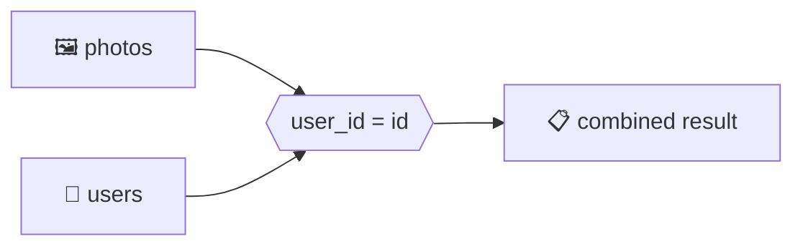

<div align="center">

# 04 · Relating Records with Joins

**Part 1 — SQL Fundamentals** · ✅ Done

</div>

> Section 3 split one idea into three connected tables. This is where that split finally pays off — putting `users`, `photos`, and `comments` back together in a single query, so I can ask real questions like "who commented on whose photo" instead of staring at three separate result sets.

💾 Every query on this page is in [`examples.sql`](examples.sql). It assumes the shared schema is already loaded:
```bash
psql -d postgres_notes -f sample-db/schema.sql
psql -d postgres_notes -f sample-db/seed.sql
psql -d postgres_notes -f 04-relating-records-with-joins/examples.sql
```

### 📌 What's in here

| # | Topic | In one line |
|:-:|---|---|
| 1 | [What a join actually does](#1-what-a-join-actually-does) | Matching rows between two tables and combining them |
| 2 | [Table aliases and column-name conflicts](#2-table-aliases-and-column-name-conflicts) | Fixing "column reference is ambiguous" |
| 3 | [INNER JOIN](#3-inner-join) | Only the rows that match on both sides |
| 4 | [LEFT JOIN and RIGHT JOIN](#4-left-join-and-right-join) | Keep every row from one side, matched or not |
| 5 | [FULL JOIN](#5-full-join) | Keep every row from both sides |
| 6 | [Does the order of tables matter?](#6-does-the-order-of-tables-matter) | Only for LEFT/RIGHT — not for INNER |
| 7 | [Joins combined with WHERE](#7-joins-combined-with-where) | A trap that quietly undoes a LEFT JOIN |
| 8 | [Joining three or more tables](#8-joining-three-or-more-tables) | Chaining joins, and joining the same table twice |
| ✔ | [Recap](#recap) · [Practice](#practice) · [What confused me](#what-confused-me) | |

---

## 1. What a join actually does

**What it is:** A join matches rows from two tables using a condition, then glues the matching rows together side by side into one wider row.

**Why it exists:** Section 3 deliberately split data across tables so nothing gets duplicated. A join is how I undo that split *just for reading* — `photos.user_id` is a meaningless number on its own; I want the actual username back.

### The old way, without the JOIN keyword

Before I saw proper `JOIN` syntax, I could combine two tables by just listing both after `FROM` and filtering in `WHERE` — this still works in Postgres:

```sql
SELECT photos.url, users.username
FROM photos, users
WHERE photos.user_id = users.id;
```

**Result**

| url | username |
|---|---|
| sunset.jpg | alex |
| mountain.jpg | bella |
| coffee.jpg | alex |
| city.jpg | chris |
| beach.jpg | erin |



### ⚠️ Traps

- **Forgetting the `WHERE` condition with this comma style is silent and dangerous.**
  ```sql
  SELECT photos.url, users.username FROM photos, users;
  ```
  This doesn't error. It returns **25 rows** — every one of the 5 photos paired with every one of the 5 users, a Cartesian product, almost all of it meaningless. This exact risk is *why* I'm about to switch to the `JOIN ... ON` keyword syntax for everything else in this section — as topic 3 shows, it doesn't let me make this mistake silently.

---

## 2. Table aliases and column-name conflicts

**What it is:** A short, temporary name for a table within one query, written as `table_name AS alias` (or just `table_name alias`).

**Why it exists:** Once two tables are in the same query, a column name that exists in both of them becomes ambiguous — Postgres has no way to know which one I mean.

### Syntax

```sql
SELECT alias1.column, alias2.column
FROM table1 AS alias1
JOIN table2 AS alias2 ON alias1.column = alias2.column;
```

### Example

Both `photos` and `users` have a column called `id`:

```sql
SELECT id FROM photos JOIN users ON photos.user_id = users.id;
```

**Result:** Rejected.
```
ERROR:  column reference "id" is ambiguous
```

Qualifying the column, and using aliases to keep it short, fixes it:

```sql
SELECT p.id, p.url, u.username
FROM photos AS p
JOIN users AS u ON p.user_id = u.id;
```

### ⚠️ Traps

- **Only qualifying the *ambiguous* column and forgetting the rest** → works, but I now qualify every column once I've joined anything. It's more consistent, and it stops the next added column from breaking the query if it happens to share a name too.

---

## 3. INNER JOIN

**What it is:** Returns only the rows where the join condition matches on **both** sides. This is what plain `JOIN` means if I don't write `INNER` — I write `INNER JOIN` anyway, to say clearly what I mean.

**Why it exists:** Most of the time I only care about rows that actually have a match — a photo with no real owner isn't useful to see.

### Syntax

```sql
SELECT columns
FROM table1
INNER JOIN table2 ON table1.column = table2.column;
```

### Example

```sql
SELECT p.url, u.username
FROM photos AS p
INNER JOIN users AS u ON p.user_id = u.id;
```

**Result**

| url | username |
|---|---|
| sunset.jpg | alex |
| mountain.jpg | bella |
| coffee.jpg | alex |
| city.jpg | chris |
| beach.jpg | erin |

Same result as the comma-style query in topic 1 — this is the same join, just spelled in the syntax I'll use from here on.

### ⚠️ Traps

- **Writing `JOIN` without `ON` (or `USING`)** → unlike the comma style, this is a hard syntax error, not silently wrong data:
  ```sql
  SELECT * FROM photos JOIN users;
  ```
  ```
  ERROR:  syntax error at or near ";"
  ```
  Postgres refuses to guess. I have to say what to match on — the exception is `CROSS JOIN`, which explicitly means "yes, I want the Cartesian product," on purpose.

---

## 4. LEFT JOIN and RIGHT JOIN

**What it is:** `LEFT JOIN` keeps **every** row from the left (first) table, even ones with no match on the right — filling the right side with `NULL`s when there's nothing to match. `RIGHT JOIN` does the same thing, but keeps every row from the right table instead.

**Why it exists:** `dana` (user `4`) hasn't posted a single photo. An `INNER JOIN` would drop her from the result entirely. Sometimes that's exactly what I want — sometimes I specifically want to see "who has zero photos," and `INNER JOIN` can never show me that.

### Syntax

```sql
SELECT columns FROM table1 LEFT JOIN table2 ON table1.column = table2.column;
SELECT columns FROM table1 RIGHT JOIN table2 ON table1.column = table2.column;
```

### Example — LEFT JOIN

```sql
SELECT u.username, p.url
FROM users AS u
LEFT JOIN photos AS p ON u.id = p.user_id;
```

**Result**

| username | url |
|---|---|
| alex | sunset.jpg |
| alex | coffee.jpg |
| bella | mountain.jpg |
| chris | city.jpg |
| dana | *(NULL)* |
| erin | beach.jpg |

`alex` appears **twice** (one row per matching photo — a join is still matching rows, not merging users), and `dana` appears once with `NULL` in place of a photo, instead of vanishing.

> [!TIP]
> Finding "things with no match" is the single most common reason I reach for `LEFT JOIN`: pair it with `WHERE p.id IS NULL` to get *only* the unmatched rows — see [Practice](#practice), question 1.

### Example — RIGHT JOIN

```sql
SELECT u.username, p.url
FROM photos AS p
RIGHT JOIN users AS u ON p.user_id = u.id;
```

**Result:** The exact same 6 rows as the `LEFT JOIN` above. `RIGHT JOIN` is just `LEFT JOIN` with the table order flipped — I could always rewrite one as the other, which is why I almost never reach for `RIGHT JOIN` in practice: keeping everything as `LEFT JOIN` and choosing which table to write first is one less join type to think about.

### ⚠️ Traps

- **Expecting a `LEFT JOIN` to return one row per row on the left table** → it doesn't, if there are multiple matches. `alex` has 2 photos, so `alex` appears twice, not once. `LEFT JOIN` only guarantees the left row **isn't dropped**, not that it appears exactly once.

---

## 5. FULL JOIN

**What it is:** Keeps every row from **both** tables — matched rows combine normally, and unmatched rows from either side get `NULL`s on the other side.

**Why it exists:** Sometimes neither side should be allowed to silently disappear. A quick comparison of everything so far:

| Join type | Unmatched left rows kept? | Unmatched right rows kept? |
|---|:-:|:-:|
| `INNER JOIN` | ❌ | ❌ |
| `LEFT JOIN` | ✅ | ❌ |
| `RIGHT JOIN` | ❌ | ✅ |
| `FULL JOIN` | ✅ | ✅ |

### Example

Nothing in `users`/`photos` has gaps on *both* sides at once (every photo has a real owner), so here's a small, separate example built just to show it clearly:

```sql
CREATE TABLE morning_shift (username VARCHAR(50));
CREATE TABLE evening_shift (username VARCHAR(50));

INSERT INTO morning_shift VALUES ('alex'), ('bella'), ('chris');
INSERT INTO evening_shift VALUES ('bella'), ('dana');

SELECT morning_shift.username AS morning, evening_shift.username AS evening
FROM morning_shift
FULL JOIN evening_shift ON morning_shift.username = evening_shift.username;
```

**Result**

| morning | evening |
|---|---|
| alex | *(NULL)* |
| bella | bella |
| chris | *(NULL)* |
| *(NULL)* | dana |

Only `bella` works both shifts. `alex` and `chris` show up with no evening match, and `dana` shows up with no morning match — nobody disappears.

### ⚠️ Traps

- **Reaching for `FULL JOIN` out of habit "just in case"** → it's the right call when I genuinely need to see gaps on both sides at once. Most of the time one side is clearly the "main" list (like all users), and `LEFT JOIN` says that intent more clearly than `FULL JOIN` would.

---

## 6. Does the order of tables matter?

**What it is:** For `INNER JOIN`, no — matching is symmetric, so `a JOIN b` and `b JOIN a` return the same rows (maybe in a different column order). For `LEFT`/`RIGHT JOIN`, **yes** — the order decides which side's unmatched rows survive.

**Why it exists:** This is the whole mechanism behind `LEFT` vs `RIGHT` — they're not really two different features, just one feature with the table order flipped.

### Example

```sql
SELECT u.username, p.url FROM users AS u LEFT JOIN photos AS p ON u.id = p.user_id;
-- 6 rows — every user, dana included with a NULL photo

SELECT p.url, u.username FROM photos AS p LEFT JOIN users AS u ON p.user_id = u.id;
-- 5 rows — every photo; dana never appears, she has none to preserve
```

Same two tables, same join condition, same join *type* — different table listed first, different rows kept.

### ⚠️ Traps

- **Assuming `LEFT JOIN` always means "keep the users"** → it means "keep whatever's on the left." If `photos` is written first, `photos` is what gets preserved.

---

## 7. Joins combined with WHERE

**What it is:** A normal `WHERE` clause, applied to the already-joined, wider row — same rules as sections 1 and 2, just with more columns available to filter on.

**Why it exists:** Usually I don't want *every* joined row, just the ones matching some extra condition — like one specific user's comments.

### Syntax

```sql
SELECT columns
FROM table1
JOIN table2 ON table1.column = table2.column
WHERE condition;
```

### Example

Every photo `bella` (user `2`) left a comment on:

```sql
SELECT p.url, c.comment_text
FROM photos AS p
JOIN comments AS c ON p.id = c.photo_id
WHERE c.user_id = 2;
```

**Result**

| url | comment_text |
|---|---|
| sunset.jpg | Beautiful! |
| beach.jpg | Take me there |

### ⚠️ Traps

> [!WARNING]
> **A `WHERE` on the "kept" side's match column can silently turn a `LEFT JOIN` back into an `INNER JOIN`.** I wanted every user and their photo url, with `NULL` for anyone without one:
> ```sql
> SELECT u.username, p.url
> FROM users AS u
> LEFT JOIN photos AS p ON u.id = p.user_id
> WHERE p.url LIKE '%.jpg%';
> ```
> `dana` vanishes — her `p.url` is `NULL`, and `NULL LIKE '%.jpg%'` is `NULL`, not `TRUE` (same three-valued logic from [02 · Filtering Records](../02-filtering-records/README.md)). `WHERE` runs *after* the join and throws that row away, exactly as if the `LEFT JOIN` had never happened.
>
> The fix is moving the condition into the `ON` clause, so it's part of *matching*, not part of *keeping*:
> ```sql
> SELECT u.username, p.url
> FROM users AS u
> LEFT JOIN photos AS p ON u.id = p.user_id AND p.url LIKE '%.jpg%';
> ```
> Now `dana` is back with `NULL`, because the condition only decides *which photos count as a match*, not *which users survive*.

---

## 8. Joining three or more tables

**What it is:** Chaining multiple `JOIN` clauses in one query. Nothing new syntactically — each `JOIN` just adds another table to match against whatever's already been joined.

**Why it exists:** A real question like "who commented on whose photo" touches all three tables at once — the commenter (`users`), the comment (`comments`), and the photo's owner (also `users`).

### Syntax

```sql
SELECT columns
FROM table1
JOIN table2 ON table1.column = table2.column
JOIN table3 ON table2.column = table3.column;
```

### Example

This one joins `users` **twice** — once for the photo's owner, once for whoever wrote the comment — which is exactly why aliases from topic 2 aren't optional here:

```sql
SELECT
    commenter.username AS commented_by,
    owner.username     AS photo_owner,
    p.url,
    c.comment_text
FROM comments AS c
JOIN photos AS p        ON c.photo_id = p.id
JOIN users AS owner      ON p.user_id = owner.id
JOIN users AS commenter  ON c.user_id = commenter.id;
```

**Result**

| commented_by | photo_owner | url | comment_text |
|---|---|---|---|
| bella | alex | sunset.jpg | Beautiful! |
| chris | alex | sunset.jpg | Love this |
| alex | bella | mountain.jpg | Where is this? |
| dana | alex | coffee.jpg | Need this coffee |
| erin | chris | city.jpg | Great shot |
| bella | erin | beach.jpg | Take me there |

Without the `owner` / `commenter` aliases, this query couldn't refer to `users` twice at all — Postgres wouldn't know which `users.username` I meant.

### ⚠️ Traps

- **Chaining joins in the wrong order and getting confused, not wrong data** → the *order* of `JOIN` clauses doesn't change an `INNER JOIN` chain's result, only how easy the query is to read. I still write them in the order that matches how I'm thinking about the question (comment → its photo → its owner) rather than jumping around.

---

## Recap

| Concept | What it does |
|---|---|
| `table1, table2 ... WHERE` | The old join style — one missed `WHERE` silently produces a Cartesian product |
| Alias (`AS`) | Short table name; required once a column name exists in more than one joined table |
| `INNER JOIN` | Only rows matching on both sides |
| `LEFT JOIN` / `RIGHT JOIN` | Keep every row from one named side; the other flips the kept side |
| `FULL JOIN` | Keep every row from both sides |
| Table order | Irrelevant for `INNER JOIN`; decides what's preserved for `LEFT`/`RIGHT JOIN` |
| `WHERE` after a join | Filters the joined result — but a condition on the "outer" side's column can undo a `LEFT JOIN` |
| Joining the same table twice | Needs two different aliases, one per "role" that table plays |

> **The one thing I want to remember:** `LEFT JOIN` promises to keep every row from the named side — but only up to the `ON` clause. Anything I put in `WHERE` instead runs *after* that promise, on the possibly-`NULL` result, and can quietly break it.

---

## Practice

**1.** Which users have never posted a photo?

<details>
<summary>Show answer</summary>

```sql
SELECT u.username
FROM users AS u
LEFT JOIN photos AS p ON u.id = p.user_id
WHERE p.id IS NULL;
```

| username |
|---|
| dana |

</details>

**2.** List every comment together with the **photo owner's** username (not the commenter).

<details>
<summary>Show answer</summary>

```sql
SELECT p.url, c.comment_text, u.username AS photo_owner
FROM comments AS c
JOIN photos AS p ON c.photo_id = p.id
JOIN users AS u  ON p.user_id = u.id;
```

| url | comment_text | photo_owner |
|---|---|---|
| sunset.jpg | Beautiful! | alex |
| sunset.jpg | Love this | alex |
| mountain.jpg | Where is this? | bella |
| coffee.jpg | Need this coffee | alex |
| city.jpg | Great shot | chris |
| beach.jpg | Take me there | erin |

</details>

**3.** How many rows does `users JOIN photos` return, compared to `users LEFT JOIN photos`? Why the difference?

<details>
<summary>Show answer</summary>

**5, versus 6.** `INNER JOIN` drops `dana` entirely, since she has no matching photo. `LEFT JOIN` keeps her as a 6th row with `NULL` for every `photos` column.

</details>

**4.** What's wrong with this query, meant to show every user and how many `.jpg` photos they own (with `0`/`NULL` for `dana`)?
```sql
SELECT u.username, p.url
FROM users AS u
LEFT JOIN photos AS p ON u.id = p.user_id
WHERE p.url LIKE '%.jpg%';
```

<details>
<summary>Show answer</summary>

The `WHERE p.url LIKE '%.jpg%'` runs after the join and rejects `dana`'s row, because her `p.url` is `NULL` and `NULL LIKE '%.jpg%'` is never `TRUE`. This silently turns the `LEFT JOIN` into an `INNER JOIN`. Moving the condition into the `ON` clause fixes it:
```sql
SELECT u.username, p.url
FROM users AS u
LEFT JOIN photos AS p ON u.id = p.user_id AND p.url LIKE '%.jpg%';
```

</details>

---

## What confused me

- I expected a join to somehow "merge" two rows into one. It doesn't merge anything — it matches rows and places them side by side. If one row matches three rows on the other side, I get three wide rows out, not one.
- `RIGHT JOIN` felt like it was teaching me a whole new concept. It isn't one — it's a `LEFT JOIN` I could always rewrite by swapping which table comes first.
- The `WHERE`-after-`LEFT JOIN` trap took me the longest to understand. My query wasn't *wrong* syntactically, and it ran without any error — it just quietly answered a different, more restrictive question than the one I actually asked.
- I didn't expect to ever join a table to itself (well, to another alias of itself). Once a question needs two different "roles" from the same table — like a photo's owner *and* a comment's author, both from `users` — it stopped feeling like an edge case.

---

[⬅ 03 · Working with Tables](../03-working-with-tables/README.md) · [🏠 Index](../README.md) · [05 · Aggregation of Records ➡](../05-aggregation-of-records/README.md)
