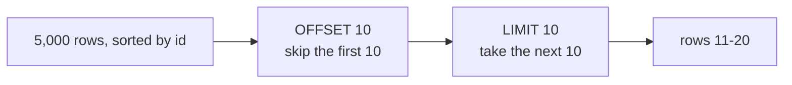

<div align="center">

# 07 · Sorting Records

**Part 1 — SQL Fundamentals** · ✅ Done

</div>

> Section 1 warned that `SELECT` makes no promise about row order. This section is how I actually take control of it — and, now that [06 · Working with Large Datasets](../06-working-with-large-datasets/README.md) left me with 5,000 rows sitting around, how I ask for a *page* of results instead of all of them at once.

💾 Every query on this page is in [`examples.sql`](examples.sql). It uses the shared `sample-db/` schema plus the `page_views` table from section 6.

### 📌 What's in here

| # | Topic | In one line |
|:-:|---|---|
| 1 | [ORDER BY with ASC / DESC](#1-order-by-with-asc--desc) | Choosing the sort order, instead of hoping for one |
| 2 | [Sorting by more than one column](#2-sorting-by-more-than-one-column) | A tiebreaker for when the first column repeats |
| 3 | [LIMIT](#3-limit) | Only the first N rows of the sorted result |
| 4 | [OFFSET and pagination](#4-offset-and-pagination) | Skipping ahead to "page 2" |
| ✔ | [Recap](#recap) · [Practice](#practice) · [What confused me](#what-confused-me) | |

---

## 1. ORDER BY with ASC / DESC

**What it is:** `ORDER BY column` sorts the result. `ASC` (ascending, the default) goes smallest/earliest first; `DESC` goes largest/latest first.

**Why it exists:** Without it, row order is whatever's most convenient for Postgres internally — not something I should ever rely on, as section 1 already found out the hard way.

### Syntax

```sql
SELECT columns FROM table_name ORDER BY column ASC;   -- ASC is the default, can be omitted
SELECT columns FROM table_name ORDER BY column DESC;
```

### Example

```sql
SELECT comment_text, LENGTH(comment_text) AS len
FROM comments
ORDER BY len DESC;
```

**Result**

| comment_text | len |
|---|--:|
| Need this coffee | 16 |
| Where is this? | 14 |
| Take me there | 13 |
| Beautiful! | 10 |
| Great shot | 10 |
| Love this | 9 |

### ⚠️ Traps

- **Ties have no guaranteed relative order.** `'Beautiful!'` and `'Great shot'` are both length `10` — which one comes first between them isn't defined by this query at all. It happened to come out this way; a different run isn't guaranteed to match. See topic 2.
- **Sorting by a column that isn't in `SELECT`** → totally legal (`ORDER BY len` here works even without selecting `len`... except I did select it). Postgres sorts using the full row, not just the displayed columns, so I don't have to select something just to sort by it.

---

## 2. Sorting by more than one column

**What it is:** Additional `ORDER BY` columns act as tiebreakers, applied in the order they're written, only when everything before them is equal.

**Why it exists:** To make sort order fully deterministic, and because "grouped by X, alphabetical within X" is an extremely common real request.

### Syntax

```sql
SELECT columns FROM table_name ORDER BY column1 ASC, column2 DESC;
```

### Example

Every photo, grouped by owner, alphabetical by url within each owner:

```sql
SELECT user_id, url
FROM photos
ORDER BY user_id ASC, url ASC;
```

**Result**

| user_id | url |
|--:|---|
| 1 | coffee.jpg |
| 1 | sunset.jpg |
| 2 | mountain.jpg |
| 3 | city.jpg |
| 5 | beach.jpg |

`user_id 1` (alex) owns two photos — `url ASC` is only consulted to order *those two* relative to each other, because their `user_id`s tied. Every other user has just one photo, so the second sort key never even comes into play for them.

Different columns can sort in different directions:

```sql
SELECT comment_text, LENGTH(comment_text) AS len
FROM comments
ORDER BY len ASC, comment_text ASC;
```

**Result**

| comment_text | len |
|---|--:|
| Love this | 9 |
| Beautiful! | 10 |
| Great shot | 10 |
| Take me there | 13 |
| Where is this? | 14 |
| Need this coffee | 16 |

Now the length-`10` tie is broken deterministically — `'Beautiful!'` before `'Great shot'`, alphabetically.

### ⚠️ Traps

- **Assuming `ORDER BY a, b DESC` sorts both columns descending** → it doesn't. `DESC` only applies to the column it's directly attached to; every other column defaults back to `ASC` unless it says otherwise.

---

## 3. LIMIT

**What it is:** Cuts the result down to the first `N` rows, *after* sorting.

**Why it exists:** "Top 3" and "most recent 10" are everywhere in real applications, and pulling back the whole table just to keep a handful of rows client-side would be wasteful.

### Syntax

```sql
SELECT columns FROM table_name ORDER BY column DESC LIMIT n;
```

### Example

The 3 longest comments:

```sql
SELECT comment_text, LENGTH(comment_text) AS len
FROM comments
ORDER BY len DESC
LIMIT 3;
```

**Result**

| comment_text | len |
|---|--:|
| Need this coffee | 16 |
| Where is this? | 14 |
| Take me there | 13 |

### ⚠️ Traps

> [!WARNING]
> **`LIMIT` without `ORDER BY` is almost meaningless.** `SELECT * FROM page_views LIMIT 5;` returns *some* 5 rows — not necessarily the first 5 by any column I'd recognize, and not guaranteed to be the same 5 if the table changes or Postgres picks a different plan. `LIMIT` only means something predictable once it's cutting into a result that's already sorted.

---

## 4. OFFSET and pagination

**What it is:** `OFFSET n` skips the first `n` rows of the (sorted) result before `LIMIT` starts counting. Together, they slice out one "page" of a larger result.

**Why it exists:** A page of search results, a feed, an admin table — almost nothing shows an entire table at once. `page_views` alone has 5,000 rows; nobody wants that in one response.

### Syntax

```sql
SELECT columns FROM table_name
ORDER BY column
LIMIT page_size OFFSET (page_number - 1) * page_size;
```

### Example

Page 2 of `page_views`, 10 rows per page (so, rows 11–20):

```sql
SELECT id, photo_id, duration_seconds
FROM page_views
ORDER BY id
LIMIT 10 OFFSET 10;
```

**Result**

| id | photo_id | duration_seconds |
|--:|--:|--:|
| 11 | 102 | 21 |
| 12 | 103 | 22 |
| 13 | 104 | 23 |
| 14 | 105 | 24 |
| 15 | 101 | 25 |
| 16 | 102 | 26 |
| 17 | 103 | 27 |
| 18 | 104 | 28 |
| 19 | 105 | 29 |
| 20 | 101 | 30 |



### ⚠️ Traps

- **`OFFSET` on a large table gets slower the further in I page.** Postgres still has to walk through (and discard) every skipped row to know where row `10,001` starts — `OFFSET 10000` does real work, it doesn't jump straight there. On genuinely large tables, keyed pagination (`WHERE id > last_seen_id ORDER BY id LIMIT page_size`) avoids this, at the cost of not being able to jump to an arbitrary page number. I haven't needed that trade-off yet at 5,000 rows, but it's why "just add `OFFSET`" stops being the obvious answer at real scale — more on reading query cost in [23 · Basic Query Tuning](../23-basic-query-tuning/README.md).
- **Paging through a table that's changing between requests** → row `11` on page 2 might not be the same row it was a minute ago if something was inserted or deleted in between, since `OFFSET` counts *positions* in the current sorted result, not stable identities.

---

## Recap

| Concept | What it does |
|---|---|
| `ORDER BY column ASC/DESC` | Sorts the result; `ASC` is the default |
| `ORDER BY col1, col2` | `col2` only breaks ties left over from `col1` |
| `LIMIT n` | Keeps only the first `n` rows, after sorting |
| `OFFSET n` | Skips the first `n` rows, before `LIMIT` counts |
| `LIMIT` + `OFFSET` | One page of a larger, sorted result |

> **The one thing I want to remember:** `LIMIT`/`OFFSET` without `ORDER BY` is a coin flip wearing the costume of a real query — always sort first, or "page 2" isn't a meaningful concept at all.

---

## Practice

**1.** Show the 3 most recent `page_views` (largest `id`).

<details>
<summary>Show answer</summary>

```sql
SELECT id, photo_id FROM page_views ORDER BY id DESC LIMIT 3;
```

| id | photo_id |
|--:|--:|
| 5000 | 101 |
| 4999 | 105 |
| 4998 | 104 |

</details>

**2.** Show photos ordered by owner descending, and alphabetically *descending* within each owner.

<details>
<summary>Show answer</summary>

```sql
SELECT user_id, url FROM photos ORDER BY user_id DESC, url DESC;
```

| user_id | url |
|--:|---|
| 5 | beach.jpg |
| 3 | city.jpg |
| 2 | mountain.jpg |
| 1 | sunset.jpg |
| 1 | coffee.jpg |

</details>

**3.** Get page 3 of `page_views`, 25 rows per page.

<details>
<summary>Show answer</summary>

Page 3 means skipping the first 2 full pages: `OFFSET = (3 - 1) * 25 = 50`.

```sql
SELECT id FROM page_views ORDER BY id LIMIT 25 OFFSET 50;
```

Rows with `id` 51 through 75.

</details>

---

## What confused me

- I assumed `LIMIT` alone was enough to get "the top 5." It only gets *some* 5 unless there's an `ORDER BY` deciding what "top" even means.
- Sorting by a column I never `SELECT`ed felt like it shouldn't be allowed. It's completely fine — `ORDER BY` sees the whole row from the table, not just whatever ended up in the output.
- I expected `OFFSET` to be roughly free, like an index lookup. Learning it has to walk past every skipped row (and gets slower at higher page numbers) changed how I think about "just add pagination" on a big table.

---

[⬅ 06 · Working with Large Datasets](../06-working-with-large-datasets/README.md) · [🏠 Index](../README.md) · [08 · Unions and Intersections with Sets ➡](../08-unions-and-intersections-with-sets/README.md)
