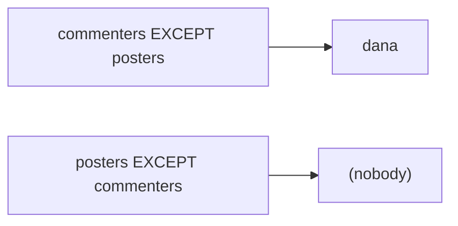

<div align="center">

# 08 · Unions and Intersections with Sets

**Part 1 — SQL Fundamentals** · ✅ Done

</div>

> Every query so far has combined tables *sideways* — a join, widening each row with more columns. This section combines queries *vertically* instead — stacking the results of two separate `SELECT`s into one list, the way math set operations combine two sets.

💾 Every query on this page is in [`examples.sql`](examples.sql). It uses the shared `sample-db/` schema.

### 📌 What's in here

| # | Topic | In one line |
|:-:|---|---|
| 1 | [UNION](#1-union) | Stack two results together, dropping duplicates |
| 2 | [UNION vs UNION ALL](#2-union-vs-union-all) | Keeping duplicates, and why that's sometimes what I want |
| 3 | [INTERSECT / INTERSECT ALL](#3-intersect--intersect-all) | Only rows that appear on both sides |
| 4 | [EXCEPT / EXCEPT ALL](#4-except--except-all) | Rows in the first query, not the second — order matters |
| 5 | [The rules: columns and types](#5-the-rules-columns-and-types) | Same column count, compatible types |
| ✔ | [Recap](#recap) · [Practice](#practice) · [What confused me](#what-confused-me) | |

---

## 1. UNION

**What it is:** Stacks the rows from two `SELECT`s into one result, then removes any duplicate rows from the combined total.

**Why it exists:** Sometimes the answer to a question isn't one query's rows — it's the *combination* of two different questions' rows. "Everyone who's posted, plus everyone who's commented" is naturally two separate queries, glued together.

### Syntax

```sql
SELECT column FROM table1
UNION
SELECT column FROM table2;
```

### Example

Every username that's posted a photo, or commented, or both:

```sql
SELECT u.username FROM users AS u JOIN photos AS p ON u.id = p.user_id
UNION
SELECT u.username FROM users AS u JOIN comments AS c ON u.id = c.user_id
ORDER BY username;
```

**Result**

| username |
|---|
| alex |
| bella |
| chris |
| dana |
| erin |

All 5 users, each listed **once** — even though `alex` owns 2 photos (so the first query alone produces `alex` twice) and `bella` wrote 2 comments (so the second query alone produces `bella` twice). `UNION` doesn't just concatenate; it de-duplicates the *entire combined result*, including duplicates that came from only one side.

### ⚠️ Traps

- **Expecting `UNION` to preserve input order** → same rule as `ORDER BY` everywhere else: nothing about `UNION` promises row order. I added `ORDER BY` at the very end, after both queries, because it applies to the *combined* result, not to either half individually.

---

## 2. UNION vs UNION ALL

**What it is:** `UNION ALL` does the same stacking as `UNION`, but skips the de-duplication step — every row from both sides survives, duplicates included.

**Why it exists:** De-duplication costs work (Postgres has to compare every row against every other row). If I already know there's no overlap, or I actually *want* to count duplicates, `UNION ALL` is both faster and more correct.

### Syntax

```sql
SELECT column FROM table1
UNION ALL
SELECT column FROM table2;
```

### Example

```sql
SELECT u.username FROM users AS u JOIN photos AS p ON u.id = p.user_id
UNION ALL
SELECT u.username FROM users AS u JOIN comments AS c ON u.id = c.user_id;
```

**Result:** 11 rows — `alex` twice (his 2 photos), `bella` twice (her 2 comments), everyone else once each, `dana` once (from the comments side only). Compare that to `UNION`'s 5.

| Operation | Rows returned | Duplicates |
|---|--:|---|
| `UNION` | 5 | removed |
| `UNION ALL` | 11 | kept |

### ⚠️ Traps

- **Reaching for `UNION` out of habit when I actually want a count.** If the real question is "how many total posting-or-commenting *actions* happened," `UNION` quietly throws away the information needed to answer it — I want `UNION ALL` there, then `COUNT(*)` on top.

---

## 3. INTERSECT / INTERSECT ALL

**What it is:** `INTERSECT` returns only the rows present in **both** queries' results (de-duplicated, like `UNION`). `INTERSECT ALL` keeps duplicates, but with a specific rule: a value's count in the result is the *smaller* of its count on each side.

**Why it exists:** "Who has done both X and Y" is a very different question from "who has done X or Y" — `INTERSECT` answers it directly, without a join or a subquery.

### Syntax

```sql
SELECT column FROM table1
INTERSECT
SELECT column FROM table2;
```

### Example

Users who have **both** posted a photo **and** written a comment:

```sql
SELECT u.username FROM users AS u JOIN photos AS p ON u.id = p.user_id
INTERSECT
SELECT u.username FROM users AS u JOIN comments AS c ON u.id = c.user_id
ORDER BY username;
```

**Result**

| username |
|---|
| alex |
| bella |
| chris |
| erin |

`dana` is missing — she's commented, but never posted, so she's not in *both* sets.

### INTERSECT ALL, with a small example

The "smaller count wins" rule only shows up when there are actual duplicates to count, so here's a minimal example built just to see it clearly:

```sql
SELECT * FROM (VALUES ('bella'), ('bella'), ('chris')) AS a(name)
INTERSECT ALL
SELECT * FROM (VALUES ('bella'), ('dana')) AS b(name);
```

**Result**

| name |
|---|
| bella |

`'bella'` appears twice on the left, once on the right — `INTERSECT ALL` keeps the smaller of the two counts, `1`. `'chris'` and `'dana'` don't appear on both sides at all, so neither survives.

### ⚠️ Traps

- **Confusing `INTERSECT` with an `INNER JOIN` on matching columns** → they can look similar, but `INTERSECT` compares whole *rows* between two independent queries. There's no join condition, no combining of columns from each side — the output has exactly the columns of one side, not both.

---

## 4. EXCEPT / EXCEPT ALL

**What it is:** `EXCEPT` returns rows from the **first** query that don't appear in the second (de-duplicated). Unlike `UNION` and `INTERSECT`, **order matters** — `A EXCEPT B` is not the same as `B EXCEPT A`.

**Why it exists:** "Who's commented but never posted" is a "things in this set but not that one" question — exactly what `EXCEPT` is for.

### Syntax

```sql
SELECT column FROM table1
EXCEPT
SELECT column FROM table2;
```

### Example

```sql
SELECT u.username FROM users AS u JOIN comments AS c ON u.id = c.user_id
EXCEPT
SELECT u.username FROM users AS u JOIN photos AS p ON u.id = p.user_id;
```

**Result**

| username |
|---|
| dana |

Flipping the order asks the opposite question — "who's posted but never commented":

```sql
SELECT u.username FROM users AS u JOIN photos AS p ON u.id = p.user_id
EXCEPT
SELECT u.username FROM users AS u JOIN comments AS c ON u.id = c.user_id;
```

**Result:** zero rows. Every single photo-poster has also left at least one comment somewhere, so there's nothing left after subtracting the commenters.



### ⚠️ Traps

- **Treating `EXCEPT` as symmetric, like `UNION`/`INTERSECT` are.** Swapping the two queries in `UNION` or `INTERSECT` never changes the answer. Swapping them in `EXCEPT` almost always does — I read it left-to-right as "first, minus whatever's in second."

---

## 5. The rules: columns and types

**What it is:** Every `SELECT` combined with `UNION`/`INTERSECT`/`EXCEPT` must return the **same number of columns**, in the same positions, with **compatible types** column-for-column.

**Why it exists:** These operators compare whole rows to find duplicates or overlaps — that comparison is meaningless if the two sides don't even have matching "shapes."

### Example — wrong column count

```sql
SELECT username FROM users
UNION
SELECT username, id FROM users;
```

**Result:** Rejected.
```
ERROR:  each UNION query must have the same number of columns
```

### Example — incompatible types

```sql
SELECT id FROM users
UNION
SELECT username FROM users;
```

**Result:** Rejected.
```
ERROR:  UNION types integer and text cannot be matched
```

An `integer` and a `varchar` aren't automatically converted into a shared type here — I have to cast explicitly if I genuinely mean to combine them, e.g. `id::TEXT`.

### ⚠️ Traps

- **Column names come from the *first* query only.** `SELECT username AS name FROM users UNION SELECT username FROM comments;`'s result column is called `name` — the second query's column name (or lack of an alias) is completely ignored for naming purposes, even though its values are still included.

---

## Recap

| Operator | Keeps |
|---|---|
| `UNION` | Everything from both sides, duplicates removed |
| `UNION ALL` | Everything from both sides, duplicates kept |
| `INTERSECT` | Only rows on both sides, duplicates removed |
| `INTERSECT ALL` | Rows on both sides, kept up to the *smaller* count |
| `EXCEPT` | Rows in the first query only — order matters |
| `EXCEPT ALL` | Same, keeping duplicate rows beyond what the second side removes |

> **The one thing I want to remember:** `UNION`/`INTERSECT`/`EXCEPT` compare entire result rows, not related columns like a join does — which means both sides need the same number of columns, in compatible types, before any of this works at all.

---

## Practice

**1.** Which users have posted a photo but never left a comment?

<details>
<summary>Show answer</summary>

```sql
SELECT u.username FROM users AS u JOIN photos AS p ON u.id = p.user_id
EXCEPT
SELECT u.username FROM users AS u JOIN comments AS c ON u.id = c.user_id;
```

Zero rows — every poster has commented on something too (see topic 4).

</details>

**2.** Without running anything: how many rows does `SELECT category FROM products UNION ALL SELECT category FROM products;` return, if `products` (from sections 1–2) has 10 rows?

<details>
<summary>Show answer</summary>

**20.** `UNION ALL` never removes duplicates — it's just every row from the first query, then every row from the second, concatenated. Since it's the same 10-row table both times, that's `10 + 10`.

</details>

**3.** What's wrong with this query?
```sql
SELECT username, id FROM users
UNION
SELECT id, username FROM users;
```

<details>
<summary>Show answer</summary>

The column *count* matches (2 and 2), but the column *order* doesn't — the first query is `(text, integer)` and the second is `(integer, text)`. `UNION` matches columns by position, not by name, so this fails the same way a straight type mismatch would:
```
ERROR:  UNION types character varying and integer cannot be matched
```

</details>

---

## What confused me

- I expected `UNION` to just glue two result sets together, like `UNION ALL` does. The automatic de-duplication — even removing duplicates that only existed within *one* side — surprised me the first time `alex` collapsed from two rows to one.
- `EXCEPT` not being symmetric took real getting used to. `UNION` and `INTERSECT` never cared which query I wrote first; `EXCEPT` cares enormously.
- I initially thought `INTERSECT` needed a matching column, like a join's `ON`. It doesn't — it compares entire output rows, which is why both sides need the exact same column shape to make any sense at all.

---

[⬅ 07 · Sorting Records](../07-sorting-records/README.md) · [🏠 Index](../README.md) · [09 · Assembling Queries with Subqueries ➡](../09-assembling-queries-with-subqueries/README.md)
