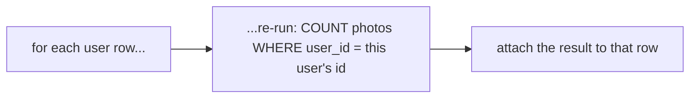

<div align="center">

# 09 · Assembling Queries with Subqueries

**Part 1 — SQL Fundamentals** · ✅ Done

</div>

> Some questions genuinely need two steps: "find the photo with the *most* comments" means first counting comments per photo, then finding the biggest count. A subquery is how both steps live in one statement — one `SELECT` used as an ingredient inside another.

💾 Every query on this page is in [`examples.sql`](examples.sql). It uses the shared `sample-db/` schema.

### 📌 What's in here

| # | Topic | In one line |
|:-:|---|---|
| 1 | [What a subquery is](#1-what-a-subquery-is) | A query nested inside another query |
| 2 | [The shape of a result](#2-the-shape-of-a-result) | Single value, one column, or a full table — it decides where a subquery fits |
| 3 | [Subqueries in SELECT](#3-subqueries-in-select) | Must return exactly one value |
| 4 | [Subqueries in FROM](#4-subqueries-in-from) | A whole derived table — and it needs an alias |
| 5 | [Subqueries in JOIN](#5-subqueries-in-join) | Joining to a derived table instead of a real one |
| 6 | [Subqueries in WHERE](#6-subqueries-in-where) | `IN`, `NOT IN`, and direct comparisons |
| 7 | [ALL and SOME / ANY](#7-all-and-some--any) | Comparing against every, or just one, row in a list |
| 8 | [Correlated subqueries](#8-correlated-subqueries) | A subquery that re-runs once per outer row |
| 9 | [SELECT without FROM](#9-select-without-from) | When there's no table to query at all |
| ✔ | [Recap](#recap) · [Practice](#practice) · [What confused me](#what-confused-me) | |

---

## 1. What a subquery is

**What it is:** A complete `SELECT` statement, wrapped in parentheses, sitting inside another query — used anywhere a value, list, or table would normally go.

**Why it exists:** Some questions need an intermediate result before the real question can be asked. "Which photo has the most comments" can't be answered in one pass over `photos` alone — I first need to know *how many comments each photo has*, which is itself a query.

### Example

```sql
SELECT username
FROM users
WHERE id IN (SELECT user_id FROM photos);
```

The parenthesized `SELECT user_id FROM photos` runs first (conceptually), producing a list of ids; the outer query then filters `users` against that list. Two questions, one statement.

---

## 2. The shape of a result

**What it is:** A subquery's result has a shape — how many rows, how many columns — and that shape decides exactly where it's legal to use.

**Why it exists:** `WHERE price = (subquery)` only makes sense if the subquery returns exactly one value. Postgres enforces that, rather than guessing what I meant with three rows instead of one.

| Shape | Example | Usable where |
|---|---|---|
| Single value (1 row, 1 column) | `(SELECT COUNT(*) FROM photos)` | Anywhere a literal could go — `SELECT`, `WHERE column = ...` |
| Single column (many rows, 1 column) | `(SELECT user_id FROM photos)` | `IN`, `NOT IN`, `ALL`, `ANY`/`SOME` |
| Full table (many rows, many columns) | `(SELECT * FROM photos)` | `FROM`, `JOIN` — with an alias |

### ⚠️ Traps

- **Using a multi-row subquery where a single value is expected** →
  ```sql
  SELECT username FROM users WHERE id = (SELECT user_id FROM photos);
  ```
  ```
  ERROR:  more than one row returned by a subquery used as an expression
  ```
  `photos` has 5 rows, so this subquery returns 5 values, not 1 — `=` can't compare against a list. `IN` (topic 6) is what I actually meant.

---

## 3. Subqueries in SELECT

**What it is:** A subquery inside the column list. It must return a single value (or `NULL`) per outer row — a scalar.

**Why it exists:** Sometimes one extra computed number belongs next to every row, without needing a full `JOIN` + `GROUP BY` just to get it.

### Syntax

```sql
SELECT column, (SELECT ... ) AS extra_column
FROM table_name;
```

### Example

```sql
SELECT username, (SELECT COUNT(*) FROM photos) AS total_photos_ever
FROM users;
```

**Result**

| username | total_photos_ever |
|---|--:|
| alex | 5 |
| bella | 5 |
| chris | 5 |
| dana | 5 |
| erin | 5 |

The subquery doesn't reference anything from `users` — it computes the same single number (`5`, the total row count of `photos`) once, and Postgres attaches it to every outer row. A subquery that *does* reference the outer row is a **correlated** subquery, covered properly in topic 8.

### ⚠️ Traps

- **Forgetting this must be a scalar** → `(SELECT url FROM photos)` here would hit the exact "more than one row" error from topic 2, since `photos` has 5 rows and a `SELECT`-list subquery can only ever contribute one value per row.

---

## 4. Subqueries in FROM

**What it is:** A subquery used as if it were a table, in the `FROM` clause. Its result becomes a **derived table** — rows and columns I can `SELECT`, `WHERE`, or further `JOIN`, exactly like a real table.

**Why it exists:** Some questions are naturally two steps: aggregate first, *then* filter or sort the aggregated result — which `HAVING` can do too, but a derived table reads more clearly once there's more than one follow-up step.

### Syntax

```sql
SELECT columns
FROM (SELECT ...) AS alias
WHERE condition;
```

### Example

```sql
SELECT photo_counts.username, photo_counts.cnt
FROM (
    SELECT u.username, COUNT(p.id) AS cnt
    FROM users AS u
    LEFT JOIN photos AS p ON u.id = p.user_id
    GROUP BY u.username
) AS photo_counts
WHERE photo_counts.cnt > 0;
```

**Result**

| username | cnt |
|---|--:|
| alex | 2 |
| bella | 1 |
| chris | 1 |
| erin | 1 |

The inner query (identical to a [05 · Aggregation](../05-aggregation-of-records/README.md) `GROUP BY`) runs first and produces a 5-row table (`dana` included, at `0`). The outer query then treats that result as an ordinary table called `photo_counts` and filters it — `dana` drops out here, in the *outer* `WHERE`, not inside the subquery.

### ⚠️ Traps

> [!IMPORTANT]
> **A subquery in `FROM` must have an alias.** Leaving off `AS photo_counts` is a syntax error in Postgres — unlike a real table, a derived table has no name of its own until I give it one.

---

## 5. Subqueries in JOIN

**What it is:** The same derived-table idea from topic 4, but joined to another table instead of queried on its own.

**Why it exists:** Sometimes I need the aggregate *alongside* columns from the original table, not instead of them.

### Example

```sql
SELECT u.username, cc.comment_count
FROM users AS u
JOIN (
    SELECT user_id, COUNT(*) AS comment_count
    FROM comments
    GROUP BY user_id
) AS cc ON u.id = cc.user_id;
```

**Result**

| username | comment_count |
|---|--:|
| alex | 1 |
| bella | 2 |
| chris | 1 |
| dana | 1 |
| erin | 1 |

Every user appears because, as it turns out, all 5 have written at least one comment (see [08 · Sets](../08-unions-and-intersections-with-sets/README.md)) — an `INNER JOIN` here would have silently hidden anyone with zero, same trap as always.

---

## 6. Subqueries in WHERE

**What it is:** A subquery used inside a `WHERE` condition — as a list for `IN`/`NOT IN`, or as a single value for direct comparison.

**Why it exists:** "Users who own a photo" is naturally "give me the ids that show up in `photos`, then check who's in that list" — exactly what `IN` with a subquery expresses.

### Syntax

```sql
SELECT columns FROM table_name WHERE column IN (SELECT ...);
SELECT columns FROM table_name WHERE column NOT IN (SELECT ...);
```

### Example

```sql
SELECT username
FROM users
WHERE id IN (SELECT user_id FROM photos);
```

**Result**

| username |
|---|
| alex |
| bella |
| chris |
| erin |

Same answer as the `JOIN`-based version from section 4, and the `INTERSECT`-based version from section 8 — three different tools, one question. I reach for whichever reads clearest for the specific query; there's rarely only one "correct" way.

### ⚠️ Traps

> [!WARNING]
> **`NOT IN` with a subquery inherits the exact `NULL` trap from [02 · Filtering Records](../02-filtering-records/README.md) — and it's easier to trigger by accident here**, because I might not immediately notice the subquery's column can contain `NULL`. `photos.user_id` has no `NOT NULL` constraint (section 3), so this is possible:
> ```sql
> INSERT INTO photos (url, user_id) VALUES ('orphan.jpg', NULL);
>
> SELECT username FROM users WHERE id NOT IN (SELECT user_id FROM photos);
> ```
> **Zero rows** — not even `dana`, who genuinely owns no photos. The subquery's result list now contains a `NULL`, and (as topic 7 explains precisely) `NOT IN` is really `<> ALL(...)`, which can never be certain once one comparison is unknown. The fix is filtering `NULL`s out of the subquery itself:
> ```sql
> SELECT username FROM users
> WHERE id NOT IN (SELECT user_id FROM photos WHERE user_id IS NOT NULL);
> ```
> (I removed the `orphan.jpg` test row again afterward — it isn't part of the real seed data.)

---

## 7. ALL and SOME / ANY

**What it is:** `= ANY (subquery)` compares against a list, true if **any** row matches — this is exactly what `IN` secretly is. `<> ALL (subquery)` requires **every** comparison to hold — exactly what `NOT IN` secretly is. `SOME` is just another word for `ANY`; they're interchangeable.

**Why it exists:** `IN`/`NOT IN` only ever mean equality. `ALL`/`ANY` work with *any* comparison operator — `>`, `<`, `>=` — against every value a subquery returns.

### Syntax

```sql
SELECT columns FROM table_name WHERE column operator ALL (subquery);
SELECT columns FROM table_name WHERE column operator ANY (subquery);  -- SOME is a synonym
```

### Example

The photo(s) with the *most* comments — "my comment count is `>=` every photo's comment count":

```sql
SELECT p.url
FROM photos AS p
WHERE (SELECT COUNT(*) FROM comments AS c WHERE c.photo_id = p.id)
      >= ALL (SELECT COUNT(*) FROM comments GROUP BY photo_id);
```

**Result**

| url |
|---|
| sunset.jpg |

`sunset.jpg` has 2 comments; every other photo has 1. `2 >= ALL([2, 1, 1, 1, 1])` is the only comparison that holds for every element in that list — this is exactly `>= MAX(...)`, spelled a different way.

### ⚠️ Traps

- **`IN` and `= ANY` looking identical and feeling redundant** → they are identical for equality. `ANY`/`ALL` only start earning their keep with a non-`=` operator, which `IN` can't express at all.

---

## 8. Correlated subqueries

**What it is:** A subquery that references a column from the *outer* query — meaning it can't run once and be done; conceptually, Postgres re-evaluates it for every outer row.

**Why it exists:** "This photo's comment count" is a different number for every photo — the subquery needs to know *which* photo it's currently being asked about.

### Syntax

```sql
SELECT outer_table.column,
       (SELECT ... FROM inner_table WHERE inner_table.fk = outer_table.pk) AS computed
FROM outer_table;
```

### Example

```sql
SELECT u.username,
       (SELECT COUNT(*) FROM photos AS p WHERE p.user_id = u.id) AS photo_count
FROM users AS u;
```

**Result**

| username | photo_count |
|---|--:|
| alex | 2 |
| bella | 1 |
| chris | 1 |
| dana | 0 |
| erin | 1 |

Compare this to topic 3's example — same *position* in the query (inside `SELECT`), but `p.user_id = u.id` ties the inner query to whichever outer row is currently being processed. That's the entire difference between "a subquery that happens to be in `SELECT`" and "a *correlated* subquery."



### ⚠️ Traps

- **Assuming a correlated subquery runs once, like the non-correlated one in topic 3** → conceptually it runs once per outer row (Postgres's planner often optimizes the actual execution, but the *meaning* is "once per row"). This is usually fine at small scale; at large scale it's worth knowing a `JOIN` + `GROUP BY` can often express the same thing and let the planner consider different strategies — more on comparing plans in [23 · Basic Query Tuning](../23-basic-query-tuning/README.md).

---

## 9. SELECT without FROM

**What it is:** A `SELECT` with no `FROM` clause at all — Postgres just evaluates the expression list once and returns it as a one-row result.

**Why it exists:** Not everything needs a table. Sometimes I just want a calculation, a constant, or a built-in value.

### Syntax

```sql
SELECT expression;
```

### Example

```sql
SELECT 1 + 1 AS sum, NOW() AS right_now, version() AS pg_version;
```

**Result** *(shape only — the actual values depend on when and where this runs)*

| sum | right_now | pg_version |
|--:|---|---|
| 2 | 2026-09-28 10:00:00 | PostgreSQL 17.x ... |

This is also exactly what a scalar subquery like `(SELECT COUNT(*) FROM photos)` reduces to once evaluated — a `SELECT` that happens to have a `FROM`, collapsed down to one value, used as if it never needed a table at all.

### ⚠️ Traps

- **Writing `SELECT NOW()` inside a loop-like process expecting a fresh timestamp each call** → within a single statement (or transaction, depending on the function), `NOW()` is fixed at the start — it doesn't tick forward mid-query. Not something I've hit yet, but worth remembering before [29 · Handling Concurrency and Reversibility with Transactions](../29-handling-concurrency-and-reversibility-with-transactions/README.md).

---

## Recap

| Concept | What it does |
|---|---|
| Subquery | A `SELECT` nested inside another query |
| Scalar shape | 1 row, 1 column — usable anywhere a literal value goes |
| Column shape | Many rows, 1 column — usable with `IN`/`NOT IN`/`ALL`/`ANY` |
| Table shape | Many rows, many columns — usable in `FROM`/`JOIN`, needs an alias |
| `IN` / `NOT IN` | Shorthand for `= ANY` / `<> ALL` — equality only |
| `ALL` / `ANY` (`SOME`) | Compare against every / any row a subquery returns, with any operator |
| Correlated subquery | References the outer row; conceptually re-runs per row |
| `SELECT` with no `FROM` | A one-off expression, no table needed |

> **The one thing I want to remember:** `NOT IN` is `<> ALL(...)` under the hood — which is exactly why a single `NULL` anywhere in that list poisons the whole thing. Once I saw it as `ALL`, the section 2 trap stopped feeling like a special case and started feeling like the obvious consequence of how it actually works.

---

## Practice

**1.** Show every photo's url next to the username of its owner, using a subquery in `SELECT` instead of a `JOIN`.

<details>
<summary>Show answer</summary>

```sql
SELECT url, (SELECT username FROM users WHERE id = photos.user_id) AS owner
FROM photos;
```

| url | owner |
|---|---|
| sunset.jpg | alex |
| mountain.jpg | bella |
| coffee.jpg | alex |
| city.jpg | chris |
| beach.jpg | erin |

This is a correlated subquery — `photos.user_id` ties it to whichever `photos` row is currently being processed.

</details>

**2.** Which users have written *more than the average number* of comments per user?

<details>
<summary>Show answer</summary>

```sql
SELECT username FROM (
    SELECT u.username, COUNT(c.id) AS cnt
    FROM users AS u
    LEFT JOIN comments AS c ON u.id = c.user_id
    GROUP BY u.username
) AS counts
WHERE cnt > (SELECT AVG(cnt) FROM (
    SELECT COUNT(*) AS cnt FROM comments GROUP BY user_id
) AS averages);
```

Average comments per (commenting) user is `6 / 5 = 1.2`. Only `bella`, with `2`, is above it.

| username |
|---|
| bella |

</details>

**3.** What's wrong with this query?
```sql
SELECT username FROM users WHERE id = (SELECT user_id FROM photos);
```

<details>
<summary>Show answer</summary>

`photos` has 5 rows, so the subquery returns 5 values — `=` needs exactly one. Postgres rejects it:
```
ERROR:  more than one row returned by a subquery used as an expression
```
`IN` is the fix if the intent was "matches any of these ids."

</details>

---

## What confused me

- I kept expecting a subquery in `SELECT` to be able to return a whole row of extra columns. It can only ever be one value — anything richer needs to move to `FROM` or `JOIN` instead.
- The forgotten-alias error on a `FROM` subquery ("subquery in FROM must have an alias") felt pedantic at first. It stopped feeling that way once I tried to reference `photo_counts.cnt` in the outer query and realized there'd be no name to reference at all otherwise.
- `IN` and `= ANY` being the literal same thing didn't click until I saw `NOT IN` rewritten as `<> ALL`. Once I saw it that way, the `NULL` trap from section 2 stopped being a "gotcha to memorize" and became something I could actually reason through.
- I assumed a correlated subquery was just a regular subquery that happened to mention the outer table. The real distinction is that it *can't* be evaluated once, up front — its answer depends on which outer row is currently in play.

---

[⬅ 08 · Unions and Intersections with Sets](../08-unions-and-intersections-with-sets/README.md) · [🏠 Index](../README.md) · [10 · Selecting Distinct Records ➡](../10-selecting-distinct-records/README.md)
