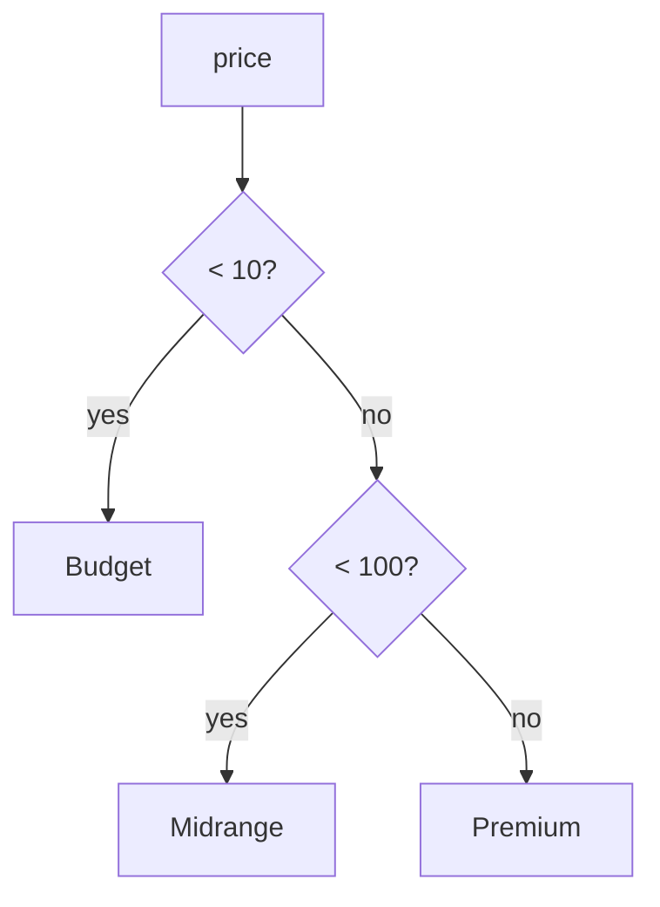

<div align="center">

# 11 · Utility Operators, Keywords, and Functions

**Part 1 — SQL Fundamentals** · ✅ Done

</div>

> A short section closing out Part 1 — two tools that don't fit neatly under "filtering" or "aggregating," but that I ended up reaching for constantly once I knew them: picking the biggest of a *few values in one row*, and branching logic right inside a query.

💾 Every query on this page is in [`examples.sql`](examples.sql). It uses `products` (sections 1–2).

### 📌 What's in here

| # | Topic | In one line |
|:-:|---|---|
| 1 | [GREATEST and LEAST](#1-greatest-and-least) | The biggest/smallest of a handful of values, sideways not down |
| 2 | [CASE expressions](#2-case-expressions) | If/else logic that produces a value |
| ✔ | [Recap](#recap) · [Practice](#practice) · [What confused me](#what-confused-me) | |

---

## 1. GREATEST and LEAST

**What it is:** `GREATEST(a, b, c, ...)` returns the largest of a fixed list of values; `LEAST` returns the smallest. Both compare values written out *side by side*, within a single row — not across many rows like `MAX`/`MIN` from [05 · Aggregation](../05-aggregation-of-records/README.md).

**Why it exists:** "Whichever of these two or three things is bigger" comes up constantly and has nothing to do with grouping rows — `MAX` would need a whole aggregation just to compare two numbers I already have.

### Syntax

```sql
SELECT GREATEST(value1, value2, ...);
SELECT LEAST(value1, value2, ...);
```

### Example — a price floor

```sql
SELECT name, price, GREATEST(price, 5) AS floor_price
FROM products;
```

**Result**

| name | price | floor_price |
|---|--:|--:|
| Wireless Mouse | 25 | 25 |
| Notebook | 3 | 5 |
| Desk Lamp | 40 | 40 |
| USB-C Cable | 10 | 10 |
| Coffee Mug | 8 | 8 |
| Mechanical Keyboard | 85 | 85 |
| Sticky Notes | 2 | 5 |
| Bluetooth Speaker | 60 | 60 |
| Standing Desk | 350 | 350 |
| Ballpoint Pen | *(NULL)* | 5 |

Anything below `5` gets bumped up to `5`; everything else passes through unchanged — a clamp, in one function call.

> [!NOTE]
> **`Ballpoint Pen`'s `NULL` price became `5`, not `NULL`.** This is deliberately different from how `NULL` behaves almost everywhere else in this course. Postgres's docs are explicit: `GREATEST`/`LEAST` ignore `NULL` arguments and only return `NULL` if *every* argument is `NULL`. It's a genuine exception to the "`NULL` poisons the whole expression" rule from [02 · Filtering Records](../02-filtering-records/README.md) — worth remembering precisely because it's the odd one out.

### ⚠️ Traps

- **Confusing this with `MAX`/`MIN`.** `GREATEST(price, 5)` compares *within one row*, across the values I hand it. `MAX(price)` compares *across all rows* in a group. They solve different-shaped problems and aren't interchangeable.

---

## 2. CASE expressions

**What it is:** Inline if/else logic that evaluates to a single value — usable anywhere an expression can go: `SELECT`, `WHERE`, `ORDER BY`, even inside an aggregate function.

**Why it exists:** Turning a raw value into a labeled category ("budget" / "premium") is common enough that doing it in the query — instead of after fetching the data — keeps that logic in one place.

### Syntax

```sql
-- "Searched" CASE: any condition per branch
CASE
    WHEN condition1 THEN result1
    WHEN condition2 THEN result2
    ELSE fallback
END

-- "Simple" CASE: compares one expression against each value
CASE expression
    WHEN value1 THEN result1
    WHEN value2 THEN result2
    ELSE fallback
END
```

### Example — searched CASE

```sql
SELECT name, price,
    CASE
        WHEN price IS NULL  THEN 'Unpriced'
        WHEN price < 10     THEN 'Budget'
        WHEN price < 100    THEN 'Midrange'
        ELSE 'Premium'
    END AS price_tier
FROM products;
```

**Result**

| name | price | price_tier |
|---|--:|---|
| Wireless Mouse | 25 | Midrange |
| Notebook | 3 | Budget |
| Desk Lamp | 40 | Midrange |
| USB-C Cable | 10 | Midrange |
| Coffee Mug | 8 | Budget |
| Mechanical Keyboard | 85 | Midrange |
| Sticky Notes | 2 | Budget |
| Bluetooth Speaker | 60 | Midrange |
| Standing Desk | 350 | Premium |
| Ballpoint Pen | *(NULL)* | Unpriced |

Branches are checked **top to bottom**, and the first match wins — `USB-C Cable` at exactly `10` skips `price < 10` (false) and lands on `price < 100` (true), becoming `Midrange`, not `Budget`.

### Example — simple CASE

When every branch is just checking one expression for equality, the shorter form reads cleaner:

```sql
SELECT category,
    CASE category
        WHEN 'Electronics' THEN '🔌'
        WHEN 'Stationery'  THEN '✏️'
        WHEN 'Home'        THEN '🏠'
    END AS icon
FROM products;
```

### Example — CASE inside an aggregate

Combining `CASE` with `SUM` is how I count rows matching different conditions, all in one pass, without three separate queries:

```sql
SELECT
    SUM(CASE WHEN price < 10 THEN 1 ELSE 0 END)                    AS budget_count,
    SUM(CASE WHEN price >= 10 AND price < 100 THEN 1 ELSE 0 END)   AS midrange_count,
    SUM(CASE WHEN price >= 100 THEN 1 ELSE 0 END)                  AS premium_count
FROM products;
```

**Result**

| budget_count | midrange_count | premium_count |
|--:|--:|--:|
| 3 | 5 | 1 |

Only `9` of the `10` products are accounted for — `Ballpoint Pen`'s `NULL` price fails every single condition (section 2's `NULL` rules again), so it contributes `0` to all three, silently. Neither `CASE` nor `SUM` errors; the row just doesn't count anywhere.



### ⚠️ Traps

- **No `ELSE`, and nothing matches** → the whole `CASE` quietly evaluates to `NULL`, not an error. If I'd left `ELSE 'Premium'` off the searched example, `Standing Desk` (which matches none of the first three branches) would just come back `NULL` — I always add an explicit `ELSE` unless I specifically want that fallback behavior.
- **Forgetting branches are order-sensitive** → putting `WHEN price < 100 THEN 'Midrange'` *before* `WHEN price < 10 THEN 'Budget'` would make `Budget` unreachable — everything under `100` matches the first branch and stops there.

---

## Recap

| Tool | What it does |
|---|---|
| `GREATEST(a, b, ...)` / `LEAST(a, b, ...)` | Largest/smallest of a handful of values in one row — ignores `NULL`s unless all are `NULL` |
| `MAX`/`MIN` (section 5) | The same idea, but aggregated down a column across many rows |
| Searched `CASE WHEN ... THEN ...` | Branches on arbitrary conditions, checked top to bottom |
| Simple `CASE expr WHEN ... THEN ...` | Shorthand when every branch just checks one expression for equality |
| `CASE` with no matching branch, no `ELSE` | Evaluates to `NULL`, not an error |
| `SUM(CASE WHEN ... THEN 1 ELSE 0 END)` | Conditional counting inside one aggregate query |

> **The one thing I want to remember:** `GREATEST`/`LEAST` are the rare functions that deliberately *don't* propagate `NULL` — everything else in this course has taught me to expect the opposite, which is exactly why it's worth remembering as the exception.

---

## Practice

**1.** Using `GREATEST` and `LEAST` together, clamp every product's `stock` between `10` and `400`.

<details>
<summary>Show answer</summary>

```sql
SELECT name, stock, LEAST(GREATEST(stock, 10), 400) AS clamped_stock
FROM products;
```

`GREATEST(stock, 10)` raises the floor first; wrapping that in `LEAST(..., 400)` then caps the ceiling. `Sticky Notes` (`600`) becomes `400`; `Bluetooth Speaker` (`0`) becomes `10`; everything already in range is untouched.

</details>

**2.** Label each product `'In stock'` if `stock > 0`, otherwise `'Out of stock'`.

<details>
<summary>Show answer</summary>

```sql
SELECT name, stock,
    CASE WHEN stock > 0 THEN 'In stock' ELSE 'Out of stock' END AS availability
FROM products;
```

Only `Bluetooth Speaker` (`stock = 0`) comes back `'Out of stock'`.

</details>

**3.** What does this return for `Ballpoint Pen`, and why?
```sql
SELECT CASE WHEN price > 5 THEN 'Expensive' WHEN price <= 5 THEN 'Cheap' END
FROM products WHERE name = 'Ballpoint Pen';
```

<details>
<summary>Show answer</summary>

**`NULL`.** `Ballpoint Pen`'s `price` is `NULL`; `NULL > 5` and `NULL <= 5` are both `NULL` (unknown), not `TRUE` — so neither branch matches, and with no `ELSE`, the whole expression falls through to `NULL`.

</details>

---

## What confused me

- I assumed `GREATEST`/`LEAST` would propagate `NULL` like everything else — `price` or `stock` being unknown *feels* like it should make the whole comparison unknown too. Postgres deliberately special-cased this, and now it's the one function pair I remember specifically *because* it breaks the pattern.
- The first time I put my `CASE` branches in the wrong order (broadest condition first), I got confused why nothing ever showed `'Budget'`. Top-to-bottom, first-match evaluation is the whole mental model — it's not evaluating every condition and picking the best match.
- A `CASE` with no `ELSE` silently returning `NULL` instead of erroring surprised me. It's consistent with everything else in Postgres treating "no answer" as `NULL` rather than a failure, but I still add `ELSE` out of habit now.

---

[⬅ 10 · Selecting Distinct Records](../10-selecting-distinct-records/README.md) · [🏠 Index](../README.md) · [12 · PostgreSQL Complex Datatypes ➡](../12-postgresql-complex-datatypes/README.md)
