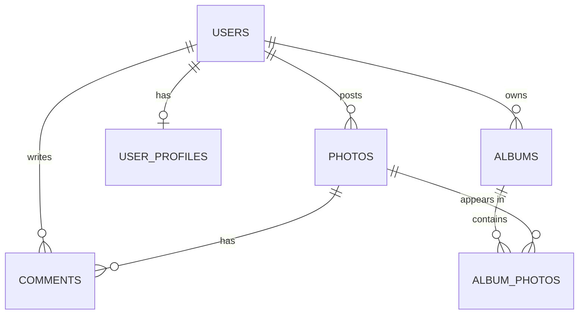

<div align="center">

# 14 · Database Structure Design Patterns

**Part 3 — Database Design** · ✅ Done

</div>

> Part 1 and 2 taught me the pieces — tables, keys, types, constraints. This section is the first time I stop and ask how I actually *use* them together, on purpose, before writing a single `CREATE TABLE`. It's less new syntax and more turning everything so far into a repeatable process — one I'll reuse for real in sections 15–19.

💾 Every query on this page is in [`examples.sql`](examples.sql). It adds a small `albums` feature on top of the shared `sample-db/` schema, as a worked example of the process below.

### 📌 What's in here

| # | Topic | In one line |
|:-:|---|---|
| 1 | [A process for approaching database design](#1-a-process-for-approaching-database-design) | Seven questions, asked in order, before any SQL |
| 2 | [Schema diagram tools](#2-schema-diagram-tools) | Drawing the design before — or after — building it |
| 3 | [Naming conventions](#3-naming-conventions) | The choices this whole repo has quietly been making |
| ✔ | [Recap](#recap) · [Practice](#practice) · [What confused me](#what-confused-me) | |

---

## 1. A process for approaching database design

**What it is:** A repeatable sequence of questions, built from everything Part 1 and 2 already covered, turned into an order to ask them in.

**Why it exists:** Section 3 designed `users`/`photos`/`comments` somewhat informally. Sections 15–19 are about to design `likes`, `mentions`, `hashtags`, and `followers` for real — having an actual process means not re-deriving it from scratch each time.

### The seven questions

1. **What are the "nouns"?** — the real-world things worth their own table.
2. **What properties does each one have?** — its columns, and the right type for each (section 12).
3. **How are they related?** — one-to-many, one-to-one, or many-to-many (section 3).
4. **What are the keys?** — primary key per table, foreign keys for every relationship.
5. **What rules must always hold?** — `NOT NULL`, `UNIQUE`, `CHECK`, `ON DELETE` behavior (sections 3, 13).
6. **Draw it.** — a diagram catches a wrong relationship faster than SQL does (topic 2).
7. **Test it against real questions.** — can this schema actually answer the things I'll ask it?

### Worked example: photo albums

Walking a genuinely new feature through all seven:

**1. Nouns:** `album` — a named, user-owned collection of photos.

**2. Properties:** a name, an owner, when it was created.

**3. Relationships:** one user has many albums (one-to-many — same shape as `users`→`photos`). One album can contain many photos, and a photo could reasonably sit in more than one album — that's many-to-many, which (section 3) means a join table.

**4. Keys:**

```sql
CREATE TABLE albums (
    id         SERIAL PRIMARY KEY,
    name       VARCHAR(100) NOT NULL,
    user_id    INTEGER NOT NULL REFERENCES users(id) ON DELETE CASCADE,
    created_at TIMESTAMP NOT NULL DEFAULT NOW()
);

CREATE TABLE album_photos (
    album_id INTEGER NOT NULL REFERENCES albums(id) ON DELETE CASCADE,
    photo_id INTEGER NOT NULL REFERENCES photos(id) ON DELETE CASCADE,
    PRIMARY KEY (album_id, photo_id)
);
```

`album_photos` has no `id` column of its own — its **primary key is the combination** of both foreign keys. For a pure join table like this, that combination *is* the natural uniqueness rule ("this photo is either in this album once, or not at all"), so a composite primary key does the job of both the primary key and a `UNIQUE (album_id, photo_id)` constraint at once.

**5. Rules:** `name NOT NULL` (an album needs a name), `ON DELETE CASCADE` on both foreign keys in `album_photos` — deleting an album or a photo should clean up the membership row, not leave it pointing at nothing.

**6. Diagram:** see topic 2.

**7. Test it:**

```sql
INSERT INTO albums (name, user_id) VALUES ('Summer Trip', 1);
INSERT INTO album_photos (album_id, photo_id) VALUES (1, 101), (1, 103);

SELECT p.url
FROM album_photos AS ap
JOIN photos AS p ON ap.photo_id = p.id
WHERE ap.album_id = 1;
```

**Result**

| url |
|---|
| sunset.jpg |
| coffee.jpg |

The schema answers "what's in this album" in one join — if it couldn't, that would mean going back to step 3 or 4, *before* writing more code around a shape that doesn't fit.

### ⚠️ Traps

- **Jumping straight to `CREATE TABLE`.** Every genuinely awkward query I've hit in this course so far traced back to a relationship I modeled wrong in step 3 — not a syntax problem. The seven questions are cheap; rebuilding a table full of real data later isn't.
- **Picking one-to-many when the real relationship is many-to-many** → I almost gave `albums` a `photo_id` column directly on `albums` itself, which would have silently limited every album to exactly one photo. The "could this thing reasonably have more than one of the other thing, from either side?" question is what catches this.

---

## 2. Schema diagram tools

**What it is:** A picture of tables, columns, and the relationships between them — drawn either before building (to think it through) or after (to document what exists).

**Why it exists:** A relationship that's wrong is often obvious in a diagram and easy to miss reading `CREATE TABLE` statements top to bottom.

### Mermaid ER diagrams (what this repo uses)

The same Mermaid tool behind every flowchart in these notes also draws proper entity-relationship diagrams, rendered right on GitHub:



`||` means "exactly one," `o{` means "zero or many," `o|` means "zero or one" — `USERS ||--o| USER_PROFILES` reads as "one user has zero or one profile," matching the one-to-one from section 12.

### Other tools worth knowing exist

- **dbdiagram.io** — writes a small DSL, renders a clean diagram; good for sketching a design *before* any SQL exists.
- **pgAdmin's ERD tool** / **DBeaver** — generates a diagram *from* an existing, already-connected database — good for topic 2's "document what's really there" use case.

I don't have a strong preference yet; Mermaid wins for these notes specifically because it's plain text that lives next to the SQL and renders without a separate tool.

### ⚠️ Traps

- **Treating the diagram as the source of truth once the tables exist.** A hand-drawn diagram can drift out of sync with the real schema the moment someone runs an `ALTER TABLE` and forgets to update it. Tools that generate the diagram *from* the live database (like pgAdmin's ERD view) don't have this problem.

---

## 3. Naming conventions

**What it is:** The consistent naming choices this repo has been making since section 1, made explicit.

**Why it exists:** A schema is read far more often than it's written. Consistent names mean I can guess a column name correctly before ever looking it up.

### The conventions used throughout these notes

| Choice | Example | Alternative (not used here, but exists) |
|---|---|---|
| `snake_case`, all lowercase | `comment_text`, `user_id` | `camelCase`, `PascalCase` |
| Table names: plural | `users`, `photos`, `comments` | Singular: `user`, `photo` |
| Primary key: always `id` | `users.id` | Table-prefixed: `user_id` as the PK itself |
| Foreign key: `<singular table>_id` | `photos.user_id` → `users.id` | Just `owner`, `fk_user`, etc. |
| Boolean columns: `is_`/`has_` prefix | `is_verified` | A bare adjective: `verified` |
| Timestamps: `_at` suffix | `created_at` | `date_created`, `created_date` |
| Join tables: both table names | `album_photos` | A made-up unrelated name |

### ⚠️ Traps

- **Mixing conventions within one schema.** `member_since` (section 12) doesn't follow the `_at` pattern the rest of this repo uses for timestamps — it reads fine on its own, but a newcomer scanning the schema for "every timestamp column" by searching for `_at` would miss it. Worth knowing it's there; not worth a disruptive rename for one column at this stage.
- **Naming a foreign key column just `id`.** `photos.user_id` makes it immediately obvious which table it points to; a column named plain `id` on `photos` is ambiguous with `photos.id` itself the moment both are ever mentioned in the same sentence, let alone the same query.

---

## Recap

| Step | Question |
|---|---|
| 1 | What are the nouns — the things worth their own table? |
| 2 | What properties does each one have, and what type is each? |
| 3 | How are they related — one-to-many, one-to-one, many-to-many? |
| 4 | What are the primary and foreign keys? |
| 5 | What rules must always hold — `NOT NULL`, `UNIQUE`, `CHECK`, `ON DELETE`? |
| 6 | Draw it |
| 7 | Test it against real questions the app will actually ask |

> **The one thing I want to remember:** a composite primary key is often the cleanest choice for a pure join table — it's simultaneously the primary key *and* the exact uniqueness rule the table exists to enforce, with no extra `id` column pretending the row means something on its own.

---

## Practice

**1.** Using the seven questions, is "a photo can have one caption" one-to-many, one-to-one, or many-to-many? What about "a photo can have many tags, and a tag can apply to many photos"?

<details>
<summary>Show answer</summary>

**Caption: one-to-one** — each photo has at most one caption, and a caption belongs to exactly one photo. **Tags: many-to-many** — needs a join table (`photo_tags`), the same shape as `album_photos`.

</details>

**2.** Write the `CREATE TABLE` for a `photo_tags` join table, following this section's conventions (plural join-table name, composite primary key, `ON DELETE CASCADE`).

<details>
<summary>Show answer</summary>

```sql
CREATE TABLE photo_tags (
    photo_id INTEGER NOT NULL REFERENCES photos(id) ON DELETE CASCADE,
    tag_id   INTEGER NOT NULL REFERENCES tags(id)    ON DELETE CASCADE,
    PRIMARY KEY (photo_id, tag_id)
);
```

</details>

**3.** How many photos are in `album_photos` right now, and which album(s) do they belong to?

<details>
<summary>Show answer</summary>

```sql
SELECT album_id, photo_id FROM album_photos;
```

| album_id | photo_id |
|--:|--:|
| 1 | 101 |
| 1 | 103 |

Just the 2 rows inserted in this section's worked example — both in album `1`, `'Summer Trip'`.

</details>

---

## What confused me

- I initially wanted to give `album_photos` its own `id SERIAL PRIMARY KEY`, out of pure habit from every other table so far. It doesn't need one — the composite key `(album_id, photo_id)` already uniquely identifies each row, and a surrogate `id` on top of that wouldn't mean anything a person could look at and understand.
- "Draw it" felt like a skippable step for a schema this small. Building the `erDiagram` above is what actually made me notice `USERS ||--o| USER_PROFILES` needed the "zero or one" (`o|`), not "exactly one" (`||`) — `dana` and `erin` genuinely have no profile row, and the diagram forced me to be honest about that.
- I didn't expect naming conventions to have actual failure modes, not just aesthetic ones. A foreign key named plain `id` instead of `user_id` isn't just less pretty — it's a real source of the "ambiguous column" errors from section 4.

---

[⬅ 13 · Database-Side Validation and Constraints](../13-database-side-validation-and-constraints/README.md) · [🏠 Index](../README.md) · [15 · How to Build a 'Like' System ➡](../15-how-to-build-a-like-system/README.md)
