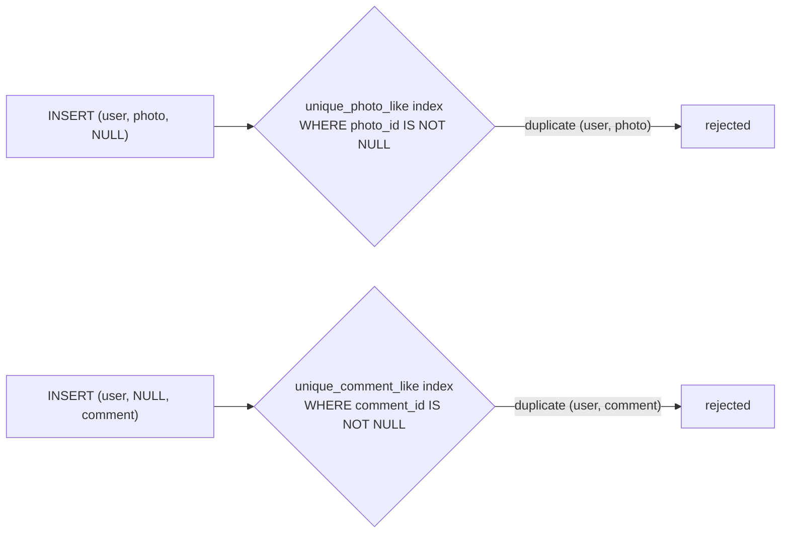

<div align="center">

# 15 · How to Build a 'Like' System

**Part 3 — Database Design** · ✅ Done

</div>

> "Users can like photos" sounds like it needs one integer column. It doesn't — and the reasons it doesn't are a genuinely good test of everything Part 1 and 2 taught. This is the first of four sections (15–18) designing one real feature each, before section 19 builds them all together.

💾 Every query on this page is in [`examples.sql`](examples.sql). It uses the shared `sample-db/` schema.

### 📌 What's in here

| # | Topic | In one line |
|:-:|---|---|
| 1 | [Rules of a like system](#1-rules-of-a-like-system) | What "liking" actually has to guarantee |
| 2 | [Why a simple counter column fails](#2-why-a-simple-counter-column-fails) | A number that can't answer "did *I* like this?" |
| 3 | [A likes table with UNIQUE](#3-a-likes-table-with-unique) | Fixing it, for photos alone, first |
| 4 | [Polymorphic associations and their problems](#4-polymorphic-associations-and-their-problems) | Liking a photo *or* a comment breaks the simple version |
| 5 | [Alternative designs](#5-alternative-designs) | Three ways to model "one of several possible targets" |
| 6 | [Going beyond likes: reactions](#6-going-beyond-likes-reactions) | More than one way to react, not just on/off |
| ✔ | [Recap](#recap) · [Practice](#practice) · [What confused me](#what-confused-me) | |

---

## 1. Rules of a like system

**What it is:** The actual requirements hiding behind "users can like photos," made explicit before designing anything.

**Why it exists:** Every rule below rules out at least one tempting shortcut.

- A user can like a given photo **at most once** (not five times by mashing a button).
- Liking is **reversible** — a user can unlike.
- The app needs to know **who** liked something, not just how many.
- The app needs to answer **"has the current user already liked this?"** quickly, every time it renders a photo.
- A photo (or, it turns out, a comment) can be liked by **many** users.

That last point alone rules out storing the like on the `photos` row itself — it's a many-to-many relationship (many users, many likeable things), and section 3 already covered what that needs: a join table.

---

## 2. Why a simple counter column fails

**What it is:** The tempting shortcut — `photos.likes_count INTEGER` — and exactly which of section 1's rules it can't satisfy.

**Why it exists:** It's worth actually trying this first, to feel precisely where it breaks.

### Example

```sql
ALTER TABLE photos ADD COLUMN likes_count INTEGER NOT NULL DEFAULT 0;

UPDATE photos SET likes_count = likes_count + 1 WHERE id = 101;
```

**Result:** `sunset.jpg` now shows `1` like. Which user liked it? **Unanswerable** — that information was never stored anywhere.

### ⚠️ Traps

- **Can't answer "has *this* user liked it?"** — the single most common question a real UI asks (to decide whether to show a filled or outline heart icon). A count has no per-user information at all.
- **Can't prevent double-liking.** Nothing stops the same user's button-mash from running `likes_count = likes_count + 1` five times.
- **The count can drift from reality.** If "unlike" ever fails to run its matching `- 1` (a crashed request, a bug, two requests racing each other), the number silently stops meaning anything, with no way to recompute the truth — the individual like events were never recorded.

---

## 3. A likes table with UNIQUE

**What it is:** A join table between `users` and `photos`, exactly like section 3's `likes` practice answer — for photos only, to start.

**Why it exists:** This fixes every problem from topic 2 at once: who liked what is recorded individually, "has this user liked it" is a lookup, and `UNIQUE` makes double-liking structurally impossible rather than something the app has to remember to prevent.

### Syntax

```sql
CREATE TABLE photo_likes (
    user_id  INTEGER NOT NULL REFERENCES users(id)  ON DELETE CASCADE,
    photo_id INTEGER NOT NULL REFERENCES photos(id) ON DELETE CASCADE,
    PRIMARY KEY (user_id, photo_id)
);
```

Same composite-primary-key shape as `album_photos` (section 14) — the combination itself *is* the uniqueness rule.

### Example

```sql
INSERT INTO photo_likes (user_id, photo_id) VALUES (2, 101);   -- bella likes sunset.jpg
INSERT INTO photo_likes (user_id, photo_id) VALUES (2, 101);   -- bella double-taps
```

**Result:** the second `INSERT` is rejected —
```
ERROR:  duplicate key value violates unique constraint "photo_likes_pkey"
```

"Has this user liked it" and "how many likes" are both now cheap, honest queries:

```sql
SELECT EXISTS (SELECT 1 FROM photo_likes WHERE user_id = 2 AND photo_id = 101) AS bella_liked_it;
SELECT COUNT(*) FROM photo_likes WHERE photo_id = 101;
```

### ⚠️ Traps

- **This only handles liking photos.** The moment "users can also like comments" shows up — and it usually does — this table's shape doesn't stretch to fit. That's topic 4.

---

## 4. Polymorphic associations and their problems

**What it is:** A **polymorphic association** is one table meant to reference rows in *more than one* other table — typically with a `target_type` column saying which table, and a `target_id` column holding the id, instead of a real foreign key.

**Why it exists:** "Users can like photos *and* comments" looks, at first glance, like it just needs one more column.

### Syntax

```sql
CREATE TABLE likes (
    user_id     INTEGER NOT NULL REFERENCES users(id) ON DELETE CASCADE,
    target_type VARCHAR(20) NOT NULL,   -- 'photo' or 'comment'
    target_id   INTEGER NOT NULL,       -- an id in *either* photos or comments
    PRIMARY KEY (user_id, target_type, target_id)
);
```

### Why this doesn't actually work well

`target_id` can't have a real `REFERENCES` clause — a single foreign key can only ever point at one specific table, and this column needs to mean "an id in `photos`" *or* "an id in `comments,`" depending on `target_type`.

### ⚠️ Traps

- **No referential integrity at all.** `target_id` accepts *any* integer, whether or not a matching row exists in either table. A typo'd `target_type` or a stale `target_id` after a delete becomes invisible garbage instead of a rejected `INSERT`.
- **`ON DELETE CASCADE` can't work.** Deleting a photo has no foreign key telling Postgres to clean up its likes — that logic would have to live in application code (or a trigger), reintroducing exactly the "can silently drift out of sync" problem from topic 2.
- **Every query needs an extra `WHERE target_type = '...'`, everywhere, forever** — and forgetting it even once silently mixes photo-like rows into a comment-like count, or vice versa.

---

## 5. Alternative designs

**What it is:** Two better ways to model "this row targets exactly one of several possible tables," keeping real foreign keys.

**Why it exists:** Giving up referential integrity (topic 4) is too high a price for this problem — Postgres has real tools for "exactly one of these."

### Option A: separate tables per target

```sql
CREATE TABLE photo_likes   (user_id INTEGER REFERENCES users(id), photo_id   INTEGER REFERENCES photos(id),   PRIMARY KEY (user_id, photo_id));
CREATE TABLE comment_likes (user_id INTEGER REFERENCES users(id), comment_id INTEGER REFERENCES comments(id), PRIMARY KEY (user_id, comment_id));
```

Simple, real foreign keys, real `ON DELETE CASCADE`. The cost: "everything this user has ever liked" needs a `UNION` (section 8) across two tables instead of one query.

### Option B: one table, nullable foreign keys, and a CHECK

```sql
CREATE TABLE likes (
    id         SERIAL PRIMARY KEY,
    user_id    INTEGER NOT NULL REFERENCES users(id) ON DELETE CASCADE,
    photo_id   INTEGER REFERENCES photos(id)   ON DELETE CASCADE,
    comment_id INTEGER REFERENCES comments(id) ON DELETE CASCADE,
    CONSTRAINT exactly_one_target CHECK (
        COALESCE(photo_id, comment_id) IS NOT NULL   -- at least one is set
        AND (photo_id IS NULL OR comment_id IS NULL) -- but not both
    )
);
```

`COALESCE(photo_id, comment_id)` returns whichever one is non-`NULL` — if that's still `NULL`, neither was provided, and the row is rejected. The second line rules out both being set at once. Real foreign keys on both columns, real cascading deletes, one table for "everything liked."

### The gotcha this introduces

```sql
INSERT INTO likes (user_id, photo_id) VALUES (2, 101);
INSERT INTO likes (user_id, photo_id) VALUES (2, 101);   -- bella double-taps sunset.jpg
```

**Both succeed.** There's no `UNIQUE (user_id, photo_id, comment_id)` here that actually works — `comment_id` is `NULL` in both rows, and **Postgres treats every `NULL` as distinct from every other `NULL`** for uniqueness purposes. Two rows that are `(2, 101, NULL)` and `(2, 101, NULL)` don't count as duplicates at all.

The fix is a **partial unique index** — an index that only covers rows matching a condition:

```sql
CREATE UNIQUE INDEX unique_photo_like   ON likes (user_id, photo_id)   WHERE photo_id IS NOT NULL;
CREATE UNIQUE INDEX unique_comment_like ON likes (user_id, comment_id) WHERE comment_id IS NOT NULL;
```

Now only rows where `photo_id IS NOT NULL` are compared for the first index — `NULL` rows are excluded from it entirely, so the comparison is between real, non-`NULL` values, where Postgres's normal duplicate-detection works as expected.



### ⚠️ Traps

- **Assuming `UNIQUE` treats `NULL`s the way `=` treats every other value.** It's the opposite of the `NULL` rule everywhere else in this course — `WHERE` treats `NULL = NULL` as unknown (section 2); `UNIQUE` treats `NULL` vs `NULL` as *definitely different*. Two completely different behaviors, easy to conflate.
- *(Postgres 15+ has `UNIQUE NULLS NOT DISTINCT (...)`, which makes `NULL`s collide on purpose — a more direct fix, if the version in use supports it. The partial-index version works everywhere.)*

---

## 6. Going beyond likes: reactions

**What it is:** Replacing a plain "liked or not" with a **choice** of reaction — 👍 ❤️ 😂 😮 — still at most one per user per target.

**Why it exists:** The shape barely changes; the meaning does.

### Syntax

```sql
CREATE TABLE likes (
    id            SERIAL PRIMARY KEY,
    user_id       INTEGER NOT NULL REFERENCES users(id) ON DELETE CASCADE,
    photo_id      INTEGER REFERENCES photos(id)   ON DELETE CASCADE,
    comment_id    INTEGER REFERENCES comments(id) ON DELETE CASCADE,
    reaction_type VARCHAR(10) NOT NULL DEFAULT 'like'
        CHECK (reaction_type IN ('like', 'love', 'haha', 'wow')),
    CONSTRAINT exactly_one_target CHECK (
        COALESCE(photo_id, comment_id) IS NOT NULL
        AND (photo_id IS NULL OR comment_id IS NULL)
    )
);
```

One new column (`reaction_type`), constrained with `CHECK ... IN (...)` (section 13). Everything from topics 3–5 — the exclusivity `CHECK`, the partial unique indexes, "at most one per user per target" — carries over unchanged.

### ⚠️ Traps

- **Letting `reaction_type` be free-text.** Without the `CHECK`, a typo like `'lov'` is stored happily and just silently never matches a `'love'` filter anywhere in the app.

---

## Recap

| Design | Referential integrity | Extra cost |
|---|---|---|
| Counter column | None — no per-user record at all | Can't answer "did I like this," can drift |
| Polymorphic (`target_type` + `target_id`) | None — no real foreign key possible | Every query needs a manual type filter |
| Separate tables per target | Full | "Everything I've liked" needs a `UNION` |
| One table, nullable FKs + `CHECK` | Full | Needs partial unique indexes, not plain `UNIQUE` |

> **The one thing I want to remember:** `UNIQUE` does not treat two `NULL`s as duplicates of each other — it's the one place in all of SQL where `NULL` behaves like it's *more* distinct than usual, not less.

---

## Practice

**1.** Using the topic 5 `likes` table, write the query for "has `alex` (user `1`) liked `mountain.jpg` (photo `102`)?"

<details>
<summary>Show answer</summary>

```sql
SELECT EXISTS (
    SELECT 1 FROM likes WHERE user_id = 1 AND photo_id = 102
) AS already_liked;
```

</details>

**2.** Why can't `target_id INTEGER REFERENCES photos(id)` be added to the polymorphic table from topic 4 to at least partly fix it?

<details>
<summary>Show answer</summary>

Because `target_id` also has to hold `comments.id` values when `target_type = 'comment'` — a single foreign key can only ever reference one specific table, so it would reject every valid comment-like as if it were an invalid photo-like.

</details>

**3.** Would `CHECK (photo_id IS NOT NULL OR comment_id IS NOT NULL)` alone (without the second condition) be enough to enforce "exactly one target"?

<details>
<summary>Show answer</summary>

No — it only enforces "at least one." A row with **both** `photo_id` and `comment_id` set would still pass. The `AND (photo_id IS NULL OR comment_id IS NULL)` half is what rules out both being set at once.

</details>

---

## What confused me

- I expected `UNIQUE (user_id, photo_id, comment_id)` to "just work" once I had the nullable-columns design. Watching the duplicate photo-like actually get accepted was the first time `NULL`'s weirdness in `UNIQUE` constraints felt real instead of theoretical.
- I didn't understand why a polymorphic `target_id` was a real problem instead of just "less elegant." Losing `ON DELETE CASCADE` entirely — meaning deleted photos would leave orphaned like-rows forever, silently — is what made it click.
- `COALESCE` inside a `CHECK` felt like an odd use of a function I'd only used to fill in a default before. Reading it as "give me whichever one isn't `NULL`, and now check *that*" made it click.

---

[⬅ 14 · Database Structure Design Patterns](../14-database-structure-design-patterns/README.md) · [🏠 Index](../README.md) · [16 · How to Build a 'Mention' System ➡](../16-how-to-build-a-mention-system/README.md)
