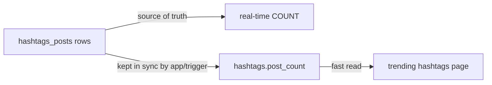

<div align="center">

# 17 · How to Build a 'Hashtag' System

**Part 3 — Database Design** · ✅ Done

</div>

> Hashtags look like text at first glance — `#sunset` is just... a word. Treating them that way is the shortcut this section talks me out of, and the reasoning turns out to be almost identical to why `users.username` was never allowed to live as a repeated string back in section 1.

💾 Every query on this page is in [`examples.sql`](examples.sql). It uses the shared `sample-db/` schema.

### 📌 What's in here

| # | Topic | In one line |
|:-:|---|---|
| 1 | [Where hashtags appear](#1-where-hashtags-appear) | Text content, extracted into structured data |
| 2 | [Designing hashtags and hashtags_posts](#2-designing-hashtags-and-hashtags_posts) | A hashtag is its own noun, not a string property |
| 3 | [Why not store hashtags as plain text](#3-why-not-store-hashtags-as-plain-text) | The same problems as section 1's flattened table, in disguise |
| 4 | [Performance considerations for counts](#4-performance-considerations-for-counts) | When a denormalized counter is actually the right call |
| ✔ | [Recap](#recap) · [Practice](#practice) · [What confused me](#what-confused-me) | |

---

## 1. Where hashtags appear

**What it is:** Hashtags are written *inside* free text — a caption, a comment, a bio — but the useful version of a hashtag system treats each one as a real, queryable thing, not just characters sitting inside a string.

**Why it exists:** "Show me every post tagged `#sunset`" is a completely different kind of question than "does this comment's text happen to contain the substring `#sunset`" — the first needs structure; the second is what I'd be stuck with otherwise (topic 3).

---

## 2. Designing hashtags and hashtags_posts

**What it is:** `hashtags` is a table of the hashtags themselves — the same way `users` is a table of users, not a column. `hashtags_posts` connects hashtags to the photos that use them: a many-to-many, one photo can carry several hashtags, one hashtag applies to many photos.

**Why it exists:** A hashtag isn't really a property *of* a photo — it's its own thing, with its own identity, that many different photos happen to reference. Same reasoning as section 3's very first "what are my nouns" question, just arriving four Part-3 sections later.

### Syntax

```sql
CREATE TABLE hashtags (
    id   SERIAL PRIMARY KEY,
    name VARCHAR(50) NOT NULL UNIQUE
);

CREATE TABLE hashtags_posts (
    hashtag_id INTEGER NOT NULL REFERENCES hashtags(id) ON DELETE CASCADE,
    photo_id   INTEGER NOT NULL REFERENCES photos(id)   ON DELETE CASCADE,
    PRIMARY KEY (hashtag_id, photo_id)
);
```

### Example

```sql
INSERT INTO hashtags (name) VALUES ('sunset'), ('beach'), ('summer');

INSERT INTO hashtags_posts (hashtag_id, photo_id)
SELECT id, 101 FROM hashtags WHERE name IN ('sunset', 'beach', 'summer');

SELECT p.url
FROM hashtags_posts AS hp
JOIN photos AS p ON hp.photo_id = p.id
JOIN hashtags AS h ON hp.hashtag_id = h.id
WHERE h.name = 'sunset';
```

**Result**

| url |
|---|
| sunset.jpg |

### ⚠️ Traps

- **Storing hashtag names with mixed case.** `'Sunset'` and `'sunset'` would count as two different rows in `hashtags`, splitting one real hashtag's posts across two ids. Lowercasing on the way in (an app-side rule, or a `CHECK (name = LOWER(name))` to enforce it) keeps `#Sunset` and `#sunset` as the same tag — the exact case-sensitivity trap from section 2's `WHERE category = 'home'`, showing up again in a new place.

---

## 3. Why not store hashtags as plain text

**What it is:** The shortcut — a `hashtag_text` column on `photos`, holding something like `'#sunset #beach #summer'` — and why it breaks down almost immediately.

**Why it exists:** It's worth trying, briefly, to feel exactly where it fails — same exercise as section 1's flattened-table example, and section 15's counter column.

### Example

```sql
ALTER TABLE photos ADD COLUMN hashtag_text VARCHAR(200);
UPDATE photos SET hashtag_text = '#sunset #beach #summer' WHERE id = 101;

SELECT url FROM photos WHERE hashtag_text LIKE '%#sunset%';
```

**Result:** it "works" for this one photo. It falls apart at real scale:

### ⚠️ Traps

- **False matches.** `LIKE '%#sunset%'` also matches a photo tagged only `'#sunsetlovers'` — the substring is there, the hashtag isn't. A structured `hashtags_posts` row either exists or it doesn't; there's no substring ambiguity.
- **No efficient lookup.** `LIKE '%...%'` (a leading wildcard) can't use an ordinary index — Postgres has to scan and text-search every single row, every time. More on why in [22 · A Look at Indexes for Performance](../22-a-look-at-indexes-for-performance/README.md).
- **"Trending hashtags" becomes a text-parsing project.** Splitting `hashtag_text` apart, counting occurrences across every photo, deduplicating case variants — all of it application code, redone on every request, instead of one `GROUP BY`.

---

## 4. Performance considerations for counts

**What it is:** Real-time counting (`JOIN` + `GROUP BY` over `hashtags_posts`, computed fresh every time) versus a denormalized counter column on `hashtags` itself.

**Why it exists:** "Trending hashtags" gets read constantly and changes relatively slowly — a very different access pattern than section 15's like counts, and one where a cached counter is a genuinely reasonable trade-off, not a mistake.

### Real-time

```sql
SELECT h.name, COUNT(*) AS post_count
FROM hashtags AS h
JOIN hashtags_posts AS hp ON h.id = hp.hashtag_id
GROUP BY h.name
ORDER BY post_count DESC;
```

Always accurate. Costs a full join and aggregation on every request.

### Denormalized

```sql
ALTER TABLE hashtags ADD COLUMN post_count INTEGER NOT NULL DEFAULT 0;
```

Updated whenever a `hashtags_posts` row is added or removed (application code, or a trigger — triggers aren't covered in this course, but that's where this logic would live for real). Reading `post_count` directly is now a single-row lookup instead of an aggregation over every post.

### Why this is different from section 15's mistake

Section 15's `likes_count` column threw away information — *who* liked something was never recorded anywhere, and there was no way to reconstruct it later. `hashtags.post_count` doesn't throw anything away: `hashtags_posts` still holds every real row, the counter is purely a cache *of* that real data. If it ever drifts, the truth is still sitting right there to recompute it from.



### ⚠️ Traps

- **Reaching for a denormalized counter before confirming it's actually needed.** It's extra code to keep correct, for a performance problem that might not exist yet at 6 hashtags and 5 photos. The real-time `GROUP BY` is simpler and still fast at this scale — this is a "when it's actually slow" optimization, not a default.

---

## Recap

| Concept | What it does |
|---|---|
| `hashtags` | Each hashtag is its own row, with its own identity |
| `hashtags_posts` | Many-to-many join table connecting hashtags to photos |
| Plain-text hashtag storage | Breaks `LIKE`-matching accuracy, indexing, and trending counts all at once |
| Real-time `COUNT` | Always accurate, recomputed every time |
| Denormalized `post_count` | Fast reads, needs to stay in sync — but doesn't lose the underlying data the way section 15's counter did |

> **The one thing I want to remember:** a denormalized counter isn't automatically the section 15 mistake — it's only a mistake when it *replaces* the detailed record instead of *caching* a number that the detailed record can still recompute.

---

## Practice

**1.** Which hashtags does `sunset.jpg` (photo `101`) currently have?

<details>
<summary>Show answer</summary>

```sql
SELECT h.name
FROM hashtags_posts AS hp
JOIN hashtags AS h ON hp.hashtag_id = h.id
WHERE hp.photo_id = 101;
```

| name |
|---|
| sunset |
| beach |
| summer |

</details>

**2.** Add the hashtag `#coffee` to `coffee.jpg` (photo `103`) — the hashtag doesn't exist yet.

<details>
<summary>Show answer</summary>

```sql
INSERT INTO hashtags (name) VALUES ('coffee');

INSERT INTO hashtags_posts (hashtag_id, photo_id)
SELECT id, 103 FROM hashtags WHERE name = 'coffee';
```

</details>

**3.** Why would `WHERE hashtag_text LIKE '%#sun%'` on the plain-text version match a photo tagged only `#sunday`, and why can't `hashtags_posts` make that same mistake?

<details>
<summary>Show answer</summary>

`LIKE` matches on raw substrings — `'#sun'` is genuinely a substring of `'#sunday'`, so it matches even though they're different hashtags entirely. `hashtags_posts` has no substring matching at all: a row either references the exact `hashtags.id` for `'sun'`, or it doesn't. There's no partial-match path for it to accidentally take.

</details>

---

## What confused me

- I didn't expect a hashtag to "deserve" its own table. It felt like a string, not a noun — until I noticed I wanted to query "everything tagged X" and "how many posts use X," both of which needed a real row to attach to, not a substring inside another column.
- I assumed denormalized counters were just flatly wrong, carrying over the conclusion from section 15 too directly. The actual rule is narrower — it's about whether the detailed data is still there to fall back on, not about whether a count is cached at all.
- I expected `LIKE '%#sunset%'` to be "close enough" for finding tagged photos. Seeing it match `'#sunsetlovers'` too was the moment substring matching stopped feeling like a shortcut and started feeling like a silent accuracy bug.

---

[⬅ 16 · How to Build a 'Mention' System](../16-how-to-build-a-mention-system/README.md) · [🏠 Index](../README.md) · [18 · How to Design a 'Follower' System ➡](../18-how-to-design-a-follower-system/README.md)
