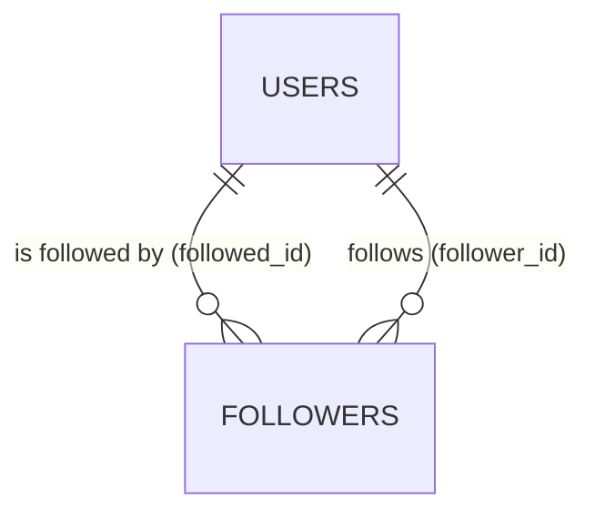

<div align="center">

# 18 · How to Design a 'Follower' System

**Part 3 — Database Design** · ✅ Done

</div>

> Section 3 and 14 both previewed this table without building it — a many-to-many where both sides point at the *same* table. That single fact (one table, two roles) is the entire twist this section adds on top of everything sections 15–17 already covered.

💾 Every query on this page is in [`examples.sql`](examples.sql). It uses the shared `sample-db/` schema, and builds a small follow graph that comes back in [26 · Recursive Common Table Expressions](../26-recursive-common-table-expressions/README.md).

### 📌 What's in here

| # | Topic | In one line |
|:-:|---|---|
| 1 | [Followers as a self-referencing many-to-many](#1-followers-as-a-self-referencing-many-to-many) | Both foreign keys point at `users` |
| 2 | [Designing the followers table](#2-designing-the-followers-table) | Two roles, one table |
| 3 | [Preventing self-follows and duplicate follows](#3-preventing-self-follows-and-duplicate-follows) | A `CHECK` and a composite key doing two different jobs |
| ✔ | [Recap](#recap) · [Practice](#practice) · [What confused me](#what-confused-me) | |

---

## 1. Followers as a self-referencing many-to-many

**What it is:** "Users follow users" is many-to-many — one user follows many, is followed by many — exactly like `album_photos` or `hashtags_posts`. The twist: there's only **one** table involved, `users`, playing **two different roles** in the same relationship.

**Why it exists:** Every join table so far connected two *different* tables (`albums`↔`photos`, `hashtags`↔`photos`). A follow relationship connects `users` to itself — the join table needs two foreign keys to the same table, distinguished only by column name.



---

## 2. Designing the followers table

**What it is:** A join table with two foreign keys to `users` — `follower_id` (who's doing the following) and `followed_id` (who's being followed).

**Why it exists:** Section 3's practice answer used generic names; giving each column a name that states its *role*, not just its target table, is what keeps `SELECT * FROM followers` readable on its own.

### Syntax

```sql
CREATE TABLE followers (
    follower_id INTEGER NOT NULL REFERENCES users(id) ON DELETE CASCADE,
    followed_id INTEGER NOT NULL REFERENCES users(id) ON DELETE CASCADE,
    created_at  TIMESTAMP NOT NULL DEFAULT NOW(),
    PRIMARY KEY (follower_id, followed_id)
);
```

### Example

A small follow graph — enough structure to matter later:

```sql
INSERT INTO followers (follower_id, followed_id) VALUES
    (1, 2),  -- alex follows bella
    (2, 1),  -- bella follows alex  (mutual with the row above)
    (1, 3),  -- alex follows chris
    (2, 3),  -- bella follows chris
    (2, 5),  -- bella follows erin
    (3, 4),  -- chris follows dana
    (4, 5),  -- dana follows erin
    (5, 1);  -- erin follows alex  (closes a loop back to alex)
```

Who does `alex` follow, versus who follows `alex` — same table, opposite columns:

```sql
SELECT u.username FROM followers f JOIN users u ON f.followed_id = u.id WHERE f.follower_id = 1;  -- alex follows...
SELECT u.username FROM followers f JOIN users u ON f.follower_id = u.id WHERE f.followed_id = 1;  -- ...alex is followed by
```

**Result**

| alex follows | alex is followed by |
|---|---|
| bella | bella |
| chris | erin |

### Finding mutual follows

A self-join — matching each row against the *reverse* of itself:

```sql
SELECT f1.follower_id, f1.followed_id
FROM followers AS f1
JOIN followers AS f2
  ON f1.follower_id = f2.followed_id
 AND f1.followed_id = f2.follower_id
WHERE f1.follower_id < f1.followed_id;   -- avoid listing each mutual pair twice
```

**Result**

| follower_id | followed_id |
|--:|--:|
| 1 | 2 |

`alex` and `bella` are the only pair following each other in both directions.

### ⚠️ Traps

- **Mixing up which column means which direction.** `follower_id = 1` means "rows where `alex` is the one following," not "people following `alex`." Naming both columns by *role* instead of just repeating `user_id` twice is what makes this readable instead of a constant source of flipped queries.

---

## 3. Preventing self-follows and duplicate follows

**What it is:** Two different rules, enforced by two different tools already covered — `CHECK` blocks a user from following themself; the composite primary key blocks the same follow relationship existing twice.

**Why it exists:** Nothing about the table shape in topic 2 stops `INSERT INTO followers VALUES (1, 1, ...)` — a user "following" themself is nonsensical, but structurally identical to any other row unless explicitly ruled out.

### Syntax

```sql
ALTER TABLE followers ADD CONSTRAINT no_self_follow CHECK (follower_id <> followed_id);
```

### Example

```sql
INSERT INTO followers (follower_id, followed_id) VALUES (1, 1);
```

**Result:** Rejected.
```
ERROR:  new row for relation "followers" violates check constraint "no_self_follow"
```

Duplicate follows are already impossible — the composite primary key from topic 2 covers it:

```sql
INSERT INTO followers (follower_id, followed_id) VALUES (1, 2);   -- alex already follows bella
```

**Result:** Rejected.
```
ERROR:  duplicate key value violates unique constraint "followers_pkey"
```

### ⚠️ Traps

- **Expecting one constraint to catch both problems.** `PRIMARY KEY (follower_id, followed_id)` and `CHECK (follower_id <> followed_id)` protect against two unrelated mistakes — a genuinely duplicate row, versus a row that's internally nonsensical regardless of duplication. Neither one substitutes for the other.

---

## Recap

| Concept | What it does |
|---|---|
| Self-referencing many-to-many | Both foreign keys point at the same table, distinguished by column name/role |
| `follower_id` / `followed_id` | Naming by role, not just repeating the target table's name |
| Self-join (`f1` / `f2` aliases) | Comparing a table against a reversed copy of itself — needed to find mutual follows |
| `CHECK (follower_id <> followed_id)` | Blocks a user from following themself |
| `PRIMARY KEY (follower_id, followed_id)` | Blocks the exact same follow relationship existing twice |

> **The one thing I want to remember:** a self-referencing relationship doesn't need a new kind of table — it needs two foreign keys to the same table, named for what they *mean*, not what they point at.

---

## Practice

**1.** How many people does each user follow?

<details>
<summary>Show answer</summary>

```sql
SELECT follower_id, COUNT(*) AS following_count
FROM followers
GROUP BY follower_id
ORDER BY follower_id;
```

| follower_id | following_count |
|--:|--:|
| 1 | 2 |
| 2 | 3 |
| 3 | 1 |
| 4 | 1 |
| 5 | 1 |

</details>

**2.** Which user(s) have the most followers?

<details>
<summary>Show answer</summary>

```sql
SELECT followed_id, COUNT(*) AS follower_count
FROM followers
GROUP BY followed_id
ORDER BY follower_count DESC;
```

| followed_id | follower_count |
|--:|--:|
| 1 | 2 |
| 3 | 2 |
| 5 | 2 |
| 2 | 1 |
| 4 | 1 |

**A three-way tie** — `alex`, `chris`, and `erin` each have exactly 2 followers. Deliberately not using `LIMIT 1` here: with a tie, `LIMIT 1` would silently hand back just one of the three, arbitrarily — the exact [07 · Sorting Records](../07-sorting-records/README.md) trap of trusting an unstated tiebreak.

</details>

**3.** Why does `WHERE f1.follower_id < f1.followed_id` show up in the mutual-follows query — what would happen without it?

<details>
<summary>Show answer</summary>

Without it, the mutual pair `(1, 2)` and `(2, 1)` would each independently match the self-join condition and both get returned — the same real-world fact ("alex and bella follow each other") listed twice, once from each direction. `follower_id < followed_id` keeps only one canonical ordering per pair.

</details>

---

## What confused me

- I expected a self-referencing relationship to need something structurally special. It doesn't — it's an ordinary many-to-many join table; the only real difference is remembering both foreign keys point at `users`, so column *names* are doing all the work of telling them apart.
- The self-join for mutual follows took a few tries to get right. Writing `f1.follower_id = f2.followed_id AND f1.followed_id = f2.follower_id` (crossed, not matched straight across) is what actually finds the *reverse* relationship instead of just matching each row to itself.
- I initially expected a single constraint to handle both "no self-follows" and "no duplicate follows." They're genuinely separate rules about separate failure modes, and needed separate tools.

---

[⬅ 17 · How to Build a 'Hashtag' System](../17-how-to-build-a-hashtag-system/README.md) · [🏠 Index](../README.md) · [19 · Implementing Database Design Patterns ➡](../19-implementing-database-design-patterns/README.md)
