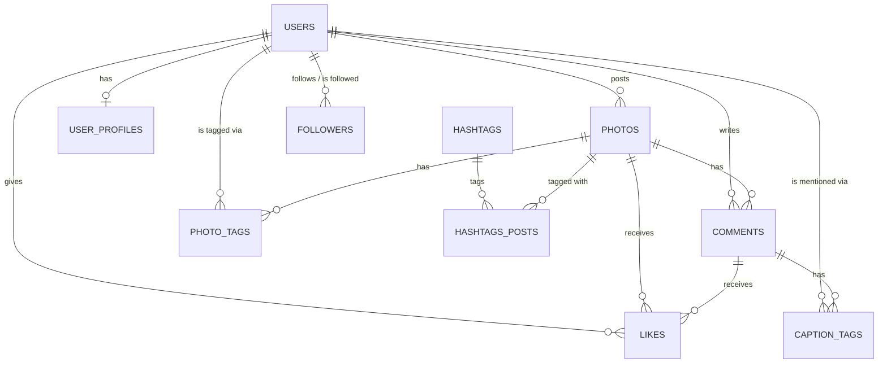

<div align="center">

# 19 · Implementing Database Design Patterns

**Part 3 — Database Design** · ✅ Done

</div>

> Sections 15–18 each designed one feature in isolation. This section is where they stop being four separate exercises and become one real schema — the same [`sample-db/`](../sample-db/) this whole course has been loading since section 4, now grown into the "bigger Instagram-style schema" its own file comment promised back then.

💾 Every query on this page is in [`examples.sql`](examples.sql). [`sample-db/schema.sql`](../sample-db/schema.sql) and [`sample-db/seed.sql`](../sample-db/seed.sql) are the real deliverable of this section — every section from here on loads them directly.

### 📌 What's in here

| # | Topic | In one line |
|:-:|---|---|
| 1 | [Building the full schema in SQL](#1-building-the-full-schema-in-sql) | Nine tables, assembled from sections 3–18 |
| 2 | [Creating tables in dependency order](#2-creating-tables-in-dependency-order) | The same rule from section 3, just with more tables |
| 3 | [Constraints that enforce the design](#3-constraints-that-enforce-the-design) | Every rule from 15–18, in one place |
| 4 | [Loading the dataset](#4-loading-the-dataset) | Seeding it all, then proving it actually hangs together |
| ✔ | [Recap](#recap) · [Practice](#practice) · [What confused me](#what-confused-me) | |

---

## 1. Building the full schema in SQL

**What it is:** All nine tables from this course so far, in one schema: `users`, `photos`, `comments` (section 3), `user_profiles` (section 12), `likes` (section 15), `photo_tags` and `caption_tags` (section 16), `hashtags` and `hashtags_posts` (section 17), `followers` (section 18).

**Why it exists:** Real features don't ship one at a time on an otherwise-empty database — they land on top of each other, and their foreign keys have to agree about what already exists.



The full `CREATE TABLE` statements are [`sample-db/schema.sql`](../sample-db/schema.sql) — not repeated here line for line, since it's exactly what sections 3, 12, and 15–18 already built, just assembled in one runnable file.

---

## 2. Creating tables in dependency order

**What it is:** The same rule from [03 · Working with Tables](../03-working-with-tables/README.md#5-foreign-key-rules-when-inserting) — parents before children when creating, children before parents when dropping — extended from 3 tables to 9.

**Why it exists:** `likes` references both `photos` and `comments`; `hashtags_posts` references both `hashtags` and `photos`. Neither can be created before *all* of its dependencies exist.

### The actual order, and why

```
users            -- depends on nothing
photos           -- needs users
comments         -- needs users, photos
user_profiles    -- needs users
likes            -- needs users, photos, comments
photo_tags       -- needs photos, users
caption_tags     -- needs comments, users
hashtags         -- depends on nothing
hashtags_posts   -- needs hashtags, photos
followers        -- needs users (twice, section 18)
```

`hashtags` could actually be created *first*, right alongside `users` — it has no dependencies of its own. It's listed later in `schema.sql` purely for readability, grouped with `hashtags_posts` which does depend on it. Dependency order is a hard requirement; where independent tables sit relative to each other is just style.

### ⚠️ Traps

- **Assuming the DROP order is arbitrary once `IF EXISTS` is added.** `IF EXISTS` only prevents an error on a table that's already gone — it doesn't change the fact that `DROP TABLE users` while `photos` still references it fails for the exact section 3 reason, regardless of `IF EXISTS`. The drop order at the top of `schema.sql` is still the dependency graph, reversed.

---

## 3. Constraints that enforce the design

**What it is:** Every constraint from sections 15–18, gathered in one place — not new rules, just the reminder that the *design* lives as much in these constraints as it does in the table shapes.

**Why it exists:** A table with the right columns but none of these constraints would still let every mistake sections 15–18 spent a whole topic each ruling out happen anyway.

| Table | Constraint | Rules out |
|---|---|---|
| `likes` | `CHECK (COALESCE(photo_id, comment_id) IS NOT NULL AND (photo_id IS NULL OR comment_id IS NULL))` | A like with no target, or two targets at once |
| `likes` | Partial unique indexes on `(user_id, photo_id)` / `(user_id, comment_id)` | Double-liking the same target |
| `photo_tags` | `UNIQUE (photo_id, user_id)` | Tagging the same person twice in one photo |
| `photo_tags` | `CHECK (x BETWEEN 0 AND 100)` (and `y`) | A tag position outside the image |
| `caption_tags` | `UNIQUE (comment_id, user_id)` | Mentioning the same person twice in one comment |
| `hashtags` | `name UNIQUE` | `#sunset` existing as two different rows |
| `hashtags_posts` | Composite `PRIMARY KEY (hashtag_id, photo_id)` | The same hashtag applied twice to one photo |
| `followers` | Composite `PRIMARY KEY (follower_id, followed_id)` | Following the same person twice |
| `followers` | `CHECK (follower_id <> followed_id)` | Following yourself |
| `user_profiles` | `CHECK (birth_date < member_since)` | Joining before being born |

### ⚠️ Traps

- **Treating this table as a checklist to copy, instead of the *reasoning* to reapply.** The next feature this course doesn't cover yet won't map onto one of these ten rows exactly — the actual skill is asking "what's the tempting-but-wrong shortcut here" (sections 15 and 17 both walked through one), the way section 14's seven questions do for table shape.

---

## 4. Loading the dataset

**What it is:** Running the assembled schema and seed data, then confirming the pieces actually connect — not just that each `CREATE TABLE` succeeded in isolation.

**Why it exists:** Nine tables' worth of foreign keys all resolving without a single constraint violation *is* the real test of sections 3–18 — a broken relationship anywhere would show up as a rejected `INSERT` here.

### Loading it

```bash
psql -d postgres_notes -f sample-db/schema.sql
psql -d postgres_notes -f sample-db/seed.sql
```

### Proving it hangs together

One query, touching six of the nine tables:

```sql
SELECT
    p.url,
    STRING_AGG(DISTINCT h.name, ', ' ORDER BY h.name) AS hashtags,
    COUNT(DISTINCT l.id)  AS like_count,
    COUNT(DISTINCT pt.id) AS tag_count
FROM photos AS p
LEFT JOIN hashtags_posts AS hp ON p.id = hp.photo_id
LEFT JOIN hashtags AS h        ON hp.hashtag_id = h.id
LEFT JOIN likes AS l           ON l.photo_id = p.id
LEFT JOIN photo_tags AS pt     ON pt.photo_id = p.id
GROUP BY p.id, p.url
ORDER BY p.id;
```

**Result**

| url | hashtags | like_count | tag_count |
|---|---|--:|--:|
| sunset.jpg | beach, summer, sunset | 2 | 1 |
| mountain.jpg | *(NULL)* | 1 | 1 |
| coffee.jpg | coffee | 0 | 0 |
| city.jpg | *(NULL)* | 1 | 0 |
| beach.jpg | *(NULL)* | 0 | 0 |

`COUNT(DISTINCT l.id)` and `COUNT(DISTINCT pt.id)` matter here specifically because the `LEFT JOIN`s multiply against each other — `sunset.jpg` has 3 hashtags **and** 2 likes **and** 1 tag, so the raw joined result has `3 × 2 × 1 = 6` rows for it alone before aggregation. Counting `DISTINCT` ids is what keeps `like_count` honestly `2`, not some multiple of it.

### ⚠️ Traps

- **Forgetting `DISTINCT` inside a `COUNT`/`STRING_AGG` once more than one `LEFT JOIN` is chained together.** Each additional join can multiply row counts against the others — `COUNT(l.id)` (no `DISTINCT`) on `sunset.jpg` above would have silently returned `6`, not `2`.

---

## Recap

| Step | What it means here |
|---|---|
| Build the schema | `sample-db/schema.sql` — sections 3, 12, and 15–18, assembled |
| Dependency order | Parents before children on create, reversed on drop — same section 3 rule at 9-table scale |
| Constraints | The actual enforcement of every design decision from 15–18, in one table |
| Load and verify | Run schema + seed, then a real cross-table query is the honest test |

> **The one thing I want to remember:** `COUNT(DISTINCT ...)` isn't just for section 10's "how many unique X" questions — it's what keeps an aggregate honest the moment more than one `LEFT JOIN` is chained in the same query.

---

## Practice

**1.** Which hashtags does `coffee.jpg` have, and how many likes?

<details>
<summary>Show answer</summary>

From the capstone query's result: `coffee`, and `0` likes — `coffee.jpg` was never directly liked in the seed data (only a *comment* on it was).

</details>

**2.** Write a query showing every photo `alex` (user `1`) is tagged in, whether by `photo_tags` or because he posted it himself.

<details>
<summary>Show answer</summary>

```sql
SELECT DISTINCT p.url
FROM photos AS p
LEFT JOIN photo_tags AS pt ON pt.photo_id = p.id
WHERE p.user_id = 1 OR pt.user_id = 1;
```

| url |
|---|
| sunset.jpg |
| coffee.jpg |
| mountain.jpg |

(`sunset.jpg`/`coffee.jpg` — alex posted them. `mountain.jpg` — he's tagged in it, per section 16's seed data.)

</details>

**3.** `hashtags` has no foreign key pointing *into* it from `users` or `photos` directly. What does reference it, and how?

<details>
<summary>Show answer</summary>

`hashtags_posts.hashtag_id` — the join table sits between `hashtags` and `photos`, exactly the many-to-many shape from section 3: neither side holds a direct foreign key to the other.

</details>

---

## What confused me

- I expected assembling four separately-designed features into one schema to surface conflicts between them. It didn't — each one only ever referenced `users`, `photos`, or `comments`, never each other, so they slotted together without any redesign.
- The join-multiplication behind `COUNT(DISTINCT ...)` wasn't obvious until I actually counted `sunset.jpg`'s rows by hand (3 hashtags × 2 likes × 1 tag = 6). Past two or three chained `LEFT JOIN`s in one query, I now assume multiplication is happening until I've checked.
- I initially treated `hashtags` needing no foreign keys as it being somehow "simpler" than the other new tables. It's not simpler — it's just the *parent* side of its relationship instead of the child, the same asymmetry `users` has always had.

---

[⬅ 18 · How to Design a 'Follower' System](../18-how-to-design-a-follower-system/README.md) · [🏠 Index](../README.md) · [20 · Approaching and Writing Complex Queries ➡](../20-approaching-and-writing-complex-queries/README.md)
