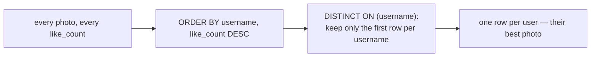

<div align="center">

# 20 · Approaching and Writing Complex Queries

**Part 4 — Complex Queries & Performance** · ✅ Done

</div>

> Every query in this course so far fit in my head before I wrote it. This section is for the ones that don't — where the honest first move isn't typing SQL, it's figuring out what I'm actually asking. First real payoff of section 19's finished schema: nine tables, finally enough to need this.

💾 Every query on this page is in [`examples.sql`](examples.sql). It uses the full `sample-db/` schema from section 19.

### 📌 What's in here

| # | Topic | In one line |
|:-:|---|---|
| 1 | [A step-by-step approach](#1-a-step-by-step-approach) | Five questions before the first line of SQL |
| 2 | [Worked example: two aggregates at once](#2-worked-example-two-aggregates-at-once) | Why joining two "many" relationships needs `DISTINCT` |
| 3 | [Worked example: the best row per group](#3-worked-example-the-best-row-per-group) | Building up to `DISTINCT ON`, on purpose, in steps |
| ✔ | [Recap](#recap) · [Practice](#practice) · [What confused me](#what-confused-me) | |

---

## 1. A step-by-step approach

**What it is:** A sequence of questions to ask *before* writing SQL, and an order to build the query itself in once I start.

**Why it exists:** A complex query written top-to-bottom in one pass, hoping it's right, is much harder to debug than one built up in verifiable stages.

1. **Restate the question in plain English, precisely.** "Top photo" is ambiguous — top by likes? By comments? Per user, or overall?
2. **Identify every table involved**, and how they connect — draw the join path if it's not obvious (section 14).
3. **Get the `FROM`/`JOIN` shape right first**, with a plain `SELECT *` — check the row count and a few actual rows make sense, *before* adding any aggregation.
4. **Add grouping and aggregation next**, and sanity-check those numbers against a small, countable slice I can verify by hand.
5. **Add filtering last** — and decide `WHERE` vs `HAVING` deliberately (section 5), not by trial and error.
6. **Test the edges** — a user with zero of something, a tie, an empty result. section 18's follower-count tie (section 18, practice 2) is exactly the kind of edge case this step exists to catch.

---

## 2. Worked example: two aggregates at once

**Question:** for each user, how many photos have they posted, and how many followers do they have?

**Step 2 — tables:** `users`, `photos` (one-to-many), `followers` (self-referencing many-to-many, section 18).

**Step 3 — the shape, first, without aggregation:**

```sql
SELECT u.username, p.id AS photo_id, f.follower_id
FROM users AS u
LEFT JOIN photos AS p    ON p.user_id = u.id
LEFT JOIN followers AS f ON f.followed_id = u.id;
```

Running just this reveals the trap before it becomes a wrong number: `alex` has 2 photos *and* 2 followers, so this shape returns `2 × 2 = 4` rows for `alex` alone — every photo paired with every follower, a small cartesian product hiding inside two otherwise-correct `LEFT JOIN`s.

**Step 4 — aggregate, with `DISTINCT`:**

```sql
SELECT u.username,
       COUNT(DISTINCT p.id) AS photo_count,
       COUNT(DISTINCT f.follower_id) AS follower_count
FROM users AS u
LEFT JOIN photos AS p    ON p.user_id = u.id
LEFT JOIN followers AS f ON f.followed_id = u.id
GROUP BY u.username
ORDER BY u.username;
```

**Result**

| username | photo_count | follower_count |
|---|--:|--:|
| alex | 2 | 2 |
| bella | 1 | 1 |
| chris | 1 | 2 |
| dana | 0 | 1 |
| erin | 1 | 2 |

`COUNT(DISTINCT ...)` is what makes this correct — exactly the section 19 lesson, now the actual reason step 3 exists: seeing the raw multiplication *before* aggregating is what makes it obvious `DISTINCT` is needed, instead of shipping a quietly-wrong count.

---

## 3. Worked example: the best row per group

**Question:** for each user, which of their own photos has the most likes, and how many?

**Step 2 — tables:** `users`, `photos`, `likes` (targeting `photo_id`).

**Step 3 — the shape:**

```sql
SELECT u.username, p.url, l.id AS like_id
FROM users AS u
JOIN photos AS p ON p.user_id = u.id
LEFT JOIN likes AS l ON l.photo_id = p.id;
```

`dana` disappears here — an intentional `JOIN`, not `LEFT JOIN`, on `photos`: a user with no photos has no "most-liked photo" to report, which is a real, correct answer for this specific question, not a bug to fix.

**Step 4 — aggregate:**

```sql
SELECT u.username, p.url, COUNT(l.id) AS like_count
FROM users AS u
JOIN photos AS p ON p.user_id = u.id
LEFT JOIN likes AS l ON l.photo_id = p.id
GROUP BY u.username, p.url
ORDER BY u.username, like_count DESC;
```

**Result**

| username | url | like_count |
|---|---|--:|
| alex | sunset.jpg | 2 |
| alex | coffee.jpg | 0 |
| bella | mountain.jpg | 1 |
| chris | city.jpg | 1 |
| erin | beach.jpg | 0 |

This is real progress — every photo's like count, correctly grouped — but it answers "every photo, ranked," not "just the winner per user." `alex` still shows twice.

**Step 5 — cut down to one row per group with `DISTINCT ON`:**

```sql
SELECT DISTINCT ON (u.username) u.username, p.url, COUNT(l.id) AS like_count
FROM users AS u
JOIN photos AS p ON p.user_id = u.id
LEFT JOIN likes AS l ON l.photo_id = p.id
GROUP BY u.username, p.url
ORDER BY u.username, like_count DESC;
```

**Result**

| username | url | like_count |
|---|---|--:|
| alex | sunset.jpg | 2 |
| bella | mountain.jpg | 1 |
| chris | city.jpg | 1 |
| erin | beach.jpg | 0 |

`DISTINCT ON (u.username)` keeps only the **first** row Postgres encounters per distinct `username` — which is why the `ORDER BY` has to start with `u.username` too, then whatever decides "first" *within* that group (`like_count DESC`, so the biggest count wins).



### ⚠️ Traps

- **`DISTINCT ON` silently depends on `ORDER BY` to mean anything.** Without an `ORDER BY` starting with the same column(s), "first row" is whatever order Postgres happens to produce — undefined, the same warning as `LIMIT` without `ORDER BY` from section 7, just easier to miss since `DISTINCT ON` doesn't look like a sorting operation at first glance.
- **This is Postgres-specific syntax**, not standard SQL — the equivalent in most other databases needs a window function (`ROW_NUMBER() OVER (...)`) instead. Worth knowing `DISTINCT ON` won't transfer if the database ever changes.

---

## Recap

| Step | What it catches |
|---|---|
| Restate the question precisely | Ambiguity like "top" without saying top *by what* |
| Identify every table | Missing an obviously-needed join |
| Shape first, no aggregation | Cartesian multiplication from stacked `LEFT JOIN`s, *before* it hides inside a wrong number |
| Aggregate, sanity-checked | `DISTINCT` where multiple one-to-many relationships are joined together |
| Filter last, `WHERE` vs `HAVING` deliberately | Filtering rows when I meant to filter groups, or the reverse |
| Test the edges | Zero-count users, ties, empty results |

> **The one thing I want to remember:** run the un-aggregated shape first, every time a query joins more than one one-to-many relationship. The row-count blow-up is obvious to spot by eye at 6 rows; it's invisible once it's already baked into a `COUNT`.

---

## Practice

**1.** Using the section 20 process, find each user's most-liked *comment* instead of photo (some users may have none).

<details>
<summary>Show answer</summary>

```sql
SELECT DISTINCT ON (u.username) u.username, c.comment_text, COUNT(l.id) AS like_count
FROM users AS u
JOIN comments AS c ON c.user_id = u.id
LEFT JOIN likes AS l ON l.comment_id = c.id
GROUP BY u.username, c.id, c.comment_text
ORDER BY u.username, like_count DESC;
```

</details>

**2.** What would `COUNT(p.id)` (no `DISTINCT`) have returned for `alex`'s `photo_count` in topic 2's example, and why?

<details>
<summary>Show answer</summary>

**4**, not `2` — `alex` has 2 photos and 2 followers, so the joined shape has `2 × 2 = 4` rows for him, and a non-`DISTINCT` `COUNT(p.id)` counts all 4, not the 2 real photos.

</details>

**3.** In topic 3's final query, what does removing `ORDER BY u.username` (keeping only `like_count DESC`) do to the result, and why is it a problem?

<details>
<summary>Show answer</summary>

`DISTINCT ON (u.username)` requires the `ORDER BY` to start with `u.username` — removing it (or reordering it after `like_count`) is a Postgres error: `SELECT DISTINCT ON expressions must match initial ORDER BY expressions`. `DISTINCT ON` and `ORDER BY` aren't independent here; the first column(s) of each have to agree.

</details>

---

## What confused me

- I wanted to skip straight to the aggregated query and got a plausible-looking wrong number for `alex`'s `photo_count` the first time. Running the un-aggregated shape *first* is what actually would have caught it — I do that step now even when I'm fairly confident.
- `DISTINCT ON` felt like it should work with any `ORDER BY`, independently. Learning it specifically needs the `ORDER BY` to *start* with the same column(s) as `DISTINCT ON` — not just "some order" — was the part that took a second pass.
- I expected "step-by-step" to mean the final query would look messier, built up in visible layers. It's the opposite — the final query is often *shorter* than my first working attempt, because building it in stages is what reveals which parts were unnecessary.

---

[⬅ 19 · Implementing Database Design Patterns](../19-implementing-database-design-patterns/README.md) · [🏠 Index](../README.md) · [21 · Understanding the Internals of PostgreSQL ➡](../21-understanding-the-internals-of-postgresql/README.md)
