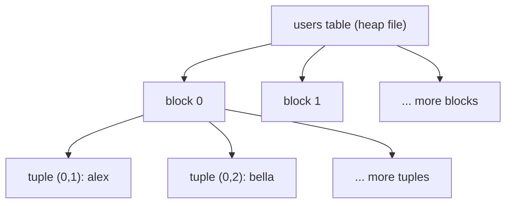

<div align="center">

# 21 · Understanding the Internals of PostgreSQL

**Part 4 — Complex Queries & Performance** · ✅ Done

</div>

> Every section so far treated a table as a logical thing — rows and columns. This is the section where I stopped and asked what's actually sitting on disk when I run `CREATE TABLE`. Not because I need it day to day, but because indexes (next section) and query costs (the two after that) stop being memorized rules and start making sense once I know what they're actually costing.

💾 Every query on this page is in [`examples.sql`](examples.sql). It uses the full `sample-db/` schema.

### 📌 What's in here

| # | Topic | In one line |
|:-:|---|---|
| 1 | [The data directory and where tables live](#1-the-data-directory-and-where-tables-live) | Every table is really a file (or several) |
| 2 | [Heap files, blocks, and tuples](#2-heap-files-blocks-and-tuples) | The unordered pile of fixed-size pages a table actually is |
| 3 | [Block data layout](#3-block-data-layout-nice-to-know) *(nice-to-know)* | What's actually inside one 8KB page |
| ✔ | [Recap](#recap) · [Practice](#practice) · [What confused me](#what-confused-me) | |

---

## 1. The data directory and where tables live

**What it is:** `PGDATA` — the folder on disk Postgres reads and writes everything from. Somewhere under it, every table I've created in this course is a real file.

**Why it exists:** `CREATE TABLE` feels like it conjures a table into existence. It actually just registers metadata and creates a file — the same kind of file `ls` can see.

### Finding it

```sql
SHOW data_directory;
```

**Result:** a path like `/var/lib/postgresql/17/main` (varies completely by install — the exact value doesn't matter, only that it points somewhere real on disk).

### Finding one specific table's file

```sql
SELECT pg_relation_filepath('users');
```

**Result:** something like `base/16384/16390` — `base/` holds every regular database, `16384` identifies *this* database, and `16390` is `users`' own file, relative to `PGDATA`. The exact numbers are unique to each installation (they're internal object ids, assigned in whatever order objects were created), but the shape — one numbered subfolder per database, one numbered file per table — is universal.

### ⚠️ Traps

- **Expecting the file name to be `users`.** It's a number (`relfilenode`), not the table name — Postgres tracks the name-to-file mapping in its own catalog (`pg_class`), specifically so renaming a table (`ALTER TABLE ... RENAME`) never has to touch the actual file on disk.

---

## 2. Heap files, blocks, and tuples

**What it is:** A table's file is a **heap** — an unordered collection of fixed-size **blocks** (also called **pages**, always 8KB by default), each holding some number of **tuples** (Postgres's internal name for one row *version*).

**Why it exists:** "Unordered" is the key word — there's no guarantee row 1 is physically first. This is the actual, concrete reason `SELECT` never promised row order, all the way back in section 1: there was never an order to promise.

### Seeing it directly

Every row secretly has a `ctid` system column — its physical address, as `(block_number, position_within_block)`:

```sql
SELECT ctid, username FROM users;
```

**Result** *(for this small, never-updated table, all in the first block)*

| ctid | username |
|---|---|
| (0,1) | alex |
| (0,2) | bella |
| (0,3) | chris |
| (0,4) | dana |
| (0,5) | erin |

### Why "tuple," not just "row"

Postgres never edits a row's bytes in place. An `UPDATE` writes a **new tuple** in the heap and marks the old one invisible — the row I see is whichever tuple version is currently valid, not a single unchanging location. This is *why* `ctid` can change after an `UPDATE`, and it's the physical mechanism behind the concurrency behavior in [29 · Handling Concurrency and Reversibility with Transactions](../29-handling-concurrency-and-reversibility-with-transactions/README.md) — old tuple versions stick around until a background process (`VACUUM`) reclaims the space.



### ⚠️ Traps

- **Treating `ctid` as a stable identifier.** It's a physical address, not an identity — it can change after `UPDATE` or `VACUUM`. `id` (the actual primary key, section 3) is the stable identifier; `ctid` is implementation detail I can look at, not something to store or rely on.

---

## 3. Block data layout *(nice-to-know)*

**What it is:** What's actually inside one 8KB block — worth knowing exists, not something I need memorized to use Postgres well day to day.

**Why it exists:** Curiosity, mostly — but it also explains *why* deleting a row doesn't shrink a table's file size (topic 2's "old tuples stick around" point, made visible).

### The layout

```
┌─────────────────────────────────────────────────┐
│ Page header (page size, checksum, free space...) │
├─────────────────────────────────────────────────┤
│ Line pointers →  (0,1) (0,2) (0,3) ...           │  ← grows forward
├─────────────────────────────────────────────────┤
│              ...free space...                    │
├─────────────────────────────────────────────────┤
│  ...  tuple 3   tuple 2   tuple 1  ← grows back   │
└─────────────────────────────────────────────────┘
```

- **Page header** — bookkeeping: how much free space is left, a checksum, etc.
- **Line pointers** — a small array of `(offset, length)` pairs, one per tuple, growing forward from just after the header. `ctid`'s second number (`(0,1)`, `(0,2)`, ...) is an index into this array.
- **Tuple data** — the actual row bytes, growing *backward* from the end of the page.
- **Free space** — the gap in the middle, shrinking from both sides as rows are added, until the block fills up and a new one starts.

### ⚠️ Traps

- **Assuming a deleted row's space is instantly reusable.** `DELETE` marks a tuple's line pointer as dead; the bytes aren't actually reclaimed until `VACUUM` runs. A table that's had a lot of updates/deletes can be physically larger on disk than its current row count would suggest, until vacuuming catches up.

---

## Recap

| Concept | What it means |
|---|---|
| `PGDATA` | The real folder on disk everything lives under |
| `relfilenode` | A table's actual file name — a number, not the table name |
| Heap | A table's data file: an unordered pile of fixed-size blocks |
| Block / page | 8KB by default; holds some number of tuples |
| Tuple | One row *version* — `UPDATE` writes a new one instead of editing in place |
| `ctid` | A tuple's physical address, `(block, position)` — not a stable identifier |
| Line pointers | Per-tuple index inside a block; `ctid`'s second number refers to one |

> **The one thing I want to remember:** a table has no inherent row order because it's physically a pile of blocks, not a list — every "don't rely on row order" warning since section 1 was really this fact, stated early before I had the vocabulary for it.

---

## Practice

**1.** Why does `ALTER TABLE ... RENAME` never need to touch the table's actual file on disk?

<details>
<summary>Show answer</summary>

The file is named by `relfilenode` (a number), not the table's name — the name-to-file mapping lives in Postgres's catalog (`pg_class`), so renaming only updates that catalog entry.

</details>

**2.** After running many `UPDATE`s on a small table, its file on disk is noticeably larger than a freshly-loaded table with the same row count. Why?

<details>
<summary>Show answer</summary>

Every `UPDATE` writes a new tuple rather than editing in place — the old tuple versions stay in the heap, taking up space, until `VACUUM` reclaims it. More updates without a vacuum means more dead tuples physically sitting in the file.

</details>

**3.** What does `ctid`'s first number represent, and why might it be `(1, 1)` instead of `(0, 1)` for some row?

<details>
<summary>Show answer</summary>

The block/page number. A row shows up in block `1` instead of `0` once block `0` has filled up (8KB worth of tuples) and Postgres has started writing into the next block in the heap file.

</details>

---

## What confused me

- I assumed a table was stored roughly like a spreadsheet, in row order, on disk. It's a pile of fixed-size blocks with no inherent order — "no guaranteed row order" stopped being an arbitrary SQL rule and became an obvious physical fact once I saw it that way.
- I didn't expect `UPDATE` to write an entirely new tuple instead of changing the existing bytes. It's the direct explanation for why a heavily-updated table can bloat in size without gaining any rows — the old versions are still sitting there.
- `ctid` looking like a great, cheap row identifier was tempting for about five minutes, until I read that it changes after `VACUUM`. `id` (an actual primary key) is the only identifier worth relying on — `ctid` is just something to *look at*.

---

[⬅ 20 · Approaching and Writing Complex Queries](../20-approaching-and-writing-complex-queries/README.md) · [🏠 Index](../README.md) · [22 · A Look at Indexes for Performance ➡](../22-a-look-at-indexes-for-performance/README.md)
