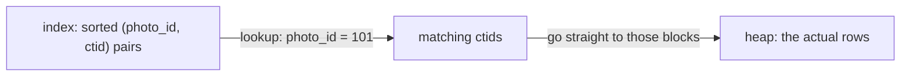
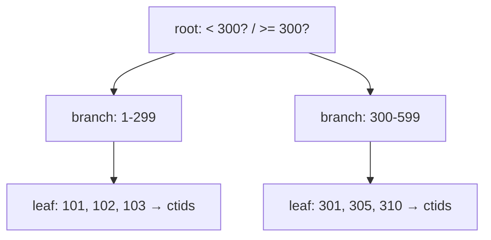

<div align="center">

# 22 · A Look at Indexes for Performance

**Part 4 — Complex Queries & Performance** · ✅ Done

</div>

> Every `WHERE`, every `JOIN ... ON`, every foreign key in this entire course has been quietly asking Postgres to *find* rows. Section 21 explained that a table is an unordered pile of blocks with no way to jump straight to anything. This section is the structure that fixes that — and a genuinely uncomfortable realization about this course's own schema.

💾 Every query on this page is in [`examples.sql`](examples.sql). It uses the full `sample-db/` schema plus `page_views` (section 6).

### 📌 What's in here

| # | Topic | In one line |
|:-:|---|---|
| 1 | [The problem: full table scans](#1-the-problem-full-table-scans) | Finding one row means checking every row |
| 2 | [What an index is](#2-what-an-index-is) | A separate, ordered lookup structure pointing back at the heap |
| 3 | [How a B-tree index finds a row](#3-how-a-b-tree-index-finds-a-row) | Narrowing the search, a level at a time |
| 4 | [Creating and dropping indexes](#4-creating-and-dropping-indexes) | One line, real trade-offs |
| 5 | [Benchmarking with and without an index](#5-benchmarking-with-and-without-an-index) | Seeing the difference, not just believing it |
| 6 | [Downsides of indexes](#6-downsides-of-indexes) | They're not free |
| 7 | [Index types](#7-index-types) | B-tree is the default for a reason, but not the only option |
| 8 | [Indexes Postgres creates automatically](#8-indexes-postgres-creates-automatically) | Some already exist — and one obvious kind doesn't |
| ✔ | [Recap](#recap) · [Practice](#practice) · [What confused me](#what-confused-me) | |

---

## 1. The problem: full table scans

**What it is:** Without any help, finding rows matching a `WHERE` condition means checking **every single row** in the heap (section 21) — a **sequential scan**.

**Why it exists (as a problem):** `page_views` has 5,000 rows. `WHERE photo_id = 101` with no index means Postgres reads all 5,000, one block at a time, to find the ~1,000 that match. At 5,000 rows that's fast regardless. At 5 million, it's the entire difference between instant and unusable.

---

## 2. What an index is

**What it is:** A separate data structure, stored alongside the table, holding the indexed column's values **in sorted order**, each one paired with a `ctid` (section 21) pointing back to the actual row in the heap.

**Why it exists:** Sorted data can be searched by narrowing a range instead of checking everything — the entire reason a phone book (or a dictionary) doesn't need to be read front to back to find one name.



---

## 3. How a B-tree index finds a row

**What it is:** Postgres's default index structure — a **balanced tree**, where each level narrows the search range, until a leaf level with the actual sorted values (and their `ctid`s) is reached.

**Why it exists:** Balanced means every leaf is the same distance from the root — no lookup is ever a "bad case" that has to walk half the table. Searching a B-tree costs roughly `log(number of rows)` comparisons, not `number of rows`.



Looking up `photo_id = 101` walks root → the `1-299` branch → the leaf holding `101`, reading a handful of blocks — not 5,000.

---

## 4. Creating and dropping indexes

**What it is:** One index per `CREATE INDEX` statement, on one or more columns.

**Why it exists:** Nothing gets indexed automatically just for being used in a `WHERE` or `JOIN` — I have to ask for it (with one significant exception, topic 8).

### Syntax

```sql
CREATE INDEX index_name ON table_name (column_name);
DROP INDEX index_name;
```

### Example

```sql
CREATE INDEX idx_page_views_photo_id ON page_views (photo_id);
```

**Result:** `CREATE INDEX`. Every query filtering or joining on `page_views.photo_id` can now use it instead of a sequential scan.

### ⚠️ Traps

- **Naming collisions with auto-generated names.** Leaving `index_name` implicit isn't possible for `CREATE INDEX` the way constraint names sometimes are — always name it explicitly, something that says what it's for (`idx_<table>_<column>` is the convention used throughout this section).

---

## 5. Benchmarking with and without an index

**What it is:** Actually *measuring* the difference, instead of assuming an index helped — `EXPLAIN` shows Postgres's chosen plan; `EXPLAIN ANALYZE` actually runs the query and reports real timing.

**Why it exists:** An index that isn't actually being used isn't helping — and (topic 6, section 24) Postgres sometimes correctly *chooses not to use* a valid index. Believing an index worked, without checking, isn't the same as knowing.

### Example

```sql
DROP INDEX IF EXISTS idx_page_views_photo_id;
EXPLAIN SELECT * FROM page_views WHERE photo_id = 101;
```

**Result (shape, not exact numbers — those depend on the machine):**
```
Seq Scan on page_views  (cost=0.00...125.00 rows=1000 width=...)
  Filter: (photo_id = 101)
```

```sql
CREATE INDEX idx_page_views_photo_id ON page_views (photo_id);
EXPLAIN SELECT * FROM page_views WHERE photo_id = 101;
```

**Result:**
```
Index Scan using idx_page_views_photo_id on page_views  (cost=0.29...45.00 rows=1000 width=...)
  Index Cond: (photo_id = 101)
```

The plan itself changes shape — `Seq Scan` becomes `Index Scan` — which is the real signal an index is being used at all. Reading exactly what these cost numbers mean is [23 · Basic Query Tuning](../23-basic-query-tuning/README.md)'s whole job; for now, the meaningful fact is just: different plan, chosen automatically, because the index now exists.

### ⚠️ Traps

- **Trusting "I added an index" without checking `EXPLAIN`.** An index that the planner decides not to use provides exactly zero benefit while still paying every cost in topic 6. The only way to know is to look.

---

## 6. Downsides of indexes

**What it is:** Indexes aren't free — they cost storage, and they cost write performance.

**Why it exists:** Every `INSERT`, `UPDATE`, or `DELETE` has to keep **every index** on that table in sync, not just the heap. More indexes means more work per write, always, whether or not that particular write ever benefits from any of them.

| Cost | What it means |
|---|---|
| Disk space | An index on a large column, on a large table, can itself be sizeable |
| Write overhead | Every write updates every relevant index, not just the table |
| Planning overhead | More indexes means more options the planner has to consider per query |

### ⚠️ Traps

- **Indexing every column "just in case."** A table that's written to constantly and rarely filtered on some column pays the write cost of an index on that column with none of the read benefit. Indexes are a deliberate trade, made per column, for columns that are actually searched or joined on.

---

## 7. Index types

**What it is:** B-tree is the default and the right choice most of the time — but Postgres has several other index types built for specific shapes of data.

**Why it exists:** Not every kind of lookup is "find values in a sorted range."

| Type | Best for |
|---|---|
| **B-tree** *(default)* | Equality and range comparisons (`=`, `<`, `>`, `BETWEEN`), and sorting |
| **Hash** | Equality only (`=`) — narrower than B-tree, rarely worth choosing over it |
| **GIN** | Columns holding *multiple* values per row — arrays, full-text search |
| **GiST** | Geometric data, nearest-neighbor searches |
| **BRIN** | Huge tables with naturally-ordered data (like a `created_at` that only ever increases) — a tiny index, at the cost of coarser precision |

### ⚠️ Traps

- **Assuming a B-tree can speed up any condition.** `LIKE '%sunset%'` (a leading wildcard, section 17's hashtag trap) can't use a plain B-tree at all — it needs a completely different kind of index (full-text search, a `GIN` index over trigrams) to become fast, which is a bigger topic than a single index type.

---

## 8. Indexes Postgres creates automatically

**What it is:** `PRIMARY KEY` and `UNIQUE` constraints **automatically** create a matching index — enforcing uniqueness *requires* being able to look up "does this value already exist" quickly, so Postgres builds the index as part of adding the constraint. Foreign keys, notably, **do not** get this treatment.

**Why it exists:** Every `UNIQUE` and every `PRIMARY KEY` in this entire course — `users.id`, `users.username`, `hashtags.name`, `photo_tags`'s composite key, all of it — has secretly already been building an index, since the moment each table was created.

### Seeing it

```sql
SELECT indexname, indexdef FROM pg_indexes WHERE tablename = 'users';
```

**Result**

| indexname | indexdef |
|---|---|
| users_pkey | CREATE UNIQUE INDEX users_pkey ON users USING btree (id) |
| users_username_key | CREATE UNIQUE INDEX users_username_key ON users USING btree (username) |

Two indexes, never explicitly requested — one from `PRIMARY KEY`, one from `username UNIQUE` (section 3).

### The gap this reveals

```sql
SELECT indexname FROM pg_indexes WHERE tablename = 'photos';
```

**Result:** just `photos_pkey` — nothing on `photos.user_id`, despite it being a foreign key I've joined on in nearly every section since section 4.

### ⚠️ Traps

> [!WARNING]
> **Foreign key columns are *not* automatically indexed.** Every `photos.user_id`, `comments.photo_id`, `likes.photo_id` in this schema has been relying on a sequential scan (or, at this tiny scale, gotten away with it) for every single join and every `ON DELETE CASCADE` check this entire course. At real scale, deleting one `users` row means Postgres has to find every `photos` row referencing it — without an index on `photos.user_id`, that's a full scan of `photos`, every single delete.
> ```sql
> CREATE INDEX idx_photos_user_id ON photos (user_id);
> ```
> This is genuinely one of the most common real-world Postgres performance gaps — foreign keys *feel* like they should be indexed automatically, since the columns they reference always are, but the referencing side never is.

---

## Recap

| Concept | What it means |
|---|---|
| Sequential scan | Checking every row — Postgres's fallback with no usable index |
| Index | A sorted structure of (value, `ctid`) pairs, pointing back at the heap |
| B-tree | The default; balanced, so lookups cost `~log(n)`, not `n` |
| `CREATE INDEX` / `DROP INDEX` | Opt-in, per column (or columns), per table |
| `EXPLAIN` | Shows the chosen plan — `Seq Scan` vs `Index Scan` — the real proof an index is used |
| Costs | Disk space, and slower writes on every indexed column |
| `PRIMARY KEY` / `UNIQUE` | Auto-indexed |
| Foreign keys | **Not** auto-indexed — a deliberate, common thing to add by hand |

> **The one thing I want to remember:** `UNIQUE` and `PRIMARY KEY` get a free index; a foreign key column does not, ever, automatically. If I've joined on it or it's the child side of an `ON DELETE CASCADE`, indexing it is a decision I have to make myself.

---

## Practice

**1.** Which foreign key columns in the full schema (section 19) are currently missing an index? List at least three.

<details>
<summary>Show answer</summary>

`photos.user_id`, `comments.user_id`, `comments.photo_id`, `likes.user_id`, `photo_tags.user_id`, `caption_tags.user_id`, `followers.follower_id`/`followed_id` (partially covered by the composite primary key, but not for lookups keyed on `followed_id` alone) — none of these get an automatic index.

</details>

**2.** Write the `CREATE INDEX` statement for `comments.photo_id`, and explain in one sentence which real query from earlier sections it would speed up.

<details>
<summary>Show answer</summary>

```sql
CREATE INDEX idx_comments_photo_id ON comments (photo_id);
```

It would speed up every `JOIN comments ON comments.photo_id = photos.id` from section 4 onward — currently a sequential scan of `comments` for every join.

</details>

**3.** Why doesn't a B-tree index help `WHERE hashtag_text LIKE '%sunset%'` from section 17's plain-text trap, even with an index on `hashtag_text`?

<details>
<summary>Show answer</summary>

A leading `%` means the match could start anywhere in the string — there's no sorted prefix a B-tree can narrow down from. B-tree indexes speed up comparisons like `=`, `<`, and `LIKE 'sunset%'` (no *leading* wildcard), not substring search.

</details>

---

## What confused me

- I assumed every column I'd ever filtered on on in this course was already indexed, just because the queries always ran fine. At 5-5,000 rows, a sequential scan *is* fast — the missing indexes were invisible purely because the dataset was never big enough to expose them.
- I expected foreign keys to be indexed automatically, the same way I now know `PRIMARY KEY`/`UNIQUE` are. Finding `photos_pkey` alone in `pg_indexes` for a table I'd joined on `user_id` in nearly every section was the moment that assumption broke.
- `EXPLAIN` showing a completely different plan shape (`Seq Scan` → `Index Scan`) rather than just a smaller number was not what I expected — I thought an index would just make the *same* plan faster, not change which strategy gets chosen at all.

---

[⬅ 21 · Understanding the Internals of PostgreSQL](../21-understanding-the-internals-of-postgresql/README.md) · [🏠 Index](../README.md) · [23 · Basic Query Tuning ➡](../23-basic-query-tuning/README.md)
