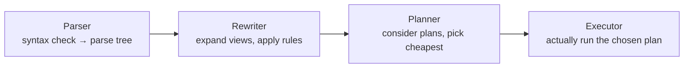

<div align="center">

# 23 · Basic Query Tuning

**Part 4 — Complex Queries & Performance** · ✅ Done

</div>

> Section 22 used `EXPLAIN` a few times without really explaining it. This section is the follow-through — what actually happens between typing a query and getting a result, and how to read what Postgres decided to do about it.

💾 Every query on this page is in [`examples.sql`](examples.sql). It uses the full `sample-db/` schema plus `page_views` (section 6).

### 📌 What's in here

| # | Topic | In one line |
|:-:|---|---|
| 1 | [The query processing pipeline](#1-the-query-processing-pipeline) | Four stages between typing SQL and getting rows back |
| 2 | [EXPLAIN](#2-explain) | Shows the plan, without running it |
| 3 | [EXPLAIN ANALYZE](#3-explain-analyze) | Actually runs it — with a real trap |
| 4 | [Reading a query plan](#4-reading-a-query-plan) | The tree, the costs, estimate vs reality |
| 5 | [Statistics the planner uses](#5-statistics-the-planner-uses) | Why the planner isn't guessing blindly |
| ✔ | [Recap](#recap) · [Practice](#practice) · [What confused me](#what-confused-me) | |

---

## 1. The query processing pipeline

**What it is:** Four stages every query passes through before I see a single row back.

**Why it exists:** "Run my SQL" is doing more work than it looks like — knowing the stages is what makes `EXPLAIN`'s output (topic 2) make sense instead of feeling like a black box.



- **Parser** — checks the SQL is grammatically valid, turns it into an internal parse tree. This is where `SELECT FROM;` with nothing selected fails, before anything about tables is even considered.
- **Rewriter** — applies rewrite rules, most notably expanding any view (section 27) into the real query underneath it.
- **Planner / optimizer** — considers multiple possible strategies for actually answering the query (`Seq Scan` vs `Index Scan` from section 22, different join orders and algorithms) and picks the one it estimates is cheapest, using stored statistics (topic 5).
- **Executor** — runs the plan the planner chose, and returns the rows.

`EXPLAIN` (topic 2) shows the output of the *planner* stage — the chosen plan — without letting the *executor* stage actually run.

---

## 2. EXPLAIN

**What it is:** Shows the plan Postgres *would* use for a query, with estimated costs — without executing it.

**Why it exists:** Seeing the plan is how section 22 could tell `Seq Scan` became `Index Scan` after adding an index, without needing to actually run (and wait for) the query each time.

### Syntax

```sql
EXPLAIN query;
```

### Example

```sql
EXPLAIN SELECT * FROM page_views WHERE photo_id = 101;
```

**Result (shape — exact numbers depend on the machine and current statistics):**
```
Index Scan using idx_page_views_photo_id on page_views  (cost=0.29..45.12 rows=1000 width=24)
  Index Cond: (photo_id = 101)
```

- `cost=0.29..45.12` — estimated cost to return the *first* row, then *all* rows, in arbitrary cost units (not milliseconds — topic 4 of [24 · Advanced Query Tuning](../24-advanced-query-tuning/README.md) covers what the units actually mean).
- `rows=1000` — the planner's **estimate** of how many rows will match, from statistics, not a real count.
- `width=24` — estimated average bytes per row.

### ⚠️ Traps

- **Reading `rows=1000` as a guaranteed number.** It's the planner's best guess *before running anything* — topic 3 is specifically about seeing how close that guess actually was.

---

## 3. EXPLAIN ANALYZE

**What it is:** Like `EXPLAIN`, but **actually executes** the query and adds real timing and real row counts next to the estimates.

**Why it exists:** Comparing "estimated 1000 rows" against "actual 1000 rows" is how I'd notice the planner's statistics are stale (topic 5) — `EXPLAIN` alone can't show that, since it never runs anything.

### Syntax

```sql
EXPLAIN ANALYZE query;
```

### Example

```sql
EXPLAIN ANALYZE SELECT * FROM page_views WHERE photo_id = 101;
```

**Result (shape):**
```
Index Scan using idx_page_views_photo_id on page_views
  (cost=0.29..45.12 rows=1000 width=24) (actual time=0.02..0.31 rows=1000 loops=1)
  Index Cond: (photo_id = 101)
Planning Time: 0.15 ms
Execution Time: 0.38 ms
```

`rows=1000` (estimate) matches `rows=1000` (actual) — the planner's statistics were accurate here.

### ⚠️ Traps

> [!WARNING]
> **`EXPLAIN ANALYZE` actually runs the query — including `INSERT`, `UPDATE`, and `DELETE`.** `EXPLAIN ANALYZE DELETE FROM page_views WHERE photo_id = 101;` doesn't preview a delete, it **performs it**, for real, then reports on what it just did. `EXPLAIN` (without `ANALYZE`) is the safe, look-only version for anything that isn't a plain `SELECT`.

---

## 4. Reading a query plan

**What it is:** A tree, printed as nested indentation — the most-indented lines run **first**; their results feed into the less-indented lines above them.

**Why it exists:** A plan for a join isn't one step, it's several, each depending on the one below it — reading top-to-bottom would have the steps backward.

### Example

```sql
EXPLAIN SELECT p.url, u.username
FROM photos AS p
JOIN users AS u ON p.user_id = u.id;
```

**Result (shape):**
```
Hash Join  (cost=1.11..2.35 rows=5 width=40)
  Hash Cond: (p.user_id = u.id)
  ->  Seq Scan on photos p  (cost=0.00..1.05 rows=5 width=24)
  ->  Hash  (cost=1.06..1.06 rows=5 width=20)
        ->  Seq Scan on users u  (cost=0.00..1.05 rows=5 width=20)
```

Read from the bottom up: `users` is scanned and built into an in-memory `Hash` structure *first*; `photos` is scanned next; then the `Hash Join` at the top combines them. Three real steps, even though it's one query.

### ⚠️ Traps

- **Reading a plan top-to-bottom, like the query text.** The indentation is an execution *dependency* order, not a reading order — the deepest-indented node genuinely runs before anything that depends on it.

---

## 5. Statistics the planner uses

**What it is:** The planner doesn't inspect the real table before every query — it uses **stored statistics** (row counts, most common values, how many distinct values a column has), refreshed by `ANALYZE` (the command — different from `EXPLAIN ANALYZE`).

**Why it exists:** Actually counting matching rows before *every* query would defeat the purpose of planning quickly. Stored estimates are cheap to consult; they just need to be kept reasonably fresh.

### Syntax

```sql
ANALYZE table_name;   -- refresh statistics
SELECT * FROM pg_stats WHERE tablename = 'table_name';
```

### Example

```sql
SELECT attname, n_distinct, most_common_vals
FROM pg_stats
WHERE tablename = 'page_views' AND attname = 'photo_id';
```

**Result (shape):** `n_distinct` around `5` (the number of distinct `photo_id` values that actually exist), and `most_common_vals` listing some of them — this is exactly what the planner consulted to estimate `rows=1000` in topic 2, without ever counting the real table.

### ⚠️ Traps

- **Bulk-loading data (like section 6's 5,000-row `generate_series` insert) and expecting the planner to immediately know about it.** Statistics are refreshed by `ANALYZE` (run automatically by autovacuum, eventually — not instantly) — right after a large bulk load, running `ANALYZE table_name;` by hand keeps the planner's next estimate from being based on stale, pre-bulk-load statistics.

---

## Recap

| Concept | What it means |
|---|---|
| Parser → Rewriter → Planner → Executor | The four stages every query passes through |
| `EXPLAIN` | Shows the chosen plan and cost *estimates* — doesn't run anything |
| `EXPLAIN ANALYZE` | Actually runs the query, adds real timing and actual row counts |
| Plan tree | Read bottom-up / most-indented-first — that's execution order |
| `pg_stats` / `ANALYZE` | Where the planner's row-count and value estimates come from |

> **The one thing I want to remember:** `EXPLAIN` is a look; `EXPLAIN ANALYZE` is a run. The difference matters enormously the moment the query being explained isn't a `SELECT`.

---

## Practice

**1.** Why might `EXPLAIN`'s `rows=` estimate and `EXPLAIN ANALYZE`'s actual `rows=` disagree significantly on a table that's had a lot of recent inserts?

<details>
<summary>Show answer</summary>

If `ANALYZE` hasn't run since those inserts, the planner is still estimating from stale statistics that don't reflect the table's current size or value distribution — running `ANALYZE table_name;` refreshes them.

</details>

**2.** Is it safe to run `EXPLAIN ANALYZE UPDATE products SET stock = 0;`? Why or why not?

<details>
<summary>Show answer</summary>

**No.** `EXPLAIN ANALYZE` executes the statement for real — this would actually zero out every row's `stock`, not preview it. Plain `EXPLAIN` (no `ANALYZE`) is the safe option for anything other than a `SELECT`.

</details>

**3.** In the `Hash Join` plan from topic 4, which table is scanned *first* — `photos` or `users`?

<details>
<summary>Show answer</summary>

**`users`.** It's the most deeply indented `Seq Scan`, nested inside the `Hash` step — the plan builds the hash table from `users` before scanning `photos` and joining against it.

</details>

---

## What confused me

- I assumed `EXPLAIN` and `EXPLAIN ANALYZE` were basically the same command with slightly more detail. Realizing `ANALYZE` actually *executes* the query — real `DELETE`s and all — was an uncomfortable surprise the first time I read that carefully instead of skimming it.
- Reading a plan top-to-bottom, like normal SQL, gave me the execution order backward every time until I noticed the indentation was the real signal, not the line order on the page.
- I didn't realize the planner was working from **stored estimates**, not the live table, until `pg_stats` made it concrete. It reframed "the planner chose a bad plan" from "Postgres made a mistake" to "the statistics it was working from were stale" — a much more useful way to think about it.

---

[⬅ 22 · A Look at Indexes for Performance](../22-a-look-at-indexes-for-performance/README.md) · [🏠 Index](../README.md) · [24 · Advanced Query Tuning ➡](../24-advanced-query-tuning/README.md)
