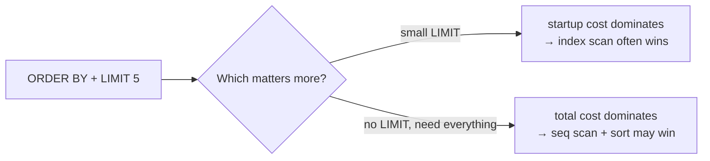

<div align="center">

# 24 · Advanced Query Tuning

**Part 4 — Complex Queries & Performance** · ✅ Done

</div>

> Section 23 kept saying "cost, in arbitrary units" and moving on. This section is where that stops being good enough — what the numbers in `EXPLAIN` actually come from, and the specific, satisfying case of watching Postgres correctly *refuse* to use an index I built for it.

💾 Every query on this page is in [`examples.sql`](examples.sql). It uses the full `sample-db/` schema plus `page_views` and its index (sections 6, 22).

### 📌 What's in here

| # | Topic | In one line |
|:-:|---|---|
| 1 | [What "cost" means](#1-what-cost-means) | A relative unit, not a time prediction |
| 2 | [Calculating cost by hand](#2-calculating-cost-by-hand) | The actual formula behind a `Seq Scan`'s number |
| 3 | [Cost settings](#3-cost-settings) | The knobs that formula is built from |
| 4 | [Startup cost vs total cost](#4-startup-cost-vs-total-cost) | Two numbers, and why `LIMIT` cares about the first one |
| 5 | [Why Postgres sometimes ignores your index](#5-why-postgres-sometimes-ignores-your-index) | Correctly, most of the time |
| ✔ | [Recap](#recap) · [Practice](#practice) · [What confused me](#what-confused-me) | |

---

## 1. What "cost" means

**What it is:** An abstract, relative number — **not** milliseconds, not any real unit of time. It exists purely so the planner can compare candidate plans against each other and pick the smallest.

**Why it exists:** Predicting actual runtime would need to know the exact machine, disk, cache state, and load at execution time. Cost sidesteps all of that — it only has to be *consistently* comparable, not accurate in an absolute sense.

---

## 2. Calculating cost by hand

**What it is:** The formula behind the number `EXPLAIN` shows for a plain sequential scan:

```
Seq Scan cost = (pages × seq_page_cost) + (rows × cpu_tuple_cost)
```

**Why it exists:** Reading `cost=0.00..90.00` and knowing *where* `90.00` came from is the difference between memorizing a number and understanding a formula I could sanity-check.

### Example (illustrative numbers — the real page count depends on stored row width)

For `page_views` (5,000 rows, roughly 40 pages at this table's row width), using the default settings from topic 3:

```
(40 pages × 1.0) + (5,000 rows × 0.01) = 40 + 50 = 90
```

`EXPLAIN`'s `cost=0.00..90.00` for a full `page_views` scan isn't a magic number — it's exactly this sum. The `0.00` startup and `90.00` total are topic 4.

### ⚠️ Traps

- **Expecting the exact page count without checking.** `pages` depends on the table's actual stored row width, which depends on the real column types and any padding — the formula is exact; the inputs to it aren't something to guess without looking (`SELECT relpages FROM pg_class WHERE relname = 'page_views';` gives the real number).

---

## 3. Cost settings

**What it is:** The tunable constants the cost formula is built from — how expensive Postgres *assumes* each kind of operation is, relative to each other.

**Why it exists:** These assumptions come from spinning-disk-era defaults. They're still the defaults today, but not always the right assumptions for modern hardware.

| Setting | Default | Meaning |
|---|--:|---|
| `seq_page_cost` | `1.0` | Cost to read one page sequentially |
| `random_page_cost` | `4.0` | Cost to read one page at a random location |
| `cpu_tuple_cost` | `0.01` | Cost to process one row |
| `cpu_index_tuple_cost` | `0.005` | Cost to process one index entry |
| `cpu_operator_cost` | `0.0025` | Cost to evaluate one operator/function call |

`random_page_cost` being `4×` `seq_page_cost` encodes "a disk seek is expensive" — true for spinning disks, much less true for SSDs. This is a genuinely common real-world tuning change: lowering `random_page_cost` (sometimes to as low as `1.1`) on SSD-backed databases, so the planner stops over-penalizing index scans that don't deserve it.

### ⚠️ Traps

- **Assuming these settings are universal facts about databases**, rather than assumptions Postgres makes that I can override. `SET random_page_cost = 1.1;` is a real, common tuning step — not something exotic.

---

## 4. Startup cost vs total cost

**What it is:** The two numbers in `cost=X..Y` — `X` (startup cost) is the estimated cost *before the first row* can be returned; `Y` (total cost) is the estimated cost to return *every* row.

**Why it exists:** They're the same number for a plain sequential scan (nothing to do before the first row). They diverge sharply for anything that has to prepare before producing output at all — like sorting.

### Example

```sql
EXPLAIN SELECT * FROM page_views ORDER BY viewed_at LIMIT 5;
```

A plan that sorts the *entire* 5,000-row table first has a high **startup** cost (the whole sort has to finish before row 1 comes out) even if its total cost looks reasonable. A plan using an index already in `viewed_at` order has near-zero startup cost — it can hand back row 1 almost immediately.

**This is exactly why `LIMIT` can change which plan gets chosen (section 7's `LIMIT`, made concrete):** with `LIMIT 5`, the planner only cares about *reaching the first 5 rows* cheaply — startup cost plus a sliver of total cost — so it can rationally prefer a plan whose *total* cost (for all 5,000 rows) would actually be worse, simply because getting to row 5 is faster that way.



### ⚠️ Traps

- **Comparing two plans by total cost alone when a `LIMIT` is involved.** The planner itself doesn't make this mistake — but reading `EXPLAIN` output by eye and only glancing at the second number can lead to the wrong conclusion about *why* a particular plan was chosen.

---

## 5. Why Postgres sometimes ignores your index

**What it is:** The planner comparing the index-scan cost against the sequential-scan cost, honestly, and sometimes finding the sequential scan cheaper — even for a column that has a perfectly good index (section 22).

**Why it exists:** An index scan means extra random-access reads (topic 3's expensive `random_page_cost`) *on top of* fetching the actual heap rows it points to. If a query is going to match a large fraction of the table anyway, reading every page once, in order, can genuinely cost less than jumping around via the index.

### Example

```sql
EXPLAIN SELECT * FROM page_views WHERE photo_id IN (101, 102, 103, 104, 105);
```

**Result (shape):**
```
Seq Scan on page_views  (cost=0.00..90.00 rows=5000 width=24)
  Filter: (photo_id = ANY ('{101,102,103,104,105}'::integer[]))
```

Even with `idx_page_views_photo_id` sitting right there, Postgres chooses `Seq Scan` — correctly. `page_views` only has 5 distinct `photo_id` values (section 6), so `IN (101, 102, 103, 104, 105)` matches **every single row**. Using the index would mean paying for 5,000 random-access lookups just to end up reading the entire table anyway; reading it sequentially, once, is cheaper.

### ⚠️ Traps

- **Concluding an index is "broken" because a query that should obviously use it doesn't.** The far more common explanation is topic 5's actual reason: the condition matches too large a fraction of the table for the index to be worth it. Comparing `EXPLAIN`'s two candidate costs (or forcing a comparison with `SET enable_seqscan = off;` temporarily) is the way to confirm it, rather than assuming.

---

## Recap

| Concept | What it means |
|---|---|
| Cost | A relative unit for comparing plans — not a time prediction |
| `Seq Scan` cost formula | `(pages × seq_page_cost) + (rows × cpu_tuple_cost)` |
| `seq_page_cost` / `random_page_cost` | `1.0` / `4.0` by default — random access assumed 4× more expensive |
| Startup vs total cost | Cost to first row vs cost to every row — `LIMIT` cares mostly about the first |
| Index sometimes skipped | Correct, when the condition matches too large a fraction of the table |

> **The one thing I want to remember:** an index the planner declines to use usually isn't a bug — it's the planner correctly noticing that reading almost the whole table sequentially beats jumping around via the index to reach almost the whole table anyway.

---

## Practice

**1.** Would you expect `WHERE photo_id = 101` (one value) to use the index, given the same table `WHERE photo_id IN (101,102,103,104,105)` (all values) doesn't?

<details>
<summary>Show answer</summary>

**Yes.** `photo_id = 101` matches only `~1,000` of `5,000` rows (a fifth of the table, not all of it) — a small enough fraction that the index scan's random-access cost is worth paying, unlike the `IN (...)` version that matches everything.

</details>

**2.** If `random_page_cost` were lowered from `4.0` to `1.1`, would that make index scans more or less likely to be chosen, in general?

<details>
<summary>Show answer</summary>

**More likely.** Lowering `random_page_cost` makes the planner's assumed cost of an index scan's random-access reads cheaper relative to a sequential scan, shifting more borderline decisions toward using the index.

</details>

**3.** For `SELECT * FROM page_views ORDER BY id LIMIT 5;`, would you expect a low or high startup cost from the plan using `page_views`'s primary key index, and why?

<details>
<summary>Show answer</summary>

**Low.** The primary key index already stores `id` values in sorted order — the first 5 rows are immediately available at the start of the index, with no sorting step required before returning them.

</details>

---

## What confused me

- I initially read "cost" as an estimate of milliseconds. Realizing it's a unitless, relative number — only meaningful for comparing two plans against each other, never as an absolute prediction — changed how I read `EXPLAIN` output entirely.
- Seeing `Seq Scan` chosen over an index I'd specifically built felt like something was wrong, the first time I hit it. Working through *why* (topic 5) turned it from a suspected bug into a genuinely reassuring sign the planner was reasoning correctly.
- I didn't expect two separate cost numbers to matter independently. `LIMIT` caring almost entirely about startup cost, while an unlimited query cares about total cost, was the piece that made `cost=X..Y` click as two different, useful pieces of information instead of one confusing pair.

---

[⬅ 23 · Basic Query Tuning](../23-basic-query-tuning/README.md) · [🏠 Index](../README.md) · [25 · Simple Common Table Expressions ➡](../25-simple-common-table-expressions/README.md)
