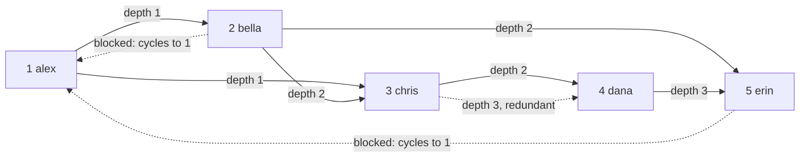

<div align="center">

# 26 · Recursive Common Table Expressions

**Part 5 — Advanced Querying** · ✅ Done

</div>

> Every query so far answers a question about a fixed number of "hops" — one join, two joins, however many I wrote. "Everyone reachable by following chains, however many hops that takes" isn't answerable that way — the number of joins needed depends on the data itself. This is the tool for that, and section 18's follow graph (deliberately built with a cycle in it) is exactly the trap that makes it worth learning carefully.

💾 Every query on this page is in [`examples.sql`](examples.sql). It uses the follow graph from section 18.

### 📌 What's in here

| # | Topic | In one line |
|:-:|---|---|
| 1 | [WITH RECURSIVE syntax](#1-with-recursive-syntax) | A base case, and a case that refers to itself |
| 2 | [How recursion runs, step by step](#2-how-recursion-runs-step-by-step) | One real trace, by hand, through a graph with a cycle |
| 3 | [Example: follower suggestions](#3-example-follower-suggestions) | "People near me in the graph I don't already follow" |
| ✔ | [Recap](#recap) · [Practice](#practice) · [What confused me](#what-confused-me) | |

---

## 1. WITH RECURSIVE syntax

**What it is:** A CTE (section 25) with two parts, combined with `UNION` or `UNION ALL`: a **base case** (runs once) and a **recursive case** (refers back to the CTE's own name, and keeps running against whatever the *previous* run just produced, until it produces nothing new).

**Why it exists:** "Follow the graph outward, however far it goes" can't be written as a fixed number of joins — the depth isn't known in advance.

### Syntax

```sql
WITH RECURSIVE cte_name AS (
    -- base case: the starting point(s)
    SELECT ...

    UNION ALL

    -- recursive case: refers to cte_name itself
    SELECT ...
    FROM some_table
    JOIN cte_name ON ...
)
SELECT ... FROM cte_name;
```

### ⚠️ Traps

- **Using `UNION` instead of `UNION ALL` out of habit.** `UNION` (section 8) de-duplicates every iteration against everything so far, which can quietly hide a real bug (rows that *should* be distinct but aren't) behind automatic cleanup. `UNION ALL` plus an explicit cycle guard (topic 2) is the standard, more honest pattern.

---

## 2. How recursion runs, step by step

**What it is:** Each round, the recursive case runs only against the rows the **previous round** produced — not the whole accumulated result — and stops the moment a round produces zero new rows.

**Why it exists:** Section 18's follow graph has a cycle on purpose (`alex → chris → dana → erin → alex`) — tracing through it by hand is what makes "this needs a stopping condition, or it never stops" a fact I've seen, not a warning I'm just trusting.

### Tracing "everyone reachable by following, from alex, within 3 hops" — by hand

```sql
WITH RECURSIVE reachable AS (
    SELECT followed_id AS user_id, 1 AS depth, ARRAY[1, followed_id] AS path
    FROM followers
    WHERE follower_id = 1

    UNION ALL

    SELECT f.followed_id, r.depth + 1, r.path || f.followed_id
    FROM followers AS f
    JOIN reachable AS r ON f.follower_id = r.user_id
    WHERE r.depth < 3
      AND NOT (f.followed_id = ANY (r.path))   -- cycle guard
)
SELECT * FROM reachable ORDER BY depth, user_id;
```

| Round | New rows produced |
|---|---|
| Base | `(2, depth 1, [1,2])`, `(3, depth 1, [1,3])` — alex's direct follows |
| Round 1 | From `2`: `(3, depth 2)`, `(5, depth 2)` — **not** `(1, ...)`, blocked by the cycle guard (`1` is already in `2`'s path). From `3`: `(4, depth 2)` |
| Round 2 | From `3`(depth 2): `(4, depth 3)`. From `5`(depth 2): nothing new — its only outgoing edge goes to `1`, already in its path. From `4`(depth 2): `(5, depth 3)` |
| Round 3 | `depth < 3` is now false for every depth-3 row — nothing left to expand |



### ⚠️ Traps

> [!WARNING]
> **Without the cycle guard, this specific graph never terminates.** Remove `AND NOT (f.followed_id = ANY(r.path))` and `bella → alex → bella → alex → ...` (and the longer `chris → dana → erin → alex → chris → ...` cycle) would keep producing "new" rows forever — `depth < 3` alone doesn't save it, because depth still keeps climbing past 3 every round; the `WHERE r.depth < 3` filter on the *next* expansion is the only thing stopping it, and forgetting it (or forgetting the cycle guard when depth isn't capped) is exactly how a recursive query runs indefinitely.

---

## 3. Example: follower suggestions

**What it is:** "People within reach of my follow graph that I don't already follow directly" — a real, common feature, and the actual point of tracing topic 2 by hand.

**Why it exists:** Direct follows (depth 1) aren't suggestions — they're already followed. The useful suggestions are the *reachable but not-yet-followed* users: friends of friends.

### Example

```sql
WITH RECURSIVE reachable AS (
    SELECT followed_id AS user_id, 1 AS depth, ARRAY[1, followed_id] AS path
    FROM followers
    WHERE follower_id = 1

    UNION ALL

    SELECT f.followed_id, r.depth + 1, r.path || f.followed_id
    FROM followers AS f
    JOIN reachable AS r ON f.follower_id = r.user_id
    WHERE r.depth < 3
      AND NOT (f.followed_id = ANY (r.path))
)
SELECT u.username, MIN(r.depth) AS shortest_hops
FROM reachable AS r
JOIN users AS u ON u.id = r.user_id
WHERE r.user_id NOT IN (SELECT followed_id FROM followers WHERE follower_id = 1)
GROUP BY u.username
ORDER BY shortest_hops, u.username;
```

**Result**

| username | shortest_hops |
|---|--:|
| dana | 2 |
| erin | 2 |

`bella` and `chris` are reachable too (at `depth 1`), but they're excluded — `alex` already follows them directly, so they're not *suggestions*. `dana` and `erin` are two hops out: people alex's follows follow, that alex doesn't follow yet.

### ⚠️ Traps

- **Forgetting to exclude already-followed users**, and suggesting people already being followed. The recursive part finds everyone *reachable* — deciding which of those are actually useful *suggestions* is a separate filter on top, easy to skip and get a technically-working but useless result.

---

## Recap

| Concept | What it means |
|---|---|
| `WITH RECURSIVE name AS (base UNION ALL recursive)` | Base case runs once; recursive case re-runs against only the newest rows |
| Termination | Stops automatically once a round produces zero new rows — or runs forever without one |
| Cycle guard (`NOT (x = ANY(path))`) | Required on graphs with cycles, or depth keeps "growing" without ever converging |
| Follower suggestions | Reachable users, minus users already directly followed |

> **The one thing I want to remember:** a recursive CTE without either a depth cap or a cycle guard isn't slow on a graph with a cycle — it's infinite. Section 18 built that cycle into the follow graph on purpose, specifically so this lesson would be concrete instead of theoretical.

---

## Practice

**1.** Using the `reachable` CTE (depth `< 3`), which users are reachable from `bella` (user `2`) within 2 hops?

<details>
<summary>Show answer</summary>

```sql
WITH RECURSIVE reachable AS (
    SELECT followed_id AS user_id, 1 AS depth, ARRAY[2, followed_id] AS path
    FROM followers WHERE follower_id = 2
    UNION ALL
    SELECT f.followed_id, r.depth + 1, r.path || f.followed_id
    FROM followers AS f JOIN reachable AS r ON f.follower_id = r.user_id
    WHERE r.depth < 2 AND NOT (f.followed_id = ANY (r.path))
)
SELECT DISTINCT user_id, MIN(depth) AS shortest_hops FROM reachable GROUP BY user_id ORDER BY shortest_hops;
```

`1` (alex, depth 1), `3` (chris, depth 1), `5` (erin, depth 1), `4` (dana, depth 2, via chris).

</details>

**2.** What would happen to the follower-suggestions query if `WHERE r.depth < 3` were removed entirely, but the cycle guard stayed?

<details>
<summary>Show answer</summary>

It would still terminate — the cycle guard alone is enough to stop it, since every path can only visit each user once, and there are only 5 users total. It would just search *further* (up to 4 hops, the longest possible non-repeating path in a 5-user graph) instead of stopping at 3.

</details>

**3.** Why is `UNION ALL` used here instead of `UNION`, given the cycle guard already prevents infinite growth?

<details>
<summary>Show answer</summary>

They're solving different problems. The cycle guard stops *one path* from revisiting a user. `UNION ALL` vs `UNION` is about whether *identical rows arriving via different paths* get deduplicated — with `UNION ALL`, `chris` reached at depth 2 via one path and depth 2 via another (if such a case existed) would both survive, which is exactly the raw data `MIN(depth)` needs to work correctly afterward.

</details>

---

## What confused me

- I expected the recursive term to re-scan the *entire* accumulated result each round. It only sees the rows the *immediately previous* round added — which is exactly why a cycle guard has to look at the specific path taken so far, not just "have I seen this user anywhere yet across all rounds."
- Tracing the cycle by hand was the only thing that actually made "this could run forever" feel real instead of a warning to take on faith. Seeing `bella → alex` get blocked specifically because `1` was already in `bella`'s own path — not some global "visited" set — was the detail that made the mechanism click.
- I initially built the suggestions query without excluding already-followed users and got confused why `bella` showed up as a "suggestion" for someone who already follows her. The recursive part was completely correct — it was a missing filter *afterward*, not a recursion bug.

---

[⬅ 25 · Simple Common Table Expressions](../25-simple-common-table-expressions/README.md) · [🏠 Index](../README.md) · [27 · Simplifying Queries with Views ➡](../27-simplifying-queries-with-views/README.md)
