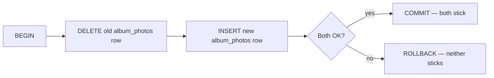
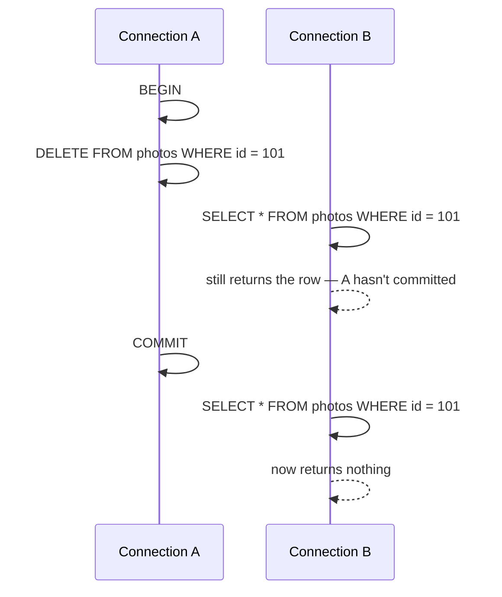

<div align="center">

# 29 · Handling Concurrency and Reversibility with Transactions

**Part 6 — Transactions & Migrations** · ✅ Done

</div>

> Every statement in this entire course has run alone, committed the instant it finished, with no way to undo it except writing another statement. Section 21 mentioned tuples and MVCC in passing — this is where that actually matters: grouping several statements into one all-or-nothing unit, and seeing exactly what Postgres does the moment one of them fails.

💾 Every query on this page is in [`examples.sql`](examples.sql). It uses the full `sample-db/` schema.

### 📌 What's in here

| # | Topic | In one line |
|:-:|---|---|
| 1 | [Why transactions exist](#1-why-transactions-exist) | Several statements that must succeed, or fail, together |
| 2 | [BEGIN, COMMIT, ROLLBACK](#2-begin-commit-rollback) | Starting a unit, keeping it, or undoing it |
| 3 | [Aborted transactions and errors](#3-aborted-transactions-and-errors) | One failure poisons everything after it, until ROLLBACK |
| 4 | [Transactions and concurrent connections](#4-transactions-and-concurrent-connections) | What other connections can and can't see mid-transaction |
| ✔ | [Recap](#recap) · [Practice](#practice) · [What confused me](#what-confused-me) | |

---

## 1. Why transactions exist

**What it is:** A way to group multiple statements into one unit that either **all** succeed, or **all** get undone — never half-applied.

**Why it exists:** Moving a photo from one album to another is really two statements — remove it from the old `album_photos` row, add it to the new one. If the first succeeds and the second fails (a crash, a constraint violation, anything), the photo silently disappears from every album. Neither statement is wrong on its own; the *pair* needs to be atomic.



---

## 2. BEGIN, COMMIT, ROLLBACK

**What it is:** `BEGIN` starts a transaction. `COMMIT` makes everything inside it permanent. `ROLLBACK` undoes everything inside it, as if none of it ever ran.

**Why it exists:** Without `BEGIN`, every statement is already its own tiny, automatically-committed transaction (this is why nothing in this course has needed `COMMIT` until now) — `BEGIN` is what makes "several statements, one unit" possible at all.

### Syntax

```sql
BEGIN;
  -- statements
COMMIT;    -- keep it all
-- or
ROLLBACK;  -- undo it all
```

### Example — the album move, done safely

```sql
INSERT INTO albums (name, user_id) VALUES ('Coffee Shots', 1);   -- album id 2

BEGIN;
DELETE FROM album_photos WHERE album_id = 1 AND photo_id = 103;
INSERT INTO album_photos (album_id, photo_id) VALUES (2, 103);
COMMIT;
```

### Example — catching a mistake before it's permanent

```sql
BEGIN;
DELETE FROM photos WHERE id = 101;   -- wrong photo!
ROLLBACK;

SELECT * FROM photos WHERE id = 101;
```

**Result:** `sunset.jpg` is still there — the `DELETE` genuinely ran, but `ROLLBACK` undid it completely before it ever became permanent.

### ⚠️ Traps

- **Forgetting a transaction is open.** Every statement after a `BEGIN` with no matching `COMMIT`/`ROLLBACK` is sitting in limbo — not yet permanent, and (topic 4) not visible to anyone else either. Leaving one open by accident (walking away from a `psql` session mid-transaction) can quietly block other work.

---

## 3. Aborted transactions and errors

**What it is:** The moment **any** statement inside a transaction errors, Postgres marks the **entire transaction** as aborted — every statement after that, even a perfectly valid one, gets rejected until a `ROLLBACK`.

**Why it exists:** Postgres can't know whether a later statement was written assuming the failed one had actually succeeded — refusing everything until an explicit decision (`ROLLBACK`) is the safe default, rather than guessing.

### Example

```sql
BEGIN;
INSERT INTO users (username) VALUES ('newuser');   -- succeeds
INSERT INTO users (username) VALUES ('alex');       -- fails: duplicate username
SELECT * FROM users;                                -- also fails!
```

**Result:** the second `INSERT` fails as expected —
```
ERROR:  duplicate key value violates unique constraint "users_username_key"
```
— but the `SELECT` afterward, a completely valid statement on its own, **also** fails:
```
ERROR:  current transaction is aborted, commands ignored until end of transaction block
```

The only way out is `ROLLBACK`. Even the first, successful `INSERT` ('newuser') is undone with it — the whole transaction, not just the failed statement.

```sql
ROLLBACK;
SELECT COUNT(*) FROM users;
```

**Result:** back to `5` — `'newuser'` never actually stuck, despite its own `INSERT` having reported success at the time.

### ⚠️ Traps

- **Assuming a successful statement inside a later-failed transaction is safe.** It isn't, until `COMMIT` actually runs. `'newuser'`'s `INSERT` genuinely succeeded in the moment — and still vanished, because the transaction as a whole was rolled back.

---

## 4. Transactions and concurrent connections

**What it is:** Changes made inside an open transaction are only visible **within that same connection**, until `COMMIT`. A different connection querying the same table sees the old data, as if nothing had happened yet.

**Why it exists:** Without this, other connections would see partially-applied, possibly-about-to-be-rolled-back changes — exactly the "half of a multi-step operation" problem topic 1 exists to prevent, just visible to *other* people instead of just to me.

### The scenario



Connection `A`'s `DELETE` is real, immediately, from `A`'s own point of view — but invisible to `B` until `A` commits. This is the concrete reason `ROLLBACK` (topic 2) can undo it completely: nobody else had committed to seeing it yet.

### ⚠️ Traps

- **Assuming a long-running transaction is harmless just because it hasn't errored.** Section 21's "old tuple versions stick around" fact is directly relevant here — a long-open transaction can delay Postgres from cleaning up old row versions that transaction might still need to see, which is part of why leaving transactions open indefinitely (topic 2's trap) is a real operational concern, not just a style issue.

---

## Recap

| Concept | What it means |
|---|---|
| Transaction | Multiple statements, one all-or-nothing unit |
| `BEGIN` | Starts grouping statements together |
| `COMMIT` | Makes everything since `BEGIN` permanent |
| `ROLLBACK` | Undoes everything since `BEGIN`, entirely |
| One failed statement | Aborts the *whole* transaction — every later statement is rejected until `ROLLBACK` |
| Visibility | Changes inside an open transaction are invisible to other connections until `COMMIT` |

> **The one thing I want to remember:** a statement reporting success inside a transaction is not the same as that change being permanent. Nothing is real until `COMMIT` — and one later failure can take an earlier success down with it.

---

## Practice

**1.** What does `SELECT * FROM users;` return if run immediately after the failed transaction in topic 3, but *before* `ROLLBACK`?

<details>
<summary>Show answer</summary>

An error — `current transaction is aborted, commands ignored until end of transaction block`. The transaction stays aborted, rejecting every statement, until `ROLLBACK` (or, if it could still be salvaged with a `SAVEPOINT`, a topic beyond this course) explicitly ends it.

</details>

**2.** Two connections both have an open transaction that `UPDATE`s the same row's `stock`. Does the second connection's `UPDATE` succeed immediately?

<details>
<summary>Show answer</summary>

It waits — Postgres blocks the second `UPDATE` until the first transaction either commits or rolls back, since letting both proceed independently could mean one of the changes gets silently lost. This is a genuine simplification of real locking behavior; the concrete takeaway for this course is just that concurrent writers to the same row don't run fully independently.

</details>

**3.** Why does moving a photo between albums (topic 2's example) need `BEGIN`/`COMMIT` at all, if `DELETE` and `INSERT` each already succeed or fail on their own?

<details>
<summary>Show answer</summary>

Each statement is individually safe, but the *pair* isn't — if the `DELETE` succeeds and the `INSERT` then fails (or the connection drops in between), the photo is now in zero albums, a state neither statement intended on its own. `BEGIN`/`COMMIT` is what makes "both, or neither" the actual guarantee.

</details>

---

## What confused me

- I expected a failed statement to just... fail, and let me keep going with the rest of the transaction. Postgres poisoning the *entire* transaction after one error, rejecting even completely unrelated valid statements, was a genuine surprise the first time I hit it mid-session.
- Watching `'newuser'`'s successful `INSERT` disappear after a *later* statement failed was the moment "nothing is real until `COMMIT`" stopped being an abstract rule and became something I'd actually seen happen.
- I hadn't considered that other connections simply don't see my changes at all until I commit — not "see them provisionally," not "see a warning," just genuinely unaware anything happened yet.

---

[⬅ 28 · Optimizing Queries with Materialized Views](../28-optimizing-queries-with-materialized-views/README.md) · [🏠 Index](../README.md) · [30 · Managing Database Design with Schema Migrations ➡](../30-managing-database-design-with-schema-migrations/README.md)
