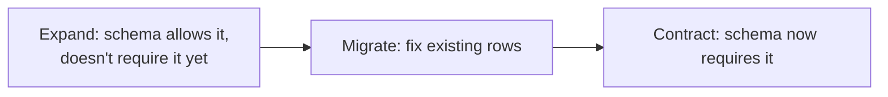

<div align="center">

# 31 · Schema vs Data Migrations

**Part 6 — Transactions & Migrations** · ✅ Done

</div>

> Last section. Section 17 warned that `#Sunset` and `#sunset` could end up as two different rows, and section 13 showed that adding a `CHECK` constraint fails outright if existing data already breaks it. This section is where both of those finally connect — fixing dirty data *before* enforcing a rule against it, as two deliberately separate steps, is the entire reason this distinction exists.

💾 Every query on this page is in [`examples.sql`](examples.sql). It uses the full `sample-db/` schema.

### 📌 What's in here

| # | Topic | In one line |
|:-:|---|---|
| 1 | [Schema migrations vs data migrations](#1-schema-migrations-vs-data-migrations) | Changing structure vs changing values |
| 2 | [Why to keep them separate](#2-why-to-keep-them-separate) | A bad backfill shouldn't force undoing a good schema change |
| 3 | [The multi-step migration process](#3-the-multi-step-migration-process) | Expand, migrate, contract |
| 4 | [Running data migrations safely with transactions](#4-running-data-migrations-safely-with-transactions) | Batches, not one giant statement |
| ✔ | [Recap](#recap) · [Practice](#practice) · [What confused me](#what-confused-me) | |

---

## 1. Schema migrations vs data migrations

**What it is:** A **schema migration** changes *structure* — `ALTER TABLE ADD COLUMN`, `ADD CONSTRAINT` (section 30's whole topic). A **data migration** changes *values in existing rows* — ordinary `UPDATE`/`DELETE`/`INSERT`, no `ALTER TABLE` involved at all.

**Why it exists:** They're solving genuinely different problems, even though both are "changes to the database" in casual conversation.

| | Schema migration | Data migration |
|---|---|---|
| Changes | Table shape | Row values |
| Tool | DDL (`ALTER TABLE`, ...) | DML (`UPDATE`, ...) |
| Section 13 relevance | Existing data can block a new `CHECK` | Fixing that data is *this* |

---

## 2. Why to keep them separate

**What it is:** Never bundling "change the structure" and "fix up the data to match" into one migration.

**Why it exists:** Section 13's `birth_before_membership` `CHECK` succeeded immediately because the data already happened to comply. Real legacy data usually doesn't — and discovering that *while* also trying to add a column in the same migration means either both succeed, or (section 29) both roll back together, even if only the data part was actually wrong.

### Concrete stakes

Adding `CHECK (name = LOWER(name))` to `hashtags` directly, on data that might already contain `'Winter'`, would just fail outright — the exact section 13 trap. Fixing the case *first*, as its own step, and adding the constraint *second*, means each step can be verified independently before the next one runs.

### ⚠️ Traps

- **Writing an `UPDATE` to backfill data in the *same* migration that adds a `NOT NULL` column.** If the backfill has a bug (wrong computed value, a missed edge case), the schema change and the bad data land together — there's no way to keep the column but redo just the data without also touching the now-correct schema.

---

## 3. The multi-step migration process

**What it is:** The standard shape for changing something already depended on by real data: **expand → migrate → contract**.

1. **Expand** (schema) — add the new thing, permissively (nullable, no constraint yet).
2. **Migrate** (data) — fix or populate the actual rows.
3. **Contract** (schema) — now that the data is verified clean, add the constraint that makes it a real rule.

**Why it exists:** Each step is independently safe and independently revertible — exactly section 30's up/down philosophy, applied across *both* kinds of migration instead of just one.

### Worked example: enforcing section 17's lowercase hashtag rule, for real

A legacy row that predates any validation:

```sql
INSERT INTO hashtags (name) VALUES ('Winter');
```

**Step 1 — expand:** nothing needed; `hashtags.name` already exists as `VARCHAR(50)`.

**Step 2 — migrate (data):**

```sql
UPDATE hashtags SET name = LOWER(name) WHERE name <> LOWER(name);
```

**Result:** `UPDATE 1` — `'Winter'` becomes `'winter'`. Every other row was already lowercase and is untouched (`name <> LOWER(name)` is `FALSE` for them).

**Step 3 — contract (schema):**

```sql
ALTER TABLE hashtags ADD CONSTRAINT hashtag_name_lowercase CHECK (name = LOWER(name));
```

**Result:** `ALTER TABLE` — succeeds immediately, because step 2 already guaranteed every existing row complies. Attempting this *before* step 2 would hit the exact section 13 rejection:
```
ERROR:  check constraint "hashtag_name_lowercase" of relation "hashtags" is violated by some row
```



### ⚠️ Traps

- **Skipping straight to "contract."** It's tempting when there's only one bad row to fix — but the *reason* to keep the steps separate (topic 2) doesn't depend on how much data needs fixing, only on whether structure and data changes are two different kinds of risk.

---

## 4. Running data migrations safely with transactions

**What it is:** For a genuinely large table, a data migration's `UPDATE` runs in **batches** — smaller ranges of rows, each its own transaction (section 29) — instead of one statement touching millions of rows at once.

**Why it exists:** One giant `UPDATE` holds its locks and accumulates its undo information for as long as it runs — on a huge table, that can be minutes or hours of blocking other work. A crash or cancellation partway through a single unbatched `UPDATE` also means **starting completely over**, since section 29's atomicity rolls the whole thing back.

### The pattern (illustrated — `hashtags` is far too small to need this in practice)

```sql
UPDATE hashtags SET name = LOWER(name)
WHERE id BETWEEN 1 AND 1000 AND name <> LOWER(name);
COMMIT;

UPDATE hashtags SET name = LOWER(name)
WHERE id BETWEEN 1001 AND 2000 AND name <> LOWER(name);
COMMIT;

-- ...continue in batches until done
```

Each batch commits independently — a failure partway through only needs the *remaining* batches re-run, not the ones already committed.

### ⚠️ Traps

- **Assuming this section's tiny 4-row `hashtags` table means batching never matters.** The pattern exists specifically for scale this course's dataset was never built to demonstrate honestly — the *reasoning* (long locks, all-or-nothing risk on one giant transaction) is the actual lesson, independent of `hashtags` being far too small to need it here.

---

## Recap

| Concept | What it means |
|---|---|
| Schema migration | Structure change — DDL |
| Data migration | Value change — DML |
| Keep them separate | Independent verification, independent recovery from a bad step |
| Expand → migrate → contract | Add permissively, fix the data, then enforce the rule |
| Batched data migrations | Smaller transactions, so a failure only costs the current batch |

> **The one thing I want to remember:** section 13's "existing data can block a new constraint" was never really a warning about `CHECK` — it was a warning that structure and data are two different kinds of change, and this section is just that same fact, finally given its own name.

---

## Practice

**1.** Which step — expand, migrate, or contract — does `ALTER TABLE photos ADD COLUMN caption TEXT;` (nullable, no default) belong to?

<details>
<summary>Show answer</summary>

**Expand.** It's a permissive schema change — every existing row gets `NULL` automatically, nothing is required yet, and no data has been touched.

</details>

**2.** After step 2's `UPDATE` in the worked example, could step 3's `CHECK` have been added *before* running the `UPDATE`, if `'Winter'` didn't exist yet but might be inserted later?

<details>
<summary>Show answer</summary>

Yes — if every row *already* complies with a rule, nothing prevents adding the `CHECK` immediately; the ordering constraint (data first, then constraint) only exists because of *already-present* violations, not hypothetical future ones. Going forward, the `CHECK` itself is what stops new violations from ever being inserted.

</details>

**3.** Why does batching a data migration into separate transactions (topic 4) trade away some of section 29's atomicity guarantee, and why is that an acceptable trade here?

<details>
<summary>Show answer</summary>

With separate transactions per batch, a crash partway through leaves *some* batches committed and others not — the migration as a whole is no longer strictly all-or-nothing. It's acceptable because each individual batch is still internally atomic and idempotent-safe (`WHERE name <> LOWER(name)` naturally skips already-fixed rows), so resuming from wherever it stopped is safe, and the alternative — one multi-hour lock with total rollback on any failure — is the worse risk at real scale.

</details>

---

## What confused me

- I initially treated "backfill this column" and "add the column" as naturally one step, since they're clearly related. Separating them only started making sense once I considered a backfill bug specifically — fixing bad data shouldn't require undoing a schema change that was correct all along.
- Section 13's constraint-blocked-by-existing-data error felt, at the time, like a one-off gotcha about `CHECK`. This section is the moment it turned into the actual organizing principle behind an entire discipline (migrations), not a narrow fact about one constraint type.
- Batching felt like unnecessary complexity for data this small. Once I stopped thinking about `hashtags`'s 4 rows and thought about a real table with millions, "one transaction holds a lock for the entire multi-hour run" stopped being abstract.

---

[⬅ 30 · Managing Database Design with Schema Migrations](../30-managing-database-design-with-schema-migrations/README.md) · [🏠 Index](../README.md)
