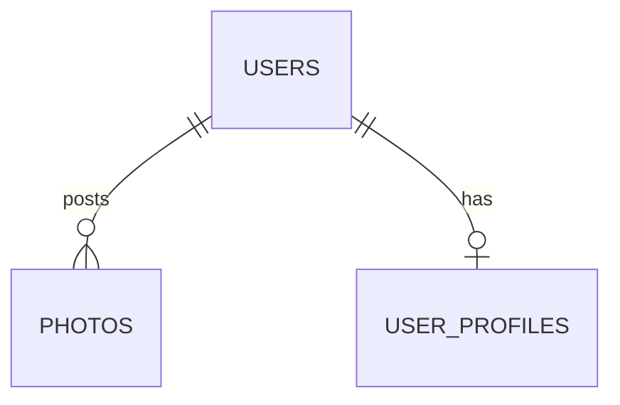

# 📝 PostgreSQL Cheatsheet

My one-page syntax reference. Every entry links back to the full explanation.
It grows as I finish each section.

[🏠 Back to index](README.md)

---

## Basics · [01](01-simple-sql-statements/README.md)

```sql
-- Create a table
CREATE TABLE products (
    name   VARCHAR(50),
    price  INTEGER
);

-- Insert rows (values match columns by position)
INSERT INTO products (name, price)
VALUES ('Notebook', 3), ('Desk Lamp', 40);

-- Read data
SELECT * FROM products;
SELECT name, price FROM products;

-- Calculated column + alias
SELECT name, price * 2 AS double_price FROM products;

-- Text
SELECT name || ' costs ' || price  AS label,
       CONCAT(name, '!')           AS excited,
       UPPER(name), LOWER(name), LENGTH(name)
FROM products;
```

**Remember:** text in `'single quotes'` · `7 / 2 = 3` (integer division) · `||` with `NULL` gives `NULL`, `CONCAT` skips it.

---

## Filtering · [02](02-filtering-records/README.md)

```sql
-- Comparison operators
SELECT * FROM products WHERE price > 40;
SELECT * FROM products WHERE price IS NULL;        -- never use = NULL or <> NULL

-- Ranges and lists
SELECT * FROM products WHERE price BETWEEN 10 AND 60;   -- inclusive both ends
SELECT * FROM products WHERE category IN ('Electronics', 'Stationery');
SELECT * FROM products WHERE category NOT IN ('Electronics');  -- avoid if the list/column can contain NULL

-- Combining conditions (AND binds tighter than OR — use parentheses!)
SELECT * FROM products WHERE (category = 'Home' OR category = 'Stationery') AND price < 5;

-- Calculations inside WHERE (can't reference a SELECT alias — repeat the expression)
SELECT * FROM products WHERE price * stock > 1300;

-- Change existing rows
UPDATE products SET stock = 25 WHERE name = 'Bluetooth Speaker' RETURNING *;

-- Remove rows for good
DELETE FROM products WHERE name = 'Sticky Notes' RETURNING *;
```

**Remember:** `WHERE` runs before `SELECT`, so it can't see column aliases · `NULL` is never `=` or `<>` anything, use `IS NULL` / `IS NOT NULL` · a `NULL` inside a `NOT IN (...)` list silently zeroes out the whole result · always preview an `UPDATE`/`DELETE`'s `WHERE` with a plain `SELECT` first — there's no undo.

---

## Working with Tables · [03](03-working-with-tables/README.md)

```sql
-- Primary key: auto-incrementing identity
CREATE TABLE users (
    id       SERIAL PRIMARY KEY,
    username VARCHAR(50) NOT NULL UNIQUE
);

-- Foreign key: must match a real row in the parent table (or be NULL)
CREATE TABLE photos (
    id      SERIAL PRIMARY KEY,
    url     VARCHAR(200) NOT NULL,
    user_id INTEGER REFERENCES users(id) ON DELETE CASCADE
);

-- ON DELETE options: CASCADE (delete children too) · SET NULL (disconnect) ·
-- SET DEFAULT (fall back) · RESTRICT / NO ACTION (block the delete, the default)

-- Explicit ids don't move a SERIAL sequence forward — resync it by hand:
SELECT setval(pg_get_serial_sequence('photos', 'id'), (SELECT MAX(id) FROM photos));
```

**Remember:** create/insert parents before children, drop children before parents · a foreign key is checked on every insert/update, not just a naming convention · `ON DELETE` defaults to `NO ACTION` (blocks the delete) if you don't specify one · `CASCADE` can ripple through more than one table in a single `DELETE`.

---

## Relating Records with Joins · [04](04-relating-records-with-joins/README.md)

```sql
-- INNER JOIN: only rows that match on both sides
SELECT p.url, u.username
FROM photos AS p
JOIN users AS u ON p.user_id = u.id;

-- LEFT JOIN: keep every row from the left table, NULL if no match
SELECT u.username, p.url
FROM users AS u
LEFT JOIN photos AS p ON u.id = p.user_id;

-- Find rows with no match at all
SELECT u.username
FROM users AS u
LEFT JOIN photos AS p ON u.id = p.user_id
WHERE p.id IS NULL;

-- FULL JOIN: keep every row from both sides
SELECT a.x, b.x FROM a FULL JOIN b ON a.x = b.x;

-- Joining the same table twice needs two different aliases
SELECT c.comment_text, owner.username AS photo_owner, commenter.username AS commented_by
FROM comments AS c
JOIN photos AS p       ON c.photo_id = p.id
JOIN users AS owner     ON p.user_id = owner.id
JOIN users AS commenter ON c.user_id = commenter.id;
```

**Remember:** `JOIN` without `ON`/`USING` is a syntax error (good — the old comma-join style fails silently instead) · `RIGHT JOIN` is just `LEFT JOIN` with the tables swapped · a `WHERE` on the outer side's column can silently turn a `LEFT JOIN` back into an `INNER JOIN` — put that condition in `ON` instead.

---

## Aggregation · [05](05-aggregation-of-records/README.md)

```sql
-- One row per distinct value
SELECT u.username, COUNT(*) AS comment_count
FROM comments AS c
JOIN users AS u ON c.user_id = u.id
GROUP BY u.username;

-- COUNT(*) counts rows; COUNT(column) skips NULLs (they diverge after LEFT JOIN)
SELECT u.username, COUNT(*) AS row_count, COUNT(p.id) AS real_count
FROM users AS u
LEFT JOIN photos AS p ON u.id = p.user_id
GROUP BY u.username;

-- HAVING filters groups (after aggregation); WHERE can't reference an aggregate
SELECT u.username, COUNT(p.id) AS photo_count
FROM users AS u
LEFT JOIN photos AS p ON u.id = p.user_id
GROUP BY u.username
HAVING COUNT(p.id) > 1;
```

**Remember:** every `SELECT`ed column must be grouped or aggregated, no exceptions · `AVG` on zero rows is `NULL`, not `0` · `HAVING` runs after grouping, `WHERE` runs before it.

---

## Large Datasets · [06](06-working-with-large-datasets/README.md)

```sql
-- Generate bulk rows instead of typing them
INSERT INTO page_views (photo_id, viewed_at, duration_seconds)
SELECT (ARRAY[101,102,103,104,105])[1 + (n % 5)],
       TIMESTAMP '2026-01-01' + (n * INTERVAL '1 minute'),
       10 + (n % 50)
FROM generate_series(1, 5000) AS n;

-- Explore an unfamiliar table
-- \dt              -- list tables (psql)
-- \d page_views    -- describe one table (psql)
SELECT column_name, data_type, is_nullable
FROM information_schema.columns
WHERE table_name = 'page_views';

SELECT * FROM page_views LIMIT 5;   -- always LIMIT on an unknown table first
```

**Remember:** Postgres arrays are 1-indexed, not 0-indexed · a query that's correct on 6 rows is correct (or wrong) for the same reasons on 5,000 · `information_schema.columns` works in any tool, `\d` only works in `psql`.

---

## Sorting · [07](07-sorting-records/README.md)

```sql
-- Sort, with a tiebreaker column
SELECT user_id, url FROM photos ORDER BY user_id ASC, url ASC;

-- Top N
SELECT comment_text FROM comments ORDER BY LENGTH(comment_text) DESC LIMIT 3;

-- One page of a larger result (page 2, 10 per page)
SELECT id FROM page_views ORDER BY id LIMIT 10 OFFSET 10;
```

**Remember:** `LIMIT`/`OFFSET` without `ORDER BY` isn't meaningfully "the first N" — always sort first · `DESC` only applies to the column it's attached to, not every column after it · `OFFSET` gets slower the further in you page, since Postgres still walks past every skipped row.

---

## Sets · [08](08-unions-and-intersections-with-sets/README.md)

```sql
-- UNION removes duplicates from the combined result; UNION ALL keeps them
SELECT username FROM a UNION SELECT username FROM b;
SELECT username FROM a UNION ALL SELECT username FROM b;

-- INTERSECT: only rows in both · EXCEPT: rows in the first, not the second
SELECT username FROM a INTERSECT SELECT username FROM b;
SELECT username FROM a EXCEPT SELECT username FROM b;   -- order matters!
```

**Remember:** both sides need the same number of columns, in compatible types, matched by position (not name) · `EXCEPT` is not symmetric — `A EXCEPT B` ≠ `B EXCEPT A` · the result's column names come from the first query only.

---

## Subqueries · [09](09-assembling-queries-with-subqueries/README.md)

```sql
-- In WHERE: IN is really "= ANY", NOT IN is really "<> ALL"
SELECT username FROM users WHERE id IN (SELECT user_id FROM photos);

-- In SELECT: must return exactly one value (correlated if it uses the outer row)
SELECT u.username,
       (SELECT COUNT(*) FROM photos p WHERE p.user_id = u.id) AS photo_count
FROM users u;

-- In FROM: needs an alias
SELECT t.username, t.cnt FROM (
    SELECT username, COUNT(*) AS cnt FROM users GROUP BY username
) AS t;

-- ALL / ANY (SOME): compare against every / any row a subquery returns
SELECT url FROM photos p
WHERE (SELECT COUNT(*) FROM comments c WHERE c.photo_id = p.id)
      >= ALL (SELECT COUNT(*) FROM comments GROUP BY photo_id);
```

**Remember:** a `NULL` anywhere in a `NOT IN` subquery's results zeroes out the whole query — filter it with `WHERE col IS NOT NULL` inside the subquery · a subquery used as a scalar must return exactly one row or it errors · a `FROM`-clause subquery always needs an alias.

---

## Distinct · [10](10-selecting-distinct-records/README.md)

```sql
-- Dedupe whole rows (or a combination of columns)
SELECT DISTINCT category FROM products;
SELECT DISTINCT photo_id, duration_seconds FROM page_views;

-- Count distinct values, not rows
SELECT COUNT(DISTINCT user_id) FROM comments;

-- Same result as DISTINCT here, but GROUP BY also allows aggregates
SELECT category FROM products GROUP BY category;
```

**Remember:** multi-column `DISTINCT` dedupes on the *combination*, not each column separately · `COUNT(DISTINCT col)` still ignores `NULL` · reach for `GROUP BY` instead the moment you also want a count/sum per group.

---

## Utility Operators · [11](11-utility-operators-keywords-and-functions/README.md)

```sql
-- Biggest/smallest of a few values in one row (NOT the same as MAX/MIN across rows)
SELECT GREATEST(price, 5) FROM products;   -- ignores NULL unless every argument is NULL

-- Branching logic as a value
SELECT CASE
    WHEN price < 10  THEN 'Budget'
    WHEN price < 100 THEN 'Midrange'
    ELSE 'Premium'
END AS price_tier FROM products;

-- Conditional counting inside an aggregate
SELECT SUM(CASE WHEN price < 10 THEN 1 ELSE 0 END) AS budget_count FROM products;
```

**Remember:** `GREATEST`/`LEAST` are the rare functions that don't propagate `NULL` · `CASE` branches are checked top to bottom, first match wins · no matching branch and no `ELSE` → silently `NULL`, not an error.

---

## Datatypes · [12](12-postgresql-complex-datatypes/README.md)

```sql
-- NUMERIC is exact; REAL/DOUBLE PRECISION are approximate — never use float for money
SELECT 0.1::DOUBLE PRECISION + 0.2::DOUBLE PRECISION;  -- 0.30000000000000004
SELECT 0.1::NUMERIC + 0.2::NUMERIC;                    -- 0.3

-- TIMESTAMPTZ is the default for real-world event times; TIMESTAMP has no time zone
last_login TIMESTAMPTZ,
member_since TIMESTAMP NOT NULL

-- Date math
SELECT member_since + INTERVAL '1 year' FROM user_profiles;
SELECT AGE(DATE '2026-09-28', birth_date) FROM user_profiles;
```

**Remember:** `NUMERIC(p,s)` for money and anything that can't tolerate rounding drift · `CHAR(n)` pads with real trailing spaces that survive concatenation · `'1'::boolean` (text) works, `1::boolean` (integer) doesn't · `BOOLEAN` has three states — `TRUE`, `FALSE`, and `NULL` (unknown).

---

## Validation · [13](13-database-side-validation-and-constraints/README.md)

```sql
CREATE TABLE products (
    name       VARCHAR(50)    NOT NULL,
    category   VARCHAR(30)    NOT NULL,
    price      NUMERIC(10, 2) CHECK (price >= 0),
    stock      INTEGER        NOT NULL DEFAULT 0 CHECK (stock >= 0),
    created_at TIMESTAMP      NOT NULL DEFAULT NOW()
);

-- Multi-column UNIQUE: no duplicate *combinations*
UNIQUE (user_id, photo_id)

-- Cross-column CHECK, added after the fact
ALTER TABLE user_profiles ADD CONSTRAINT birth_before_membership
    CHECK (birth_date < member_since);
```

**Remember:** `DEFAULT` only fires when a column is omitted, not when `NULL` is given explicitly · `CHECK` treats `NULL` as passing (same three-valued logic as `WHERE`) — pair it with `NOT NULL` if the value must also be present · adding a constraint to an existing table fails if any current row already violates it.

---

## Design Patterns · [14](14-database-structure-design-patterns/README.md)

```sql
-- A pure join table: composite primary key = the uniqueness rule, no extra id column
CREATE TABLE album_photos (
    album_id INTEGER NOT NULL REFERENCES albums(id) ON DELETE CASCADE,
    photo_id INTEGER NOT NULL REFERENCES photos(id) ON DELETE CASCADE,
    PRIMARY KEY (album_id, photo_id)
);
```



**The 7-step process:** nouns → properties/types → relationships → keys → rules (`NOT NULL`/`UNIQUE`/`CHECK`/`ON DELETE`) → diagram it → test against real questions.

**Naming conventions used throughout:** `snake_case`, plural table names, primary key always `id`, foreign key `<singular_table>_id`, booleans `is_`/`has_`, timestamps `_at`.

---

## Likes · [15](15-how-to-build-a-like-system/README.md)

```sql
-- One row targets exactly one of two possible tables, with real foreign keys
CREATE TABLE likes (
    id         SERIAL PRIMARY KEY,
    user_id    INTEGER NOT NULL REFERENCES users(id) ON DELETE CASCADE,
    photo_id   INTEGER REFERENCES photos(id)   ON DELETE CASCADE,
    comment_id INTEGER REFERENCES comments(id) ON DELETE CASCADE,
    CHECK (COALESCE(photo_id, comment_id) IS NOT NULL
           AND (photo_id IS NULL OR comment_id IS NULL))
);

-- Plain UNIQUE doesn't work here — NULLs aren't distinct from each other. Use partial indexes:
CREATE UNIQUE INDEX unique_photo_like   ON likes (user_id, photo_id)   WHERE photo_id IS NOT NULL;
CREATE UNIQUE INDEX unique_comment_like ON likes (user_id, comment_id) WHERE comment_id IS NOT NULL;
```

**Remember:** a counter column can't answer "did I like this" and can drift out of sync · a polymorphic `target_type`/`target_id` column loses real foreign-key integrity · `UNIQUE` treats every `NULL` as distinct from every other `NULL` — partial unique indexes (`WHERE col IS NOT NULL`) are the fix.

---

## Mentions · [16](16-how-to-build-a-mention-system/README.md)

```sql
CREATE TABLE photo_tags (
    id       SERIAL PRIMARY KEY,
    photo_id INTEGER NOT NULL REFERENCES photos(id) ON DELETE CASCADE,
    user_id  INTEGER NOT NULL REFERENCES users(id)  ON DELETE CASCADE,
    x        NUMERIC(5, 2) NOT NULL CHECK (x BETWEEN 0 AND 100),  -- % position, not pixels
    y        NUMERIC(5, 2) NOT NULL CHECK (y BETWEEN 0 AND 100),
    UNIQUE (photo_id, user_id)
);
```

**Remember:** one table vs two isn't decided by "how many possible targets" — it's decided by whether the non-target columns actually match (contrast with section 15's `likes`) · store tag position as a percentage, not pixels, so it survives any display size.

---

## Hashtags · [17](17-how-to-build-a-hashtag-system/README.md)

```sql
CREATE TABLE hashtags (id SERIAL PRIMARY KEY, name VARCHAR(50) NOT NULL UNIQUE);
CREATE TABLE hashtags_posts (
    hashtag_id INTEGER NOT NULL REFERENCES hashtags(id) ON DELETE CASCADE,
    photo_id   INTEGER NOT NULL REFERENCES photos(id)   ON DELETE CASCADE,
    PRIMARY KEY (hashtag_id, photo_id)
);

-- Real-time count vs a denormalized cache (fine here — the source rows aren't lost)
SELECT h.name, COUNT(*) FROM hashtags h JOIN hashtags_posts hp ON h.id = hp.hashtag_id GROUP BY h.name;
```

**Remember:** never store hashtags as plain text in a column — `LIKE '%...%'` gives false substring matches and can't use an index · lowercase hashtag names on the way in so `#Sunset`/`#sunset` don't split into two rows · a denormalized counter is fine when the detailed rows still exist to recompute it from (unlike section 15's `likes_count`).

---

## Followers · [18](18-how-to-design-a-follower-system/README.md)

```sql
CREATE TABLE followers (
    follower_id INTEGER NOT NULL REFERENCES users(id) ON DELETE CASCADE,
    followed_id INTEGER NOT NULL REFERENCES users(id) ON DELETE CASCADE,
    PRIMARY KEY (follower_id, followed_id),
    CHECK (follower_id <> followed_id)
);

-- Self-join to find mutual follows
SELECT f1.follower_id, f1.followed_id
FROM followers f1
JOIN followers f2 ON f1.follower_id = f2.followed_id AND f1.followed_id = f2.follower_id
WHERE f1.follower_id < f1.followed_id;
```

**Remember:** a self-referencing many-to-many needs two foreign keys to the *same* table, named by role (`follower_id`/`followed_id`), not by target · `CHECK` blocks self-follows, the composite primary key blocks duplicates — two different rules, two different tools.

---

## Implementing the Design · [19](19-implementing-database-design-patterns/README.md)

`sample-db/` is now the full 9-table schema (sections 3, 12, 15-18) — every section from here on loads it directly.

```sql
-- COUNT(DISTINCT ...) once more than one LEFT JOIN is chained — joins multiply rows
SELECT p.url, COUNT(DISTINCT l.id) AS like_count, COUNT(DISTINCT pt.id) AS tag_count
FROM photos p
LEFT JOIN likes l      ON l.photo_id = p.id
LEFT JOIN photo_tags pt ON pt.photo_id = p.id
GROUP BY p.id, p.url;
```

**Remember:** dependency order (parents before children) scales to any number of tables, not just 2-3 · chained `LEFT JOIN`s multiply rows against each other — `COUNT`/`STRING_AGG` need `DISTINCT` once more than one join is in play.

---

## Complex Queries · [20](20-approaching-and-writing-complex-queries/README.md)

```sql
-- Best row per group (Postgres-specific — needs ORDER BY to start with the same column)
SELECT DISTINCT ON (u.username) u.username, p.url, COUNT(l.id) AS like_count
FROM users u
JOIN photos p ON p.user_id = u.id
LEFT JOIN likes l ON l.photo_id = p.id
GROUP BY u.username, p.url
ORDER BY u.username, like_count DESC;
```

**The process:** restate the question precisely → identify every table → check the plain `JOIN` shape and row count *before* aggregating → aggregate with `DISTINCT` where needed → filter last (`WHERE` vs `HAVING`) → test zero/tie/empty edge cases.

**Remember:** `DISTINCT ON (col)` keeps the first row per `col` as defined by `ORDER BY` — the `ORDER BY` must start with that same column, or it's an error.

---

## Internals · [21](21-understanding-the-internals-of-postgresql/README.md)

```sql
SHOW data_directory;
SELECT pg_relation_filepath('users');   -- a table is really a numbered file
SELECT ctid, username FROM users;       -- physical address: (block, position)
```

**Remember:** a table is an unordered heap of 8KB blocks — that's the actual, physical reason row order was never guaranteed · `UPDATE` writes a new tuple instead of editing in place, which is why a heavily-updated table can bloat until `VACUUM` runs · `ctid` is a physical address, not a stable identifier — never store or rely on it, use a real primary key.

---

## Indexes · [22](22-a-look-at-indexes-for-performance/README.md)

```sql
CREATE INDEX idx_table_column ON table_name (column_name);
DROP INDEX idx_table_column;

EXPLAIN SELECT * FROM page_views WHERE photo_id = 101;  -- Seq Scan vs Index Scan

SELECT indexname, indexdef FROM pg_indexes WHERE tablename = 'users';
```

**Remember:** `PRIMARY KEY`/`UNIQUE` auto-create an index; **foreign key columns do not** — index them by hand if you join or cascade-delete on them · every index adds write overhead on every `INSERT`/`UPDATE`/`DELETE`, so index deliberately, not "just in case" · a leading-wildcard `LIKE '%x%'` can't use a plain B-tree at all.

---

## Query Tuning · [23](23-basic-query-tuning/README.md)

```sql
EXPLAIN query;            -- shows the plan + cost estimate, doesn't run it
EXPLAIN ANALYZE query;    -- actually RUNS it, adds real timing + actual rows

ANALYZE table_name;       -- refresh planner statistics after a bulk load
SELECT * FROM pg_stats WHERE tablename = '...' AND attname = '...';
```

**Pipeline:** parser → rewriter (expands views) → planner (picks cheapest plan, using `pg_stats`) → executor.

**Remember:** `EXPLAIN ANALYZE` on `INSERT`/`UPDATE`/`DELETE` really executes it — use plain `EXPLAIN` to preview anything that isn't a `SELECT` · read a plan bottom-up / most-indented-first, that's execution order.
