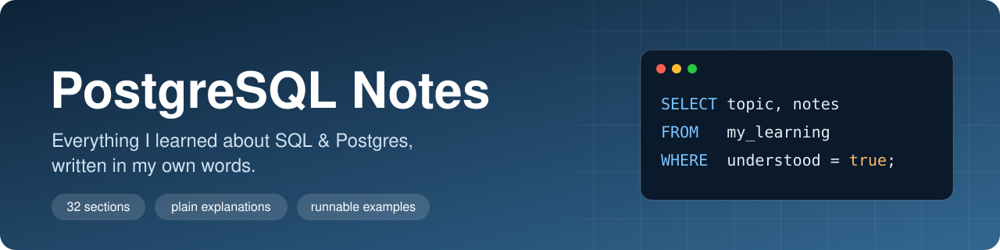

<div align="center">



<br><br>


</div>

## 👋 Hey, welcome to my notes

I just finished a complete SQL & PostgreSQL course, and I didn't want everything I learned to slowly fade away. So I'm writing it all down here: every concept, in my own words, explained the way it finally clicked for me.

This repo is two things for me:

- **My own documentation.** When I forget a syntax or how something works, I come here & aslo google it.
- **A record of what I've learned.** From my very first `SELECT`, all the way to indexes, query tuning and migrations.

These are student notes, written while learning. If you spot a mistake, please open an issue. I'd genuinely love to learn from it.

## 🧭 How I write every page

Every topic follows the same structure (my template is in [TEMPLATE.md](TEMPLATE.md)), so any page is easy to scan:

| Part | What it gives you |
|---|---|
| **What it is** | One or two plain sentences |
| **Why it exists** | The problem it solves |
| **Syntax** | The general shape to remember |
| **Example** | A real query I ran myself |
| **Result** | Exactly what that query returned |
| **Visual** | A diagram, when a picture explains it better |
| **⚠️ Traps** | Mistakes I made (or almost made) |
| **Practice** | Small exercises with hidden answers |

Every section ends with a **"What confused me"** part, because the things that confused me will probably confuse me again.

## ▶️ Running the examples

Each section folder has an `examples.sql` file with every query from that page, in order, ready to run:

```bash
createdb postgres_notes
psql -d postgres_notes -f 01-simple-sql-statements/examples.sql
```

Later sections use the shared sample database in [`sample-db/`](sample-db/):

```bash
psql -d postgres_notes -f sample-db/schema.sql
psql -d postgres_notes -f sample-db/seed.sql
```

## 🗺️ What I've covered

**Progress:** `███████░░░░░░░░░░░░░░░░░░░░░░░░` 7 / 31 sections

**Legend:** ✅ written · 🚧 in progress · ⬜ not yet

### Part 1 — SQL Fundamentals

The core language: creating tables, reading, filtering, joining, grouping and combining data.

| # | Section | What's inside | Status |
|:-:|---|---|:-:|
| 01 | [Simple — But Powerful — SQL Statements](01-simple-sql-statements/README.md) | Your first steps: what SQL is, creating a table, putting data in and reading it back. | ✅ |
| 02 | [Filtering Records](02-filtering-records/README.md) | Pick exactly the rows you want, then change or remove them. | ✅ |
| 03 | [Working with Tables](03-working-with-tables/README.md) | Designing several tables and connecting them with keys. | ✅ |
| 04 | [Relating Records with Joins](04-relating-records-with-joins/README.md) | Combining rows from related tables into one result. | ✅ |
| 05 | [Aggregation of Records](05-aggregation-of-records/README.md) | Collapsing many rows into summaries. | ✅ |
| 06 | [Working with Large Datasets](06-working-with-large-datasets/README.md) | Practising everything so far on a bigger, realistic dataset. | ✅ |
| 07 | [Sorting Records](07-sorting-records/README.md) | Controlling the order and size of results. | ✅ |
| 08 | [Unions and Intersections with Sets](08-unions-and-intersections-with-sets/README.md) | Combining the results of separate queries. | ⬜ |
| 09 | [Assembling Queries with Subqueries](09-assembling-queries-with-subqueries/README.md) | Using the result of one query inside another. | ⬜ |
| 10 | [Selecting Distinct Records](10-selecting-distinct-records/README.md) | Removing duplicates from results. | ⬜ |
| 11 | [Utility Operators, Keywords, and Functions](11-utility-operators-keywords-and-functions/README.md) | Small tools that make queries simpler. | ⬜ |

### Part 2 — Data Types & Validation

Choosing the right data type for every column, and making the database protect its own data.

| # | Section | What's inside | Status |
|:-:|---|---|:-:|
| 12 | [PostgreSQL Complex Datatypes](12-postgresql-complex-datatypes/README.md) | Choosing the right type for every column. | ⬜ |
| 13 | [Database-Side Validation and Constraints](13-database-side-validation-and-constraints/README.md) | Making the database reject bad data. | ⬜ |

### Part 3 — Database Design

Designing real features (likes, mentions, hashtags, followers) and building a full schema.

| # | Section | What's inside | Status |
|:-:|---|---|:-:|
| 14 | [Database Structure Design Patterns](14-database-structure-design-patterns/README.md) | How to approach designing a schema. | ⬜ |
| 15 | [How to Build a 'Like' System](15-how-to-build-a-like-system/README.md) | Designing likes the right way. | ⬜ |
| 16 | [How to Build a 'Mention' System](16-how-to-build-a-mention-system/README.md) | Tagging users in photos and captions. | ⬜ |
| 17 | [How to Build a 'Hashtag' System](17-how-to-build-a-hashtag-system/README.md) | Storing hashtags so they can be searched. | ⬜ |
| 18 | [How to Design a 'Follower' System](18-how-to-design-a-follower-system/README.md) | Users following users. | ⬜ |
| 19 | [Implementing Database Design Patterns](19-implementing-database-design-patterns/README.md) | Turning the designs into real tables. | ⬜ |

### Part 4 — Complex Queries & Performance

Writing hard queries step by step, and understanding how Postgres stores, finds and plans data.

| # | Section | What's inside | Status |
|:-:|---|---|:-:|
| 20 | [Approaching and Writing Complex Queries](20-approaching-and-writing-complex-queries/README.md) | A repeatable method for hard queries. | ⬜ |
| 21 | [Understanding the Internals of PostgreSQL](21-understanding-the-internals-of-postgresql/README.md) | Where your data physically lives. | ⬜ |
| 22 | [A Look at Indexes for Performance](22-a-look-at-indexes-for-performance/README.md) | How indexes make lookups fast, and what they cost. | ⬜ |
| 23 | [Basic Query Tuning](23-basic-query-tuning/README.md) | Seeing what Postgres does with your query. | ⬜ |
| 24 | [Advanced Query Tuning](24-advanced-query-tuning/README.md) | Understanding the planner's cost model. | ⬜ |

### Part 5 — Advanced Querying

CTEs, recursive queries, views and materialized views.

| # | Section | What's inside | Status |
|:-:|---|---|:-:|
| 25 | [Simple Common Table Expressions](25-simple-common-table-expressions/README.md) | Naming a sub-result to make queries readable. | ⬜ |
| 26 | [Recursive Common Table Expressions](26-recursive-common-table-expressions/README.md) | Queries that walk through trees and graphs. | ⬜ |
| 27 | [Simplifying Queries with Views](27-simplifying-queries-with-views/README.md) | Saving a query and using it like a table. | ⬜ |
| 28 | [Optimizing Queries with Materialized Views](28-optimizing-queries-with-materialized-views/README.md) | Caching the result of an expensive query. | ⬜ |

### Part 6 — Transactions & Migrations

Keeping data consistent and changing a schema safely over time.

| # | Section | What's inside | Status |
|:-:|---|---|:-:|
| 29 | [Handling Concurrency and Reversibility with Transactions](29-handling-concurrency-and-reversibility-with-transactions/README.md) | All-or-nothing changes. | ⬜ |
| 30 | [Managing Database Design with Schema Migrations](30-managing-database-design-with-schema-migrations/README.md) | Changing the schema safely, in steps you can undo. | ⬜ |
| 31 | [Schema vs Data Migrations](31-schema-vs-data-migrations/README.md) | Keeping structure changes and data changes apart. | ⬜ |

---

## 📁 How this repo is organized

```
postgres-notes/
├── README.md          ← you are here
├── TEMPLATE.md        ← the structure every topic follows
├── CHEATSHEET.md      ← one-page syntax reference
├── assets/            ← images used on this page
├── sample-db/         ← shared tables + data for later sections
├── 01-simple-sql-statements/
├── 02-filtering-records/
├── 03-working-with-tables/
├── 04-relating-records-with-joins/
├── 05-aggregation-of-records/
├── 06-working-with-large-datasets/
├── 07-sorting-records/
├── 08-unions-and-intersections-with-sets/
├── 09-assembling-queries-with-subqueries/
├── 10-selecting-distinct-records/
├── 11-utility-operators-keywords-and-functions/
├── 12-postgresql-complex-datatypes/
├── 13-database-side-validation-and-constraints/
├── 14-database-structure-design-patterns/
├── 15-how-to-build-a-like-system/
├── 16-how-to-build-a-mention-system/
├── 17-how-to-build-a-hashtag-system/
├── 18-how-to-design-a-follower-system/
├── 19-implementing-database-design-patterns/
├── 20-approaching-and-writing-complex-queries/
├── 21-understanding-the-internals-of-postgresql/
├── 22-a-look-at-indexes-for-performance/
├── 23-basic-query-tuning/
├── 24-advanced-query-tuning/
├── 25-simple-common-table-expressions/
├── 26-recursive-common-table-expressions/
├── 27-simplifying-queries-with-views/
├── 28-optimizing-queries-with-materialized-views/
├── 29-handling-concurrency-and-reversibility-with-transactions/
├── 30-managing-database-design-with-schema-migrations/
├── 31-schema-vs-data-migrations/
```

Each section folder contains:

```
01-simple-sql-statements/
├── README.md          ← the notes (GitHub opens this automatically)
├── examples.sql       ← every query from the notes, ready to run
└── images/            ← diagrams for that section
```

---

<div align="center">

Made while learning, one section at a time. 🐘

</div>
